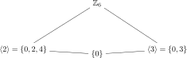
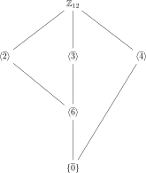
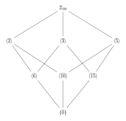

Once groups have been defined, the next structural question is: what smaller groups already live inside a given one? Subgroups are the answer, and they are the fundamental internal structure of group theory. Every later construction -- cosets, normal subgroups, quotients, group actions -- depends on fluency with subgroups.

---

## §5.1 Definition of a subgroup

### Definition 5.1 (Subgroup)

Let $(G, \ast)$ be a group. A subset $H \subseteq G$ is a **subgroup** of $G$, written $H \leq G$, if

1. $H \neq \emptyset$,
2. $H$ is itself a group under the same operation $\ast$.

Condition (2) means: the operation $\ast$ restricted to $H \times H$ lands in $H$ (closure), and $H$ satisfies associativity, has an identity element, and every element of $H$ has an inverse in $H$.

**Remark.** Associativity is inherited for free from $G$, so one never checks it separately. The real work is: nonemptiness, closure, identity, and inverses.

### Proposition 5.2 (The identity and inverses match)

If $H \leq G$, then:
- The identity element of $H$ is the same as the identity element of $G$.
- For each $a \in H$, the inverse of $a$ in $H$ is the same as the inverse of $a$ in $G$.

> [!info]- Proof
>
> Let $e_H$ be the identity of $H$ and $e$ the identity of $G$. Then $e_H e_H = e_H$ in $H$, but also $e \cdot e_H = e_H$ in $G$. Left-cancelling $e_H$ in $G$ gives $e_H = e$.
>
> For inverses: if $a \in H$ and $b$ is the inverse of $a$ in $H$, then $ab = e_H = e$. But the inverse of $a$ in $G$ is the unique element satisfying $ac = e$, so $b = a^{-1}$. $\blacksquare$

This proposition is important because it means we do not need to "discover" a new identity or new inverses. The group structure of $H$ is entirely inherited from $G$.

---

## §5.2 The two-step subgroup test

Checking all group axioms is wasteful. The following test is the standard workhorse.

### Theorem 5.3 (Two-step subgroup test)

A nonempty subset $H \subseteq G$ is a subgroup of $G$ if and only if:
1. **Closure under the operation:** for all $a, b \in H$, $ab \in H$;
2. **Closure under inverses:** for all $a \in H$, $a^{-1} \in H$.

> [!info]- Proof
>
> $(\Rightarrow)$ If $H \leq G$, then $H$ is a group, so it is closed under products and inverses.
>
> $(\Leftarrow)$ Assume $H \neq \emptyset$ and satisfies (1) and (2). We verify the group axioms for $H$.
>
> *Closure.* Given by (1).
>
> *Associativity.* For any $a, b, c \in H$, we have $(ab)c = a(bc)$ because this holds in $G$ and all elements lie in $G$.
>
> *Identity.* Since $H \neq \emptyset$, pick any $a \in H$. By (2), $a^{-1} \in H$. By (1), $a a^{-1} = e \in H$.
>
> *Inverses.* Given by (2).
>
> Therefore $H$ is a group under the same operation, so $H \leq G$. $\blacksquare$

**Example 5.4.** Show that $H = \{0, \pm 3, \pm 6, \pm 9, \ldots\} = 3\mathbb{Z}$ is a subgroup of $(\mathbb{Z}, +)$.

*Verification.* $H \neq \emptyset$ since $0 \in H$.
- Closure: if $3k, 3l \in H$, then $3k + 3l = 3(k+l) \in H$. $\checkmark$
- Inverses: if $3k \in H$, then $-(3k) = 3(-k) \in H$. $\checkmark$

By the two-step test, $H \leq \mathbb{Z}$. $\square$

---

## §5.3 The one-step subgroup test

The two conditions of Theorem 5.3 can be collapsed into a single condition.

### Theorem 5.5 (One-step subgroup test)

A nonempty subset $H \subseteq G$ is a subgroup of $G$ if and only if
$$
ab^{-1} \in H \quad \text{for all } a, b \in H.
$$

> [!info]- Proof
>
> $(\Rightarrow)$ If $H \leq G$, then $b^{-1} \in H$ for any $b \in H$, and then $ab^{-1} \in H$ by closure.
>
> $(\Leftarrow)$ Assume $H \neq \emptyset$ and $ab^{-1} \in H$ for all $a, b \in H$. We derive the two conditions of Theorem 5.3.
>
> *Identity.* Pick any $h \in H$ (possible since $H \neq \emptyset$). Setting $a = b = h$ gives $hh^{-1} = e \in H$.
>
> *Inverses.* Let $x \in H$. Since $e \in H$ (just proved), setting $a = e, b = x$ gives $ex^{-1} = x^{-1} \in H$.
>
> *Closure.* Let $x, y \in H$. Since $y^{-1} \in H$ (just proved), setting $a = x, b = y^{-1}$ gives $x(y^{-1})^{-1} = xy \in H$.
>
> By Theorem 5.3, $H \leq G$. $\blacksquare$

The proof is worth internalizing because it demonstrates a recurring algebraic technique: cleverly choosing the inputs in a universal condition to manufacture the identity, inverses, and products in turn.

**Example 5.6.** Show that $\text{SL}_n(\mathbb{R}) = \{A \in \text{GL}_n(\mathbb{R}) : \det A = 1\}$ is a subgroup of $\text{GL}_n(\mathbb{R})$.

*Verification.* $I_n \in \text{SL}_n(\mathbb{R})$ since $\det I_n = 1$, so the set is nonempty. For $A, B \in \text{SL}_n(\mathbb{R})$:
$$
\det(AB^{-1}) = \det(A) \cdot \det(B^{-1}) = \det(A) \cdot (\det B)^{-1} = 1 \cdot 1^{-1} = 1.
$$
So $AB^{-1} \in \text{SL}_n(\mathbb{R})$. By the one-step test, $\text{SL}_n(\mathbb{R}) \leq \text{GL}_n(\mathbb{R})$. $\square$

---

## §5.4 The finite subgroup test

For finite subsets, checking inverses is unnecessary -- the pigeonhole principle does the work.

### Theorem 5.7 (Finite subgroup test)

Let $H$ be a **nonempty finite** subset of a group $G$. If $H$ is closed under the group operation (i.e., $ab \in H$ for all $a, b \in H$), then $H \leq G$.

> [!info]- Proof
>
> We must show that $H$ contains the identity and all inverses. Fix any $a \in H$.
>
> **Step 1: $e \in H$.** Consider the sequence of powers
> $$
> a, a^2, a^3, \ldots
> $$
> Each lies in $H$ by closure (induction: $a^{k+1} = a^k \cdot a$, and both factors are in $H$). Since $H$ is finite, these powers cannot all be distinct. So there exist integers $m > n \geq 1$ with $a^m = a^n$. Left-cancelling (in $G$) gives
> $$
> a^{m-n} = e.
> $$
> Since $m - n \geq 1$ and $a^{m-n}$ is a product of elements of $H$, we have $e \in H$.
>
> **Step 2: $a^{-1} \in H$.** If $m - n = 1$, then $a = e$, so $a^{-1} = e \in H$. If $m - n \geq 2$, then
> $$
> a^{-1} = a^{m-n-1},
> $$
> which is a product of $m - n - 1 \geq 1$ copies of $a$, hence lies in $H$.
>
> Since $a$ was arbitrary, every element of $H$ has its inverse in $H$. Combined with closure and nonemptiness, Theorem 5.3 gives $H \leq G$. $\blacksquare$

**Why this fails for infinite sets.** The nonnegative integers $\mathbb{Z}_{\geq 0}$ are a nonempty subset of $(\mathbb{Z}, +)$ that is closed under addition. But $\mathbb{Z}_{\geq 0}$ is not a subgroup because $-1 \notin \mathbb{Z}_{\geq 0}$. The proof breaks because the pigeonhole argument requires finiteness.

---

## §5.5 Standard subgroups: trivial, improper, center, and cyclic subgroups

Every group $G$ has at least two subgroups:

- **Trivial subgroup:** $\{e\} \leq G$.
- **Improper subgroup:** $G \leq G$.

A subgroup $H$ with $\{e\} \neq H \neq G$ is called a **proper nontrivial subgroup**.

### Definition 5.8 (Center of a group)

The **center** of a group $G$ is
$$
Z(G) = \{g \in G : gx = xg \text{ for all } x \in G\}.
$$

In words: $Z(G)$ consists of exactly those elements that commute with every element of $G$.

### Theorem 5.9. $Z(G) \leq G$.

> [!info]- Proof
>
> *Nonempty.* The identity $e$ satisfies $ex = xe$ for all $x \in G$, so $e \in Z(G)$.
>
> *One-step test.* Let $a, b \in Z(G)$ and let $x \in G$ be arbitrary. We must show $ab^{-1} \in Z(G)$, i.e., $(ab^{-1})x = x(ab^{-1})$.
>
> Since $b \in Z(G)$, we have $bx = xb$ for all $x$. Taking inverses of both sides (or equivalently, multiplying on left by $b^{-1}$ and on right by $b^{-1}$) gives $b^{-1}x = xb^{-1}$ for all $x$. So $b^{-1} \in Z(G)$.
>
> Now compute:
> $$
> (ab^{-1})x = a(b^{-1}x) = a(xb^{-1}) = (ax)b^{-1} = (xa)b^{-1} = x(ab^{-1}).
> $$
> We used $b^{-1} \in Z(G)$ in the second step and $a \in Z(G)$ in the fourth step.
>
> So $ab^{-1} \in Z(G)$, and by Theorem 5.5, $Z(G) \leq G$. $\blacksquare$

### Example 5.10. $Z(S_3)$

We compute the center of $S_3 = \{e, (1\,2), (1\,3), (2\,3), (1\,2\,3), (1\,3\,2)\}$.

An element $\sigma \in Z(S_3)$ must commute with every element. Check $(1\,2)$:
$$
(1\,2)(1\,2\,3) = (1\,3), \qquad (1\,2\,3)(1\,2) = (2\,3).
$$
Since $(1\,3) \neq (2\,3)$, the transposition $(1\,2)$ does not commute with $(1\,2\,3)$, so $(1\,2) \notin Z(S_3)$. Similar computations show that every non-identity element fails to commute with at least one other element.

$$
Z(S_3) = \{e\}.
$$

A group with $Z(G) = \{e\}$ is called **centerless**. $S_3$ is the smallest non-abelian group, and it is centerless.

### Example 5.11. $Z(GL_n(\mathbb{R}))$

We claim $Z(GL_n(\mathbb{R})) = \{\lambda I_n : \lambda \in \mathbb{R}^\times\}$, the scalar matrices.

If $A = \lambda I_n$, then $AB = \lambda B = B\lambda = BA$ for all $B$, so scalar matrices are central.

Conversely, suppose $A$ commutes with every invertible matrix. In particular, $A$ commutes with every elementary matrix $E_{ij}(\alpha)$ (which adds $\alpha$ times row $j$ to row $i$). A standard linear algebra argument shows this forces $A$ to be scalar. $\square$

### Example 5.12. Center of an abelian group

If $G$ is abelian, then $gx = xg$ for all $g, x \in G$, so every element is central:
$$
Z(G) = G.
$$

Conversely, $G$ is abelian if and only if $Z(G) = G$.

---

## §5.6 Cyclic subgroups

### Definition 5.13 (Cyclic subgroup generated by an element)

For $a \in G$, the **cyclic subgroup generated by $a$** is
$$
\langle a \rangle = \{a^n : n \in \mathbb{Z}\} = \{\ldots, a^{-2}, a^{-1}, e, a, a^2, \ldots\}.
$$
(In additive notation: $\langle a \rangle = \{na : n \in \mathbb{Z}\}$.)

### Theorem 5.14. $\langle a \rangle \leq G$ for every $a \in G$.

> [!info]- Proof
>
> *Nonempty.* $a^0 = e \in \langle a \rangle$.
>
> *One-step test.* Let $a^m, a^n \in \langle a \rangle$. Then
> $$
> a^m (a^n)^{-1} = a^m a^{-n} = a^{m-n} \in \langle a \rangle,
> $$
> since $m - n \in \mathbb{Z}$.
>
> By Theorem 5.5, $\langle a \rangle \leq G$. $\blacksquare$

### Proposition 5.15 (Minimality)

$\langle a \rangle$ is the **smallest** subgroup of $G$ containing $a$. That is, if $H \leq G$ and $a \in H$, then $\langle a \rangle \subseteq H$.

> [!info]- Proof
>
> If $H \leq G$ and $a \in H$, then by closure under the operation, $a^2 = a \cdot a \in H$, $a^3 \in H$, and by induction $a^n \in H$ for all $n \geq 1$. Since $a^{-1} \in H$ (closure under inverses), the same argument gives $a^{-n} \in H$ for all $n \geq 1$. Also $e = a^0 \in H$. So $\{a^n : n \in \mathbb{Z}\} = \langle a \rangle \subseteq H$. $\blacksquare$

**Connection to cyclic groups.** A group $G$ is cyclic if $G = \langle a \rangle$ for some $a \in G$. So cyclic subgroups are exactly the subgroups that are cyclic as groups. Every element of every group generates a cyclic subgroup. This is the bridge between the abstract notion "cyclic group" (Chapter 6) and the internal structure studied here.

**Example 5.16.** In $(\mathbb{Z}, +)$: $\langle 3 \rangle = 3\mathbb{Z} = \{0, \pm 3, \pm 6, \ldots\}$.

**Example 5.17.** In $(\mathbb{Z}_{12}, +)$: $\langle \bar{3} \rangle = \{\bar{0}, \bar{3}, \bar{6}, \bar{9}\}$ (order 4) and $\langle \bar{4} \rangle = \{\bar{0}, \bar{4}, \bar{8}\}$ (order 3).

**Example 5.18.** In $S_3$: $\langle (1\,2\,3) \rangle = \{e, (1\,2\,3), (1\,3\,2)\}$ (order 3) and $\langle (1\,2) \rangle = \{e, (1\,2)\}$ (order 2).

---

## §5.7 Subgroup lattices

### Definition 5.19 (Subgroup lattice)

The **subgroup lattice** of a group $G$ is the poset of all subgroups of $G$ ordered by inclusion $\leq$. It is drawn as a Hasse diagram: subgroups higher in the diagram contain those below, and edges connect subgroups differing by one "step" of containment.

### Example 5.20. Lattice of $\mathbb{Z}_6$

The subgroups of $\mathbb{Z}_6$ are:
- $\langle \bar{1} \rangle = \mathbb{Z}_6$ (order 6)
- $\langle \bar{2} \rangle = \{\bar{0}, \bar{2}, \bar{4}\}$ (order 3)
- $\langle \bar{3} \rangle = \{\bar{0}, \bar{3}\}$ (order 2)
- $\langle \bar{0} \rangle = \{\bar{0}\}$ (order 1)

Figure: subgroup lattice of $\mathbb{Z}_6$.

The subgroup orders $\{1, 2, 3, 6\}$ are exactly the divisors of $6$, and the containment mirrors divisibility: $\langle \bar{2} \rangle \subseteq \langle \bar{1} \rangle$ because $2 \mid 6$.

### Example 5.21. Lattice of $\mathbb{Z}_{12}$

The divisors of $12$ are $1, 2, 3, 4, 6, 12$. The corresponding subgroups are:

| Generator | Subgroup | Order |
|---|---|---|
| $\bar{1}$ | $\mathbb{Z}_{12}$ | $12$ |
| $\bar{2}$ | $\{\bar{0}, \bar{2}, \bar{4}, \bar{6}, \bar{8}, \bar{10}\}$ | $6$ |
| $\bar{3}$ | $\{\bar{0}, \bar{3}, \bar{6}, \bar{9}\}$ | $4$ |
| $\bar{4}$ | $\{\bar{0}, \bar{4}, \bar{8}\}$ | $3$ |
| $\bar{6}$ | $\{\bar{0}, \bar{6}\}$ | $2$ |
| $\bar{0}$ | $\{\bar{0}\}$ | $1$ |

Figure: subgroup lattice of $\mathbb{Z}_{12}$.

Containment: $\langle \bar{4} \rangle \subseteq \langle \bar{2} \rangle$ (since $4$ is a multiple of $2$ mod $12$), $\langle \bar{6} \rangle \subseteq \langle \bar{2} \rangle$ and $\langle \bar{6} \rangle \subseteq \langle \bar{3} \rangle$, etc. Note $\langle \bar{4} \rangle \not\subseteq \langle \bar{3} \rangle$ since $\bar{4} \notin \{\bar{0}, \bar{3}, \bar{6}, \bar{9}\}$.

### Example 5.22. Lattice of $\mathbb{Z}_{30}$

$30 = 2 \cdot 3 \cdot 5$. Divisors: $1, 2, 3, 5, 6, 10, 15, 30$.

Figure: subgroup lattice of $\mathbb{Z}_{30}$.

There is one cyclic subgroup of order $d$ for each divisor $d$ of $30$. Containment: $\langle \bar{d_1} \rangle \subseteq \langle \bar{d_2} \rangle$ if and only if $d_2 \mid d_1$ (i.e., the larger the generator, the smaller the subgroup, and containment reverses the divisibility order on the generators).

### Example 5.23. Lattice of $S_3$

$S_3$ has order $6$ and is non-abelian. Its subgroups are:

| Subgroup | Elements | Order |
|---|---|---|
| $S_3$ | all six | $6$ |
| $\langle (1\,2\,3) \rangle$ | $\{e, (1\,2\,3), (1\,3\,2)\}$ | $3$ |
| $\langle (1\,2) \rangle$ | $\{e, (1\,2)\}$ | $2$ |
| $\langle (1\,3) \rangle$ | $\{e, (1\,3)\}$ | $2$ |
| $\langle (2\,3) \rangle$ | $\{e, (2\,3)\}$ | $2$ |
| $\{e\}$ | $\{e\}$ | $1$ |

Figure: subgroup lattice of $S_3$.

There is one subgroup of order 3 (the unique subgroup of index 2, which will turn out to be normal) and three subgroups of order 2. None of the order-2 subgroups contains any other, and the order-3 subgroup contains none of them.

---

## §5.8 Intersection of subgroups

### Theorem 5.24. The intersection of any family of subgroups is a subgroup.

Let $\{H_i\}_{i \in I}$ be a (possibly infinite) family of subgroups of $G$. Then
$$
H = \bigcap_{i \in I} H_i \leq G.
$$

> [!info]- Proof
>
> *Nonempty.* Each $H_i$ is a subgroup, so $e \in H_i$ for all $i$. Therefore $e \in \bigcap H_i = H$.
>
> *One-step test.* Let $a, b \in H$. Then $a, b \in H_i$ for every $i \in I$. Since each $H_i$ is a subgroup, $ab^{-1} \in H_i$ for every $i$. Hence $ab^{-1} \in \bigcap H_i = H$.
>
> By Theorem 5.5, $H \leq G$. $\blacksquare$

**Why this matters.** This theorem guarantees that the **subgroup generated by a set** is well-defined. For any subset $S \subseteq G$, the subgroup $\langle S \rangle$ can be defined as
$$
\langle S \rangle = \bigcap \{H \leq G : S \subseteq H\}.
$$
The family on the right is nonempty (since $G$ itself is such an $H$), so the intersection is a subgroup by Theorem 5.24, and it is the smallest subgroup containing $S$.

### Theorem 5.25. The union of two subgroups is generally NOT a subgroup.

More precisely: if $H, K \leq G$, then $H \cup K \leq G$ if and only if $H \subseteq K$ or $K \subseteq H$.

> [!info]- Proof
>
> $(\Leftarrow)$ If $H \subseteq K$, then $H \cup K = K \leq G$. Similarly if $K \subseteq H$.
>
> $(\Rightarrow)$ Contrapositive. Suppose $H \not\subseteq K$ and $K \not\subseteq H$. Then there exist $h \in H \setminus K$ and $k \in K \setminus H$. We claim $hk \notin H \cup K$.
>
> Suppose $hk \in H$. Since $h \in H$ and $H$ is a subgroup, $h^{-1} \in H$, so $k = h^{-1}(hk) \in H$. But $k \notin H$, contradiction.
>
> Suppose $hk \in K$. Since $k \in K$ and $K$ is a subgroup, $k^{-1} \in K$, so $h = (hk)k^{-1} \in K$. But $h \notin K$, contradiction.
>
> So $hk \notin H \cup K$, which means $H \cup K$ is not closed under the operation, hence not a subgroup. $\blacksquare$

**Concrete counterexample.** In $(\mathbb{Z}, +)$, $H = 2\mathbb{Z}$ and $K = 3\mathbb{Z}$ are subgroups. But $2 \in H$, $3 \in K$, and $2 + 3 = 5 \notin 2\mathbb{Z} \cup 3\mathbb{Z}$, since $5$ is neither even nor a multiple of $3$. So $H \cup K$ is not a subgroup.

---

## §5.9 Subgroups of $\mathbb{Z}$

This is the first real structure theorem in the course.

### Theorem 5.26. Every subgroup of $(\mathbb{Z}, +)$ is of the form $n\mathbb{Z}$ for some $n \geq 0$.

> [!info]- Proof
>
> Let $H \leq \mathbb{Z}$.
>
> **Case 1: $H = \{0\}$.** Then $H = 0\mathbb{Z}$, and we are done.
>
> **Case 2: $H \neq \{0\}$.** Since $H$ is a subgroup, if $a \in H$ with $a \neq 0$, then $-a \in H$ as well. So $H$ contains at least one positive integer. By the well-ordering principle, $H$ contains a **smallest positive integer**; call it $n$.
>
> **Claim:** $H = n\mathbb{Z}$.
>
> *($\supseteq$)* Since $n \in H$ and $H$ is a subgroup, closure gives $n + n = 2n \in H$, and by induction $kn \in H$ for all $k \geq 0$. Also $-n \in H$ (inverse), so $kn \in H$ for all $k \in \mathbb{Z}$. Thus $n\mathbb{Z} \subseteq H$.
>
> *($\subseteq$)* Let $h \in H$. By the division algorithm, write
> $$
> h = qn + r, \qquad 0 \leq r < n.
> $$
> Since $h \in H$ and $qn \in H$ (just proved), we get $r = h - qn \in H$. But $r$ is a non-negative integer less than $n$. Since $n$ is the smallest positive element of $H$, we must have $r = 0$. Therefore $h = qn \in n\mathbb{Z}$.
>
> So $H \subseteq n\mathbb{Z}$, completing the proof. $\blacksquare$

**Remark (Lang's perspective).** In Lang's *Algebra*, this theorem is the statement that $\mathbb{Z}$ is a **principal ideal domain** (PID). Every subgroup of $(\mathbb{Z}, +)$ is an ideal of the ring $\mathbb{Z}$, and the theorem says every such ideal is principal, i.e., generated by a single element. This is the prototype for the entire theory of PIDs, which later governs the structure theorem for finitely generated abelian groups (Chapter 11) and the theory of polynomial rings.

---

## §5.10 Worked examples: subgroup verification and failure

### Example 5.27. The set of positive rationals under multiplication.

Let $G = (\mathbb{Q}^\times, \cdot)$ and $H = \{q \in \mathbb{Q} : q > 0\}$.

- Nonempty: $1 \in H$. $\checkmark$
- Closure: if $a, b > 0$ are rational, then $ab > 0$ is rational. $\checkmark$
- Inverses: if $a > 0$ is rational, then $a^{-1} > 0$ is rational. $\checkmark$

So $H \leq \mathbb{Q}^\times$. $\square$

### Example 5.28. Matrices with positive determinant.

Let $G = GL_2(\mathbb{R})$ and $H = \{A \in GL_2(\mathbb{R}) : \det A > 0\}$.

- Nonempty: $\det I_2 = 1 > 0$. $\checkmark$
- Closure: $\det(AB) = \det A \cdot \det B > 0$ when both are positive. $\checkmark$
- Inverses: $\det(A^{-1}) = (\det A)^{-1} > 0$. $\checkmark$

So $H \leq GL_2(\mathbb{R})$. $\square$

### Example 5.29. A closure failure in $S_3$.

Let $L = \{e, (1\,2), (1\,3)\} \subseteq S_3$. Is $L$ a subgroup?

Compute: $(1\,2)(1\,3) = (1\,3\,2) \notin L$. So $L$ is **not closed** under composition, hence **not a subgroup**. $\square$

### Example 5.30. An inverse failure.

Let $G = (\mathbb{Z}, +)$ and $H = \mathbb{Z}_{\geq 0} = \{0, 1, 2, 3, \ldots\}$.

$H$ is nonempty and closed under addition. But $1 \in H$ and $-1 \notin H$, so $H$ fails the inverse condition. **Not a subgroup.** (This is the canonical example showing why the finite subgroup test requires finiteness.) $\square$

### Example 5.31. Checking a subgroup of $\mathbb{Z}_{12}$.

Is $H = \{\bar{0}, \bar{3}, \bar{6}, \bar{9}\}$ a subgroup of $\mathbb{Z}_{12}$?

$H$ is nonempty and finite with $|H| = 4$. Check closure by the Cayley table (addition mod 12):

| $+$ | $\bar{0}$ | $\bar{3}$ | $\bar{6}$ | $\bar{9}$ |
|---|---|---|---|---|
| $\bar{0}$ | $\bar{0}$ | $\bar{3}$ | $\bar{6}$ | $\bar{9}$ |
| $\bar{3}$ | $\bar{3}$ | $\bar{6}$ | $\bar{9}$ | $\bar{0}$ |
| $\bar{6}$ | $\bar{6}$ | $\bar{9}$ | $\bar{0}$ | $\bar{3}$ |
| $\bar{9}$ | $\bar{9}$ | $\bar{0}$ | $\bar{3}$ | $\bar{6}$ |

Every entry is in $H$. By the finite subgroup test (Theorem 5.7), $H \leq \mathbb{Z}_{12}$.

In fact, $H = \langle \bar{3} \rangle \cong \mathbb{Z}_4$. $\square$

---

## §5.11 Structural perspective (Lang)

In Lang's *Algebra*, subgroups are treated as subobjects in the category **Grp**. A subgroup $H \leq G$ corresponds to an injective (monic) homomorphism $\iota : H \hookrightarrow G$. This is not mere abstraction -- it clarifies several points:

1. **Subgroup tests are recognition criteria.** They determine when a subset with the induced operation forms a subobject. The categorical viewpoint says: $H$ is a subobject if and only if the inclusion map is a morphism.

2. **Intersections are limits.** Theorem 5.24 (intersection of subgroups is a subgroup) is a special case of the fact that limits of subobjects exist. The generated subgroup $\langle S \rangle$ is the infimum in the subgroup lattice.

3. **Subgroup lattices encode structure.** The lattice of subgroups is an invariant of the group. Two groups with non-isomorphic subgroup lattices cannot be isomorphic. Even groups with the same order can be distinguished by their lattices (compare $\mathbb{Z}_4$ with $\mathbb{Z}_2 \times \mathbb{Z}_2$: same order 4, but different lattice shapes).

4. **Theorem 5.26 and principal ideal domains.** The fact that every subgroup of $\mathbb{Z}$ is cyclic is equivalent to $\mathbb{Z}$ being a PID. This is the prototype for the structure theorem for finitely generated modules over a PID, which yields the classification of finitely generated abelian groups.

---

## §5.13 Flashcard-ready summary

> [!tip] Key facts to memorize
>
> 1. **Subgroup definition:** $H \leq G$ iff $H \neq \emptyset$, $H \subseteq G$, and $H$ is a group under the same operation.
> 2. **Two-step test:** $H \neq \emptyset$, and $\forall a,b \in H$: $ab \in H$ and $a^{-1} \in H$.
> 3. **One-step test:** $H \neq \emptyset$, and $\forall a,b \in H$: $ab^{-1} \in H$.
> 4. **Finite test:** If $H$ is finite, nonempty, and closed under the operation, then $H \leq G$.
> 5. **Center:** $Z(G) = \{g \in G : gx = xg\;\forall x \in G\}$ is always a subgroup. $G$ abelian iff $Z(G) = G$.
> 6. **Cyclic subgroup:** $\langle a \rangle = \{a^n : n \in \mathbb{Z}\}$ is the smallest subgroup containing $a$.
> 7. **Intersection:** Any intersection of subgroups is a subgroup.
> 8. **Union:** $H \cup K \leq G$ iff $H \subseteq K$ or $K \subseteq H$.
> 9. **Subgroups of $\mathbb{Z}$:** Every subgroup of $\mathbb{Z}$ has the form $n\mathbb{Z}$ (i.e., $\mathbb{Z}$ is a PID).
> 10. **Lattice of $\mathbb{Z}_n$:** One cyclic subgroup of order $d$ for each $d \mid n$, with containment reflecting divisibility.

---

## What should be mastered before leaving Chapter 5

You should be able to:
- [ ] State and prove the one-step and two-step subgroup tests
- [ ] State and prove the finite subgroup test, explaining why finiteness is needed
- [ ] Verify or refute subgroup claims for specific subsets (using the appropriate test)
- [ ] Compute $Z(G)$ for small groups ($S_3$, $D_4$, $GL_n$, abelian groups)
- [ ] Explain why $\langle a \rangle$ is a subgroup and why it is the smallest subgroup containing $a$
- [ ] Draw subgroup lattices for $\mathbb{Z}_n$ (small $n$) and $S_3$
- [ ] Prove that the intersection of subgroups is a subgroup
- [ ] Produce the counterexample showing unions of subgroups fail
- [ ] State and prove that every subgroup of $\mathbb{Z}$ is of the form $n\mathbb{Z}$
- [ ] Connect Theorem 5.26 to the PID property of $\mathbb{Z}$ (Lang's perspective)
