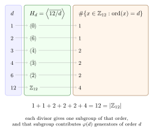
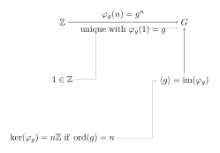

Cyclic groups are the most transparent groups in the subject. They are generated by a single element, their subgroup structure is governed entirely by divisor arithmetic, and they furnish the bridge between number theory and abstract algebra. Many later results --- normal subgroups, quotients, classification of finitely generated abelian groups --- are first learned in the cyclic case before being generalized.

---

## §6.1 Cyclic Groups: Definition and Examples

**Definition 6.1 (Cyclic group).** A group $G$ is **cyclic** if there exists an element $a \in G$ such that every element of $G$ is a power of $a$. One writes $G = \langle a \rangle$. In additive notation, every element has the form $na$ for some $n \in \mathbb{Z}$. The element $a$ is called a **generator** of $G$.

Explicitly, if $a$ has finite order $n$, then
$$
G = \langle a \rangle = \{e, a, a^2, \dots, a^{n-1}\},
$$
and $|G| = n$. If $a$ has infinite order, then all powers $a^k$ ($k \in \mathbb{Z}$) are distinct and $G$ is infinite.

> [!example]- Example 6.1: The integers $\mathbb{Z}$
> The group $(\mathbb{Z}, +)$ is cyclic with generator $1$ (or $-1$). Every integer $n$ can be written as $n \cdot 1$. This is the prototype of an infinite cyclic group.

> [!example]- Example 6.2: $\mathbb{Z}_n$
> The group $(\mathbb{Z}_n, +)$ of integers modulo $n$ is cyclic with generator $\bar{1}$. Every element $\bar{k}$ satisfies $\bar{k} = k \cdot \bar{1}$. This is the prototype of a finite cyclic group of order $n$.

> [!example]- Example 6.3: Roots of unity $\mu_n$
> Let $\zeta = e^{2\pi i/n}$. The set
> $$
> \mu_n = \{1, \zeta, \zeta^2, \dots, \zeta^{n-1}\}
> $$
> forms a cyclic group of order $n$ under multiplication in $\mathbb{C}^*$. The generator $\zeta$ is a **primitive $n$th root of unity**. Geometrically, $\mu_n$ consists of $n$ equally spaced points on the unit circle, and multiplication corresponds to rotation by $2\pi/n$.

> [!example]- Example 6.4: Non-cyclic abelian group
> The Klein four-group $V_4 = \mathbb{Z}_2 \times \mathbb{Z}_2 = \{(0,0),(1,0),(0,1),(1,1)\}$ is abelian but **not** cyclic: every non-identity element has order $2$, so no single element generates the whole group. This is the standard warning that "abelian" and "cyclic" are distinct notions.

---

## §6.2 Every Cyclic Group is Abelian

**Theorem 6.2.** Every cyclic group is abelian.

> [!info]- Proof of Theorem 6.2
> Let $G = \langle a \rangle$. Then every element of $G$ has the form $a^m$ for some $m \in \mathbb{Z}$. For any $a^m, a^n \in G$:
> $$
> a^m \cdot a^n = a^{m+n} = a^{n+m} = a^n \cdot a^m.
> $$
> The key step $a^{m+n} = a^{n+m}$ uses the commutativity of integer addition. Since every pair of elements commutes, $G$ is abelian. $\blacksquare$

The proof is short, but its content is important: once a group is controlled by powers of one element, the group operation reduces to arithmetic on exponents, and integer arithmetic is commutative. The converse is false --- $V_4$ is abelian but not cyclic.

---

## §6.3 Subgroups of Cyclic Groups Are Cyclic

**Theorem 6.3.** Every subgroup of a cyclic group is cyclic.

> [!info]- Proof of Theorem 6.3 (Division algorithm argument)
> Let $G = \langle a \rangle$ and let $H \le G$. If $H = \{e\}$, then $H = \langle e \rangle$ is trivially cyclic. Assume $H \neq \{e\}$.
>
> Consider the set of positive exponents:
> $$
> S = \{m \in \mathbb{N} : a^m \in H\}.
> $$
> Since $H$ contains a non-identity element $a^k$ (with $k \neq 0$), and $H$ is a group so $a^{-k} \in H$ as well, the set $S$ is nonempty (it contains $|k|$). By the well-ordering principle, $S$ has a least element $d$.
>
> **Claim:** $H = \langle a^d \rangle$.
>
> The inclusion $\langle a^d \rangle \subseteq H$ is clear since $a^d \in H$ and $H$ is closed under the group operation.
>
> For the reverse, let $h \in H$. Then $h = a^m$ for some integer $m$. Apply the **division algorithm**: write
> $$
> m = qd + r, \qquad 0 \le r < d.
> $$
> Then
> $$
> a^r = a^{m - qd} = a^m \cdot (a^d)^{-q}.
> $$
> Since $a^m \in H$ and $a^d \in H$, we have $a^r \in H$. But $0 \le r < d$ and $d$ is the smallest positive element of $S$. Therefore $r = 0$, so $m = qd$ and $h = (a^d)^q \in \langle a^d \rangle$.
>
> Hence $H = \langle a^d \rangle$. $\blacksquare$

This proof is a paradigm for the "division algorithm" style of argument: to show a set is generated by its least positive element, divide an arbitrary element by that least element and argue the remainder must vanish.

---

## §6.4 Classification of Cyclic Groups

**Theorem 6.4 (Classification).** Let $G$ be a cyclic group.
- If $G$ is infinite, then $G \cong \mathbb{Z}$.
- If $G$ is finite of order $n$, then $G \cong \mathbb{Z}_n$.

> [!info]- Proof of Theorem 6.4
> Let $G = \langle a \rangle$ and define
> $$
> \varphi : \mathbb{Z} \to G, \qquad k \mapsto a^k.
> $$
> This is a homomorphism: $\varphi(k + l) = a^{k+l} = a^k \cdot a^l = \varphi(k)\varphi(l)$.
> It is surjective by the definition of a cyclic group.
>
> **Case 1: $G$ is infinite.** If $a^k = a^l$ with $k \neq l$, then $a^{k-l} = e$ with $k - l \neq 0$, contradicting the assumption that $a$ has infinite order. So $\varphi$ is injective, hence an isomorphism $\mathbb{Z} \xrightarrow{\;\sim\;} G$.
>
> **Case 2: $G$ is finite of order $n$.** The kernel of $\varphi$ is
> $$
> \ker\varphi = \{k \in \mathbb{Z} : a^k = e\} = n\mathbb{Z},
> $$
> since $a$ has order $n$. By the First Isomorphism Theorem (or by direct verification at this stage), $\varphi$ induces a bijective homomorphism
> $$
> \bar{\varphi} : \mathbb{Z}/n\mathbb{Z} \xrightarrow{\;\sim\;} G, \qquad \bar{k} \mapsto a^k.
> $$
> Therefore $G \cong \mathbb{Z}_n$. $\blacksquare$

This classification says that, up to isomorphism, there are exactly two kinds of cyclic group: $\mathbb{Z}$ and $\mathbb{Z}_n$. Every cyclic group is completely determined by the order of its generator.

---

## §6.5 Order of Elements in $\mathbb{Z}_n$

**Theorem 6.5 (Order formula).** In $\mathbb{Z}_n$, the order of $\bar{k}$ is
$$
\operatorname{ord}(\bar{k}) = \frac{n}{\gcd(k, n)}.
$$

> [!info]- Proof of Theorem 6.5
> Let $d = \gcd(k, n)$. Write $k = dk_1$ and $n = dn_1$ where $\gcd(k_1, n_1) = 1$.
>
> **Step 1 (the order divides $n/d$).** Compute:
> $$
> \frac{n}{d} \cdot \bar{k} = \overline{\frac{n}{d} \cdot k} = \overline{n_1 \cdot dk_1} = \overline{k_1 n} = \bar{0} \pmod{n}.
> $$
> So the order of $\bar{k}$ divides $n/d = n_1$.
>
> **Step 2 (the order is exactly $n/d$).** Suppose $m \cdot \bar{k} = \bar{0}$, i.e., $n \mid mk$. Then $dn_1 \mid mdk_1$, which gives $n_1 \mid mk_1$. Since $\gcd(n_1, k_1) = 1$, Euclid's lemma forces $n_1 \mid m$. Therefore every positive integer killing $\bar{k}$ is a multiple of $n_1 = n/d$.
>
> Hence $\operatorname{ord}(\bar{k}) = n/d = n/\gcd(k,n)$. $\blacksquare$

> [!example]- Example 6.5a: Orders in $\mathbb{Z}_{12}$
> Using $\operatorname{ord}(\bar{k}) = 12/\gcd(k,12)$:
>
> | $\bar{k}$ | $\gcd(k,12)$ | $\operatorname{ord}(\bar{k})$ |
> |:---:|:---:|:---:|
> | $\bar{0}$ | $12$ | $1$ |
> | $\bar{1}$ | $1$ | $12$ |
> | $\bar{2}$ | $2$ | $6$ |
> | $\bar{3}$ | $3$ | $4$ |
> | $\bar{4}$ | $4$ | $3$ |
> | $\bar{5}$ | $1$ | $12$ |
> | $\bar{6}$ | $6$ | $2$ |
> | $\bar{7}$ | $1$ | $12$ |
> | $\bar{8}$ | $4$ | $3$ |
> | $\bar{9}$ | $3$ | $4$ |
> | $\bar{10}$ | $2$ | $6$ |
> | $\bar{11}$ | $1$ | $12$ |

---

## §6.6 Generators of $\mathbb{Z}_n$ and Euler's Totient Function

**Theorem 6.6.** The element $\bar{k}$ generates $\mathbb{Z}_n$ if and only if $\gcd(k, n) = 1$.

> [!info]- Proof of Theorem 6.6
> By Theorem 6.5, $\operatorname{ord}(\bar{k}) = n/\gcd(k,n)$. The element $\bar{k}$ generates $\mathbb{Z}_n$ if and only if $\operatorname{ord}(\bar{k}) = n$, which occurs if and only if $\gcd(k,n) = 1$. $\blacksquare$

**Definition 6.7 (Euler's totient function).** For $n \ge 1$, define
$$
\phi(n) = |\{k : 1 \le k \le n,\; \gcd(k, n) = 1\}|.
$$
Equivalently, $\phi(n)$ is the number of generators of $\mathbb{Z}_n$.

**Corollary 6.8.** The cyclic group $\mathbb{Z}_n$ has exactly $\phi(n)$ generators.

> [!example]- Example 6.6a: Generators of $\mathbb{Z}_{20}$
> The generators of $\mathbb{Z}_{20}$ are the elements $\bar{k}$ with $\gcd(k, 20) = 1$. Since $20 = 2^2 \cdot 5$, we need $k$ to be coprime to both $2$ and $5$:
> $$
> \bar{1},\; \bar{3},\; \bar{7},\; \bar{9},\; \bar{11},\; \bar{13},\; \bar{17},\; \bar{19}.
> $$
> There are $\phi(20) = 20 \cdot (1 - \tfrac{1}{2})(1 - \tfrac{1}{5}) = 20 \cdot \tfrac{1}{2} \cdot \tfrac{4}{5} = 8$ generators.

---

## §6.7 Euler's Totient Function: Formulas

**Theorem 6.9.** For a prime power $p^k$:
$$
\phi(p^k) = p^k - p^{k-1} = p^{k-1}(p-1).
$$

> [!info]- Proof of Theorem 6.9
> Among the integers $1, 2, \dots, p^k$, the ones **not** coprime to $p^k$ are precisely the multiples of $p$:
> $$
> p, 2p, 3p, \dots, p^{k-1} \cdot p.
> $$
> There are $p^{k-1}$ such multiples. Therefore
> $$
> \phi(p^k) = p^k - p^{k-1} = p^{k-1}(p-1). \quad \blacksquare
> $$

**Theorem 6.10 (Multiplicativity).** If $\gcd(m, n) = 1$, then
$$
\phi(mn) = \phi(m)\,\phi(n).
$$

> [!info]- Proof of Theorem 6.10 (sketch via CRT)
> By the Chinese Remainder Theorem, $\mathbb{Z}_{mn} \cong \mathbb{Z}_m \times \mathbb{Z}_n$ when $\gcd(m,n) = 1$. An element $(\bar{a}, \bar{b})$ generates $\mathbb{Z}_m \times \mathbb{Z}_n$ as an additive cyclic group if and only if $\bar{a}$ generates $\mathbb{Z}_m$ and $\bar{b}$ generates $\mathbb{Z}_n$. The number of such pairs is $\phi(m) \cdot \phi(n)$, which must equal $\phi(mn)$. $\blacksquare$

**Corollary 6.11 (General formula).** If $n = p_1^{a_1} p_2^{a_2} \cdots p_r^{a_r}$, then
$$
\phi(n) = n \prod_{i=1}^{r}\left(1 - \frac{1}{p_i}\right) = \prod_{i=1}^{r} p_i^{a_i - 1}(p_i - 1).
$$

> [!example]- Example 6.7a: Computing $\phi(36)$
> Since $36 = 2^2 \cdot 3^2$:
> $$
> \phi(36) = 36 \cdot \left(1 - \frac{1}{2}\right)\left(1 - \frac{1}{3}\right) = 36 \cdot \frac{1}{2} \cdot \frac{2}{3} = 12.
> $$
> Alternatively: $\phi(36) = \phi(4)\,\phi(9) = 2 \cdot 6 = 12$.

> [!example]- Example 6.7b: Computing $\phi(30)$
> Since $30 = 2 \cdot 3 \cdot 5$:
> $$
> \phi(30) = 30 \cdot \frac{1}{2} \cdot \frac{2}{3} \cdot \frac{4}{5} = 8.
> $$

---

## §6.8 Subgroup Lattice of $\mathbb{Z}_n$

**Theorem 6.12 (Subgroups of $\mathbb{Z}_n$).** Let $n \ge 1$. For each divisor $d$ of $n$, there is exactly one subgroup of $\mathbb{Z}_n$ of order $d$, namely $\langle \overline{n/d} \rangle$. Conversely, every subgroup of $\mathbb{Z}_n$ has this form. In particular, the subgroups of $\mathbb{Z}_n$ are in bijection with the positive divisors of $n$.

> [!info]- Proof of Theorem 6.12
> **Existence.** Let $d \mid n$ and set $m = n/d$. By Theorem 6.5,
> $$
> \operatorname{ord}(\bar{m}) = \frac{n}{\gcd(m,n)} = \frac{n}{m} = d,
> $$
> since $m \mid n$ implies $\gcd(m,n) = m$. So $\langle \bar{m} \rangle$ is a subgroup of order $d$.
>
> **Uniqueness.** Let $H \le \mathbb{Z}_n$ with $|H| = d$. By Theorem 6.3, $H = \langle \bar{k} \rangle$ for some $k$. Then
> $$
> d = \operatorname{ord}(\bar{k}) = \frac{n}{\gcd(k,n)},
> $$
> so $\gcd(k,n) = n/d = m$. Write $k = ms$ with $\gcd(s, n/m) = \gcd(s, d) = 1$. Then $\bar{k} = s \cdot \bar{m}$, and since $\gcd(s,d) = 1$, the element $\bar{k}$ generates the same cyclic subgroup as $\bar{m}$. Hence $H = \langle \bar{m} \rangle = \langle \overline{n/d} \rangle$. $\blacksquare$

### Worked Lattice: $\mathbb{Z}_{12}$

The divisors of $12$ are $1, 2, 3, 4, 6, 12$. The subgroups:

| Divisor $d$ | Subgroup $\langle \overline{12/d} \rangle$ | Elements | Order |
|:---:|:---:|:---|:---:|
| $1$ | $\langle \bar{0} \rangle = \{\bar{0}\}$ | $\{\bar{0}\}$ | $1$ |
| $2$ | $\langle \bar{6} \rangle$ | $\{\bar{0}, \bar{6}\}$ | $2$ |
| $3$ | $\langle \bar{4} \rangle$ | $\{\bar{0}, \bar{4}, \bar{8}\}$ | $3$ |
| $4$ | $\langle \bar{3} \rangle$ | $\{\bar{0}, \bar{3}, \bar{6}, \bar{9}\}$ | $4$ |
| $6$ | $\langle \bar{2} \rangle$ | $\{\bar{0}, \bar{2}, \bar{4}, \bar{6}, \bar{8}, \bar{10}\}$ | $6$ |
| $12$ | $\langle \bar{1} \rangle$ | $\mathbb{Z}_{12}$ | $12$ |

The containment relations are:
- $\langle\bar{6}\rangle \subset \langle\bar{3}\rangle \subset \langle\bar{1}\rangle = \mathbb{Z}_{12}$
- $\langle\bar{6}\rangle \subset \langle\bar{2}\rangle \subset \langle\bar{1}\rangle = \mathbb{Z}_{12}$
- $\langle\bar{4}\rangle \subset \langle\bar{2}\rangle$
- $\langle\bar{4}\rangle \subset \langle\bar{1}\rangle$
- $\langle\bar{3}\rangle \subset \langle\bar{1}\rangle$
- $\{\bar{0}\} \subset$ everything

Figure: subgroup lattice of $\mathbb{Z}_{12}$.

Figure: divisors, subgroups, and generators in $\mathbb{Z}_{12}$.

Read that figure row-by-row. For example, the divisor $4$ corresponds to the unique subgroup $\langle \bar{3}\rangle$ of order $4$, and that subgroup contributes exactly $\varphi(4)=2$ generators of order $4$, namely $\bar{3}$ and $\bar{9}$. This is the concrete mechanism behind both Theorem 6.12 and the identity $\sum_{d \mid n}\phi(d)=n$.

### Worked Lattice: $\mathbb{Z}_{30}$

The divisors of $30 = 2 \cdot 3 \cdot 5$ are $1, 2, 3, 5, 6, 10, 15, 30$. The subgroups:

| Divisor $d$ | Subgroup $\langle \overline{30/d} \rangle$ | Order |
|:---:|:---:|:---:|
| $1$ | $\langle \bar{0} \rangle = \{\bar{0}\}$ | $1$ |
| $2$ | $\langle \overline{15} \rangle$ | $2$ |
| $3$ | $\langle \overline{10} \rangle$ | $3$ |
| $5$ | $\langle \bar{6} \rangle$ | $5$ |
| $6$ | $\langle \bar{5} \rangle$ | $6$ |
| $10$ | $\langle \bar{3} \rangle$ | $10$ |
| $15$ | $\langle \bar{2} \rangle$ | $15$ |
| $30$ | $\langle \bar{1} \rangle = \mathbb{Z}_{30}$ | $30$ |

Figure: subgroup lattice of $\mathbb{Z}_{30}$.

Read it by divisor arithmetic: $\langle \overline{30/d_1}\rangle \subseteq \langle \overline{30/d_2}\rangle$ exactly when $d_1 \mid d_2$. For example, the order-$15$ subgroup $\langle \bar{2}\rangle$ contains the order-$5$ and order-$3$ subgroups, but not the order-$2$ subgroup.

The containment rule is: $\langle \overline{n/d_1} \rangle \subseteq \langle \overline{n/d_2} \rangle$ if and only if $d_1 \mid d_2$.

### Worked Lattice: $\mathbb{Z}_{36}$

The divisors of $36 = 2^2 \cdot 3^2$ are $1, 2, 3, 4, 6, 9, 12, 18, 36$. The subgroups:

| Divisor $d$ | Generator $\overline{36/d}$ | Order |
|:---:|:---:|:---:|
| $1$ | $\bar{0}$ | $1$ |
| $2$ | $\overline{18}$ | $2$ |
| $3$ | $\overline{12}$ | $3$ |
| $4$ | $\bar{9}$ | $4$ |
| $6$ | $\bar{6}$ | $6$ |
| $9$ | $\bar{4}$ | $9$ |
| $12$ | $\bar{3}$ | $12$ |
| $18$ | $\bar{2}$ | $18$ |
| $36$ | $\bar{1}$ | $36$ |

The containment lattice is the divisibility lattice of $36$:
$$
\begin{array}{ccccccccc}
\phantom{\langle\overline{18}\rangle} & & & & \mathbb{Z}_{36} & & & & \phantom{\langle\overline{18}\rangle} \\[6pt]
& & & \swarrow & & \searrow & & & \\[6pt]
& & \langle\bar{2}\rangle & & & & \langle\bar{3}\rangle & & \\[6pt]
& \swarrow & & \searrow & & \swarrow & & \searrow & \\[6pt]
\langle\bar{4}\rangle & & & & \langle\bar{6}\rangle & & & & \langle\bar{9}\rangle \\[6pt]
& \searrow & & \swarrow & & \searrow & & \swarrow & \\[6pt]
& & \langle\overline{12}\rangle & & & & \langle\overline{18}\rangle & & \\[6pt]
& & & \searrow & & \swarrow & & & \\[6pt]
& & & & \{\bar{0}\} & & & &
\end{array}
$$

Here orders 18 and 12 are the maximal proper subgroups; their intersection is $\langle \bar{6} \rangle$ of order 6.

---

## §6.9 The Identity $\sum_{d \mid n} \phi(d) = n$

**Theorem 6.13.** For every positive integer $n$,
$$
\sum_{d \mid n} \phi(d) = n.
$$

> [!info]- Proof of Theorem 6.13 (partition of $\mathbb{Z}_n$ by generator order)
> Consider the cyclic group $\mathbb{Z}_n$. For each element $\bar{k} \in \mathbb{Z}_n$, the order $\operatorname{ord}(\bar{k})$ is some divisor $d$ of $n$. The element $\bar{k}$ generates the unique subgroup of order $d$, which is isomorphic to $\mathbb{Z}_d$.
>
> Now partition $\mathbb{Z}_n$ according to which subgroup each element generates. For each divisor $d$ of $n$, the unique subgroup of order $d$ has exactly $\phi(d)$ generators (the elements of $\mathbb{Z}_n$ whose order is exactly $d$).
>
> Every element of $\mathbb{Z}_n$ generates exactly one cyclic subgroup, and its order equals the order of the element. Since the elements of order $d$ are precisely the generators of the unique subgroup of order $d$, and there are $\phi(d)$ of them, we obtain
> $$
> n = |\mathbb{Z}_n| = \sum_{d \mid n} (\text{number of elements of order } d) = \sum_{d \mid n} \phi(d). \quad \blacksquare
> $$

> [!example]- Example 6.9a: Verification for $n = 12$
> Divisors of $12$: $1, 2, 3, 4, 6, 12$.
> $$
> \phi(1) + \phi(2) + \phi(3) + \phi(4) + \phi(6) + \phi(12) = 1 + 1 + 2 + 2 + 2 + 4 = 12. \;\checkmark
> $$

---

## §6.10 Worked Examples

### Example 6.10a: All generators of $\mathbb{Z}_{20}$

We need all $\bar{k}$ with $1 \le k \le 20$ and $\gcd(k, 20) = 1$. Since $20 = 2^2 \cdot 5$:
$$
\gcd(k,20) = 1 \iff k \text{ is odd and not divisible by } 5.
$$

The generators are:
$$
\bar{1},\; \bar{3},\; \bar{7},\; \bar{9},\; \bar{11},\; \bar{13},\; \bar{17},\; \bar{19}.
$$
Count: $\phi(20) = 20(1 - \tfrac{1}{2})(1 - \tfrac{1}{5}) = 8$. $\checkmark$

### Example 6.10b: All subgroups of $\mathbb{Z}_{18}$

Since $18 = 2 \cdot 3^2$, the divisors of $18$ are $1, 2, 3, 6, 9, 18$.

| Divisor $d$ | Generator $\overline{18/d}$ | Subgroup | Order |
|:---:|:---:|:---|:---:|
| $1$ | $\bar{0}$ | $\{\bar{0}\}$ | $1$ |
| $2$ | $\bar{9}$ | $\{\bar{0}, \bar{9}\}$ | $2$ |
| $3$ | $\bar{6}$ | $\{\bar{0}, \bar{6}, \overline{12}\}$ | $3$ |
| $6$ | $\bar{3}$ | $\{\bar{0}, \bar{3}, \bar{6}, \bar{9}, \overline{12}, \overline{15}\}$ | $6$ |
| $9$ | $\bar{2}$ | $\{\bar{0}, \bar{2}, \bar{4}, \bar{6}, \bar{8}, \overline{10}, \overline{12}, \overline{14}, \overline{16}\}$ | $9$ |
| $18$ | $\bar{1}$ | $\mathbb{Z}_{18}$ | $18$ |

There are exactly $6$ subgroups --- one for each divisor.

### Example 6.10c: Order of every element in $\mathbb{Z}_{12}$

Using $\operatorname{ord}(\bar{k}) = 12/\gcd(k,12)$, here is the complete table:

$$
\begin{array}{c|cccccccccccc}
\bar{k} & \bar{0} & \bar{1} & \bar{2} & \bar{3} & \bar{4} & \bar{5} & \bar{6} & \bar{7} & \bar{8} & \bar{9} & \overline{10} & \overline{11} \\
\hline
\operatorname{ord}(\bar{k}) & 1 & 12 & 6 & 4 & 3 & 12 & 2 & 12 & 3 & 4 & 6 & 12
\end{array}
$$

Observe: the number of elements of each order matches $\phi(d)$:
- Order $1$: $1$ element ($\phi(1) = 1$)
- Order $2$: $1$ element ($\phi(2) = 1$)
- Order $3$: $2$ elements ($\phi(3) = 2$)
- Order $4$: $2$ elements ($\phi(4) = 2$)
- Order $6$: $2$ elements ($\phi(6) = 2$)
- Order $12$: $4$ elements ($\phi(12) = 4$)

Sum: $1+1+2+2+2+4 = 12$. $\checkmark$

---

## §6.11 Lang's Perspective: $\mathbb{Z}$ as the Free Cyclic Group

Lang's point is stronger than the slogan "every cyclic group is either $\mathbb{Z}$ or $\mathbb{Z}_n$." He begins from a **universal property**.

**Theorem 6.14 (Universal property of $\mathbb{Z}$).** Let $G$ be a group and let $g \in G$. Then there exists a unique group homomorphism
$$
\varphi_g : \mathbb{Z} \to G
$$
such that
$$
\varphi_g(1) = g.
$$
In multiplicative notation this homomorphism is
$$
\varphi_g(n) = g^n \qquad (n \in \mathbb{Z}).
$$

> [!info]- Proof of Theorem 6.14
> **Existence.** Define
> $$
> \varphi_g(n) = g^n
> $$
> for all integers $n$. We must check the homomorphism law:
> $$
> \varphi_g(m+n) = g^{m+n} = g^m g^n = \varphi_g(m)\varphi_g(n).
> $$
> So $\varphi_g$ is a homomorphism, and clearly $\varphi_g(1) = g$.
>
> **Uniqueness.** Let $\psi : \mathbb{Z} \to G$ be any homomorphism with $\psi(1)=g$. Then for every positive integer $n$,
> $$
> \psi(n)=\psi(\underbrace{1+\cdots+1}_{n\text{ times}})=\psi(1)^n=g^n.
> $$
> Also,
> $$
> e=\psi(0)=\psi(n+(-n))=\psi(n)\psi(-n),
> $$
> so $\psi(-n)=\psi(n)^{-1}=g^{-n}$. Hence $\psi(n)=g^n$ for every integer $n$. Therefore $\psi=\varphi_g$. $\blacksquare$

This is the precise sense in which $\mathbb{Z}$ is "free on one generator": once you specify where the generator $1$ goes, the entire homomorphism is forced.

Figure: the universal property of $\mathbb{Z}$ as the free cyclic group.

To specify a homomorphism out of $\mathbb{Z}$, it is enough to specify the image of $1$; the rest of the map is forced.

**Corollary 6.15.** The image of $\varphi_g$ is the cyclic subgroup generated by $g$:
$$
\operatorname{im}(\varphi_g)=\langle g\rangle.
$$

> [!info]- Proof of Corollary 6.15
> By definition,
> $$
> \operatorname{im}(\varphi_g)=\{\varphi_g(n):n\in\mathbb{Z}\}=\{g^n:n\in\mathbb{Z}\}=\langle g\rangle.
> $$
> So the cyclic subgroup generated by $g$ is not merely "like" the image of a map from $\mathbb{Z}$; it literally is that image. $\blacksquare$

**Corollary 6.16.** The kernel of $\varphi_g$ is:
- $\{0\}$ if $g$ has infinite order.
- $n\mathbb{Z}$ if $g$ has finite order $n$.

> [!info]- Proof of Corollary 6.16
> By definition,
> $$
> \ker(\varphi_g)=\{m\in\mathbb{Z}:g^m=e\}.
> $$
> If $g$ has infinite order, the only such integer is $0$.
>
> If $g$ has finite order $n$, then $g^m=e$ if and only if $n \mid m$. So
> $$
> \ker(\varphi_g)=n\mathbb{Z}.
> $$
> $\blacksquare$

Now the classification of cyclic groups becomes almost inevitable:

**Corollary 6.17 (Classification reinterpreted).** Every cyclic group is a quotient of $\mathbb{Z}$ by one of its subgroups. More precisely:
- if $g$ has infinite order, then $\langle g\rangle \cong \mathbb{Z}$;
- if $g$ has finite order $n$, then
$$
\langle g\rangle \cong \mathbb{Z}/n\mathbb{Z}.
$$

> [!info]- Proof of Corollary 6.17
> The image of $\varphi_g$ is $\langle g\rangle$ by Corollary 6.15. If $\ker(\varphi_g)=\{0\}$, then $\varphi_g$ is injective and $\langle g\rangle \cong \mathbb{Z}$.
>
> If $\ker(\varphi_g)=n\mathbb{Z}$, then by the First Isomorphism Theorem,
> $$
> \mathbb{Z}/n\mathbb{Z}\cong \operatorname{im}(\varphi_g)=\langle g\rangle.
> $$
> $\blacksquare$

This packages several earlier facts into one picture:
- **Subgroups of $\mathbb{Z}$** are exactly the kernels that can occur, so they must be of the form $n\mathbb{Z}$.
- **Quotients of $\mathbb{Z}$** are exactly the cyclic groups.
- **Finite versus infinite cyclic** is controlled entirely by whether the chosen generator has nontrivial kernel.

### Two concrete checks of the universal property

1. Take $G=\mathbb{Z}_{12}$ and $g=\bar{5}$. The unique homomorphism
   $$
   \varphi_{\bar{5}}:\mathbb{Z}\to\mathbb{Z}_{12}, \qquad n\mapsto \overline{5n}
   $$
   has image $\langle\bar{5}\rangle=\mathbb{Z}_{12}$ because $\gcd(5,12)=1$. Its kernel is $12\mathbb{Z}$ because $\bar{5}$ has order $12$.

2. Take $G=\mathbb{Z}_{12}$ and $g=\bar{4}$. Then
   $$
   \varphi_{\bar{4}}:\mathbb{Z}\to\mathbb{Z}_{12}, \qquad n\mapsto \overline{4n}
   $$
   has image
   $$
   \{\bar{0},\bar{4},\bar{8}\}=\langle\bar{4}\rangle
   $$
   and kernel $3\mathbb{Z}$ because $\bar{4}$ has order $3$. Therefore
   $$
   \mathbb{Z}/3\mathbb{Z}\cong \langle\bar{4}\rangle.
   $$

These examples are worth lingering over because they show the generator, the image, and the kernel all at once. In Lang's style, a cyclic group is best understood not as a bare set with a generator, but as the image of the unique map out of the universal cyclic object $\mathbb{Z}$.

---

## Bridge to Chapters 13 and 14 -- from $\mathbb{Z}$ to homomorphisms and quotients

The universal-property section is where Chapter 6 stops being only about generators and starts becoming about maps.

Start with an element $g \in G$. The universal property gives a unique homomorphism
$$
\varphi_g:\mathbb{Z}\to G,\qquad \varphi_g(1)=g.
$$
That one map already contains three later chapters in embryo:

- the **image** is the cyclic subgroup $\langle g\rangle$;
- the **kernel** records the order of $g$;
- the **quotient** $\mathbb{Z}/\ker(\varphi_g)$ is isomorphic to $\langle g\rangle$.

So the real structural route is
$$
\mathbb{Z}\text{ as free cyclic object}
\;\longrightarrow\;
\text{homomorphisms out of }\mathbb{Z}
\;\longrightarrow\;
\text{kernels }n\mathbb{Z}
\;\longrightarrow\;
\mathbb{Z}/n\mathbb{Z}
\;\longrightarrow\;
\text{classification of cyclic groups}.
$$

This becomes completely concrete when $g=\bar{1}\in \mathbb{Z}_n$. The corresponding homomorphism is the remainder map
$$
\rho_n:\mathbb{Z}\to \mathbb{Z}_n,\qquad \rho_n(m)=\bar{m}.
$$
Its image is all of $\mathbb{Z}_n$, its kernel is $n\mathbb{Z}$, and the First Isomorphism Theorem from [Chapter 13 - Homomorphisms](./Chapter%2013%20-%20Homomorphisms.md) will say
$$
\mathbb{Z}/n\mathbb{Z}\cong \mathbb{Z}_n.
$$

Then [Chapter 14 - Factor Groups](./Chapter%2014%20-%20Factor%20Groups.md) reframes the same fact as a quotient-group construction: the residue classes modulo $n$ are the cosets of the normal subgroup $n\mathbb{Z}$ in $\mathbb{Z}$.

That is why Chapter 6 is much more than a list of examples of cyclic groups. It is the first place where the whole kernel-image-quotient pattern is already visible in a familiar setting.

---

