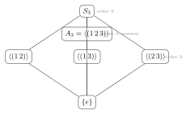

Permutation groups are where the course becomes computationally exact. A permutation is not an abstract symbol with a declared product; it is a concrete bijection, and its multiplication is composition of functions. This chapter matters because it makes group calculations explicit, and because Cayley's theorem shows that every group can be realized inside a symmetric group. Everything here should feel operational: you should be able to carry out these computations by hand, quickly and without error.

---

## §8.1 Permutations and the symmetric group

### Definition 8.1 (Permutation)

A **permutation** of a set $A$ is a bijection $\sigma : A \to A$. The set of all permutations of $A$, equipped with composition, is denoted $S_A$ and is called the **symmetric group on $A$**.

When $A = \{1, 2, \ldots, n\}$, we write $S_n$ and call it the **symmetric group on $n$ letters**. We have $|S_n| = n!$.

### Theorem 8.2. $S_A$ is a group under composition.

> [!info]- Proof
>
> We verify the group axioms.
>
> *Closure.* If $\sigma, \tau : A \to A$ are bijections, then $\sigma \circ \tau : A \to A$ is also a bijection (composition of bijections is a bijection).
>
> *Associativity.* Composition of functions is always associative: for all $x \in A$,
> $$
> ((\sigma \circ \tau) \circ \mu)(x) = (\sigma \circ \tau)(\mu(x)) = \sigma(\tau(\mu(x))) = \sigma((\tau \circ \mu)(x)) = (\sigma \circ (\tau \circ \mu))(x).
> $$
>
> *Identity.* The identity function $\iota : A \to A$ defined by $\iota(x) = x$ satisfies $\sigma \circ \iota = \iota \circ \sigma = \sigma$ for all $\sigma$.
>
> *Inverses.* Since $\sigma$ is a bijection, it has an inverse function $\sigma^{-1}$ which is also a bijection, and $\sigma \circ \sigma^{-1} = \sigma^{-1} \circ \sigma = \iota$. $\blacksquare$

### Remark 8.3 (Non-commutativity)

For $n \geq 3$, the group $S_n$ is **non-abelian**. This will be demonstrated explicitly in the worked examples below. The failure of commutativity is not pathological; it is the generic situation for permutation groups.

### Convention (Composition order)

Throughout these notes, as in Fraleigh and most algebra texts, we compose **right to left**:
$$
(\sigma\tau)(x) = \sigma(\tau(x)).
$$
This means: **apply $\tau$ first, then $\sigma$**. When computing $\sigma\tau$, trace what happens to each element by feeding it through $\tau$ and then through $\sigma$.

---

## §8.2 Two-line notation

### Definition 8.4 (Two-line notation)

A permutation $\sigma \in S_n$ can be written as a $2 \times n$ array
$$
\sigma = \begin{pmatrix} 1 & 2 & 3 & \cdots & n \\ \sigma(1) & \sigma(2) & \sigma(3) & \cdots & \sigma(n) \end{pmatrix},
$$
where the top row lists the elements of $\{1, \ldots, n\}$ and the bottom row lists their images under $\sigma$.

> [!tip] Intuition: why does a permutation look like a matrix?
>
> A permutation $\sigma$ is a function, and any function on a finite set is determined by listing its values. The two-line notation is nothing more than a **lookup table**: each column pairs an input (top) with its output (bottom), so column $k$ says "$k \mapsto \sigma(k)$." We arrange the inputs in order purely for convenience — it makes reading off $\sigma(k)$ instant.
>
> The resemblance to a matrix is not accidental. Every $\sigma \in S_n$ defines an honest $n \times n$ **permutation matrix** $P_\sigma$ by placing a single $1$ in each row and column:
> $$(P_\sigma)_{ij} = \begin{cases} 1 & \text{if } \sigma(j) = i, \\ 0 & \text{otherwise.}\end{cases}$$
> The two-line array is a compressed encoding of $P_\sigma$: instead of writing $n^2$ entries (mostly zeros), we record only the $n$ positions of the $1$'s. And just as matrix multiplication encodes composition of linear maps, composing permutation matrices corresponds to composing permutations — so the algebraic structure carries over exactly.

**Example 8.5.** The permutation $\sigma \in S_4$ defined by
$$
\sigma = \begin{pmatrix} 1 & 2 & 3 & 4 \\ 3 & 1 & 4 & 2 \end{pmatrix}
$$
means $\sigma(1) = 3$, $\sigma(2) = 1$, $\sigma(3) = 4$, $\sigma(4) = 2$.

### Composing permutations in two-line notation

To compute $\sigma\tau$, remember: apply $\tau$ first, then $\sigma$.

**Example 8.6.** Let
$$
\sigma = \begin{pmatrix} 1 & 2 & 3 & 4 \\ 3 & 1 & 4 & 2 \end{pmatrix}, \qquad
\tau = \begin{pmatrix} 1 & 2 & 3 & 4 \\ 2 & 4 & 1 & 3 \end{pmatrix}.
$$

**Computing $\sigma\tau$:** For each $x$, compute $\sigma(\tau(x))$.
$$
\begin{aligned}
1 &\xrightarrow{\tau} 2 \xrightarrow{\sigma} 1, \\
2 &\xrightarrow{\tau} 4 \xrightarrow{\sigma} 2, \\
3 &\xrightarrow{\tau} 1 \xrightarrow{\sigma} 3, \\
4 &\xrightarrow{\tau} 3 \xrightarrow{\sigma} 4.
\end{aligned}
$$
So $\sigma\tau = \begin{pmatrix} 1 & 2 & 3 & 4 \\ 1 & 2 & 3 & 4 \end{pmatrix} = \iota$, the identity.

**Computing $\tau\sigma$:** For each $x$, compute $\tau(\sigma(x))$.
$$
\begin{aligned}
1 &\xrightarrow{\sigma} 3 \xrightarrow{\tau} 1, \\
2 &\xrightarrow{\sigma} 1 \xrightarrow{\tau} 2, \\
3 &\xrightarrow{\sigma} 4 \xrightarrow{\tau} 3, \\
4 &\xrightarrow{\sigma} 2 \xrightarrow{\tau} 4.
\end{aligned}
$$
So $\tau\sigma = \begin{pmatrix} 1 & 2 & 3 & 4 \\ 1 & 2 & 3 & 4 \end{pmatrix} = \iota$ also.

In this particular example $\sigma\tau = \tau\sigma = \iota$, so $\tau = \sigma^{-1}$. This is a special case; in general $\sigma\tau \neq \tau\sigma$.

**Example 8.7.** Let $\alpha, \beta \in S_4$ be given by
$$
\alpha = \begin{pmatrix} 1 & 2 & 3 & 4 \\ 2 & 3 & 1 & 4 \end{pmatrix}, \qquad
\beta = \begin{pmatrix} 1 & 2 & 3 & 4 \\ 1 & 3 & 2 & 4 \end{pmatrix}.
$$

**$\alpha\beta$:** Apply $\beta$ first, then $\alpha$.
$$
1 \xrightarrow{\beta} 1 \xrightarrow{\alpha} 2, \quad
2 \xrightarrow{\beta} 3 \xrightarrow{\alpha} 1, \quad
3 \xrightarrow{\beta} 2 \xrightarrow{\alpha} 3, \quad
4 \xrightarrow{\beta} 4 \xrightarrow{\alpha} 4.
$$
So $\alpha\beta = \begin{pmatrix} 1 & 2 & 3 & 4 \\ 2 & 1 & 3 & 4 \end{pmatrix}$.

**$\beta\alpha$:** Apply $\alpha$ first, then $\beta$.
$$
1 \xrightarrow{\alpha} 2 \xrightarrow{\beta} 3, \quad
2 \xrightarrow{\alpha} 3 \xrightarrow{\beta} 2, \quad
3 \xrightarrow{\alpha} 1 \xrightarrow{\beta} 1, \quad
4 \xrightarrow{\alpha} 4 \xrightarrow{\beta} 4.
$$
So $\beta\alpha = \begin{pmatrix} 1 & 2 & 3 & 4 \\ 3 & 2 & 1 & 4 \end{pmatrix}$.

Since $\alpha\beta \neq \beta\alpha$, this confirms $S_4$ is non-abelian.

---

## §8.3 Cycle notation

### Definition 8.8 (Cycle)

A **$k$-cycle** (or cycle of length $k$) is a permutation $\sigma$ for which there exist distinct elements $a_1, a_2, \ldots, a_k$ such that
$$
\sigma(a_1) = a_2, \quad \sigma(a_2) = a_3, \quad \ldots, \quad \sigma(a_{k-1}) = a_k, \quad \sigma(a_k) = a_1,
$$
and $\sigma$ fixes all other elements. We write this cycle as
$$
(a_1 \; a_2 \; \cdots \; a_k).
$$

A $2$-cycle is called a **transposition**. A $1$-cycle $(a)$ is the identity on $\{a\}$ and is usually omitted.

**Example 8.9.** In $S_5$, the cycle $(1 \; 3 \; 5)$ is the permutation
$$
1 \mapsto 3, \quad 3 \mapsto 5, \quad 5 \mapsto 1, \quad 2 \mapsto 2, \quad 4 \mapsto 4.
$$
In two-line notation:
$$
(1\;3\;5) = \begin{pmatrix} 1 & 2 & 3 & 4 & 5 \\ 3 & 2 & 5 & 4 & 1 \end{pmatrix}.
$$

### Converting from two-line notation to cycle notation

Start with the smallest element. Follow its orbit under $\sigma$ until you return to the start. Record this as a cycle. Then take the smallest element not yet accounted for and repeat.

**Example 8.10.** Convert the following to cycle notation:
$$
\sigma = \begin{pmatrix} 1 & 2 & 3 & 4 & 5 & 6 \\ 3 & 5 & 1 & 6 & 2 & 4 \end{pmatrix}.
$$

- Start with $1$: $1 \to 3 \to 1$. Cycle: $(1\;3)$.

  Wait -- let us trace more carefully. $\sigma(1)=3$, $\sigma(3)=1$. So $1 \to 3 \to 1$. This gives the cycle $(1\;3)$.

- Smallest unused: $2$. $\sigma(2)=5$, $\sigma(5)=2$. Cycle: $(2\;5)$.

- Smallest unused: $4$. $\sigma(4)=6$, $\sigma(6)=4$. Cycle: $(4\;6)$.

Therefore $\sigma = (1\;3)(2\;5)(4\;6)$.

**Verification:** $(1\;3)(2\;5)(4\;6)$ sends $1\to 3$, $2\to 5$, $3\to 1$, $4\to 6$, $5\to 2$, $6\to 4$. This matches the two-line notation. $\checkmark$

**Example 8.11.** Convert to cycle notation:
$$
\tau = \begin{pmatrix} 1 & 2 & 3 & 4 & 5 \\ 4 & 2 & 5 & 1 & 3 \end{pmatrix}.
$$

- Start with $1$: $1 \to 4 \to 1$. Cycle: $(1\;4)$.
- Smallest unused: $2$. $\sigma(2) = 2$, so $2$ is a fixed point (omit).
- Smallest unused: $3$. $3 \to 5 \to 3$. Cycle: $(3\;5)$.

Therefore $\tau = (1\;4)(3\;5)$.

---

## §8.4 Disjoint cycle decomposition

### Definition 8.12 (Disjoint cycles)

Two cycles $(a_1\;\cdots\;a_j)$ and $(b_1\;\cdots\;b_k)$ are **disjoint** if $\{a_1,\ldots,a_j\} \cap \{b_1,\ldots,b_k\} = \emptyset$; that is, no element appears in both cycles.

### Theorem 8.13 (Disjoint cycle decomposition)

Every permutation $\sigma \in S_n$ can be written as a product of **disjoint cycles**. This decomposition is unique up to the order in which the cycles are listed (and up to omission of $1$-cycles).

> [!info]- Proof
>
> **Existence.** Let $\sigma \in S_n$. Define the orbit of $x$ under $\sigma$ to be
> $$
> \operatorname{Orb}_\sigma(x) = \{x, \sigma(x), \sigma^2(x), \ldots\}.
> $$
> Since $\{1,\ldots,n\}$ is finite and $\sigma$ is injective, repeated application of $\sigma$ starting from $x$ must eventually revisit a value. The first repeated value must be $x$ itself: if $\sigma^i(x) = \sigma^j(x)$ with $i < j$, then injectivity gives $x = \sigma^{j-i}(x)$. So the orbit of $x$ is
> $$
> \{x, \sigma(x), \sigma^2(x), \ldots, \sigma^{m-1}(x)\}
> $$
> for some $m \geq 1$, and $\sigma$ acts on this set as the cycle $(x\;\sigma(x)\;\sigma^2(x)\;\cdots\;\sigma^{m-1}(x))$.
>
> The orbits of $\sigma$ partition $\{1,\ldots,n\}$ (this is a general fact about equivalence relations: define $x \sim y$ iff $y = \sigma^k(x)$ for some integer $k$). On each orbit, $\sigma$ acts as a cycle. Multiplying these cycles together (in any order -- they are disjoint) recovers $\sigma$.
>
> **Uniqueness.** Suppose $\sigma = \gamma_1 \gamma_2 \cdots \gamma_r = \delta_1 \delta_2 \cdots \delta_s$ are two disjoint cycle decompositions. For any $a \in \{1,\ldots,n\}$, the cycle containing $a$ on the left side must produce the same orbit as the cycle containing $a$ on the right side (since both sides equal $\sigma$, they agree on every element). So the cycles are determined by the orbits of $\sigma$, which are determined by $\sigma$ itself. The two decompositions consist of the same cycles, possibly listed in different order. $\blacksquare$

---

## §8.5 Algebra of cycles

### Theorem 8.14 (Inverse of a cycle)

If $\sigma = (a_1\;a_2\;\cdots\;a_k)$, then
$$
\sigma^{-1} = (a_k\;a_{k-1}\;\cdots\;a_1).
$$

> [!info]- Proof
>
> Let $\tau = (a_k\;a_{k-1}\;\cdots\;a_1)$. We must show $\sigma\tau = \iota$. For any $a_i$ in the cycle (where $1 \leq i \leq k$):
>
> - $\tau$ sends $a_i$ to the element **preceding** $a_i$ in the sequence $a_k, a_{k-1}, \ldots, a_1$. The element following $a_i$ in $(a_k\;a_{k-1}\;\cdots\;a_1)$ is $a_{i-1}$ (indices mod $k$, with the convention $a_0 = a_k$). So $\tau(a_i) = a_{i-1}$.
> - Then $\sigma(a_{i-1}) = a_i$.
>
> So $(\sigma\tau)(a_i) = \sigma(\tau(a_i)) = \sigma(a_{i-1}) = a_i$.
>
> For elements not in the cycle, both $\sigma$ and $\tau$ fix them. So $\sigma\tau = \iota$. $\blacksquare$

**Example 8.15.** $(1\;3\;5\;2)^{-1} = (2\;5\;3\;1) = (1\;2\;5\;3)$ (same cycle, different starting point).

### Theorem 8.16 (Disjoint cycles commute)

If $\alpha$ and $\beta$ are disjoint cycles, then $\alpha\beta = \beta\alpha$.

> [!info]- Proof
>
> Let $\alpha = (a_1\;\cdots\;a_j)$ and $\beta = (b_1\;\cdots\;b_k)$ be disjoint. We check $(\alpha\beta)(x) = (\beta\alpha)(x)$ for every $x$.
>
> **Case 1:** $x = a_i$ for some $i$ (i.e., $x$ is in $\alpha$'s cycle). Since $\alpha$ and $\beta$ are disjoint, $\beta$ fixes $a_i$, so $\beta(a_i) = a_i$. Also, $\alpha(a_i) = a_{i+1}$ (indices mod $j$), and $\beta$ fixes $a_{i+1}$ too. Then:
> $$
> (\alpha\beta)(a_i) = \alpha(\beta(a_i)) = \alpha(a_i) = a_{i+1},
> $$
> $$
> (\beta\alpha)(a_i) = \beta(\alpha(a_i)) = \beta(a_{i+1}) = a_{i+1}.
> $$
>
> **Case 2:** $x = b_i$ for some $i$ (symmetric argument). Both sides give $b_{i+1}$.
>
> **Case 3:** $x$ is in neither cycle. Both $\alpha$ and $\beta$ fix $x$, so both compositions fix $x$.
>
> In all cases, $(\alpha\beta)(x) = (\beta\alpha)(x)$. $\blacksquare$

### Theorem 8.17 (Order of a cycle)

The order of a $k$-cycle is $k$.

> [!info]- Proof
>
> Let $\sigma = (a_1\;a_2\;\cdots\;a_k)$. Then $\sigma^t(a_1) = a_{1+t \bmod k}$. (Here we index cyclically: $a_{k+1} = a_1$, etc.) This equals $a_1$ if and only if $k \mid t$. The smallest positive such $t$ is $k$. $\blacksquare$

### Theorem 8.18 (Order of a permutation)

If $\sigma = \gamma_1 \gamma_2 \cdots \gamma_r$ is the disjoint cycle decomposition and the cycles have lengths $m_1, m_2, \ldots, m_r$, then
$$
\operatorname{ord}(\sigma) = \operatorname{lcm}(m_1, m_2, \ldots, m_r).
$$

> [!info]- Proof
>
> Since the $\gamma_i$ are disjoint, they commute (Theorem 8.16). Therefore
> $$
> \sigma^t = \gamma_1^t \gamma_2^t \cdots \gamma_r^t.
> $$
> Now $\sigma^t = \iota$ if and only if $\gamma_i^t = \iota$ for each $i$ (because the cycles act on disjoint sets of elements: $\gamma_i^t$ is the identity on the support of $\gamma_i$ if and only if $\gamma_i^t = \iota$ as a permutation, and the $\gamma_i$ have disjoint supports).
>
> By Theorem 8.17, $\gamma_i^t = \iota$ if and only if $m_i \mid t$. The smallest positive $t$ divisible by all $m_i$ is $\operatorname{lcm}(m_1, \ldots, m_r)$. $\blacksquare$

**Example 8.19.** The permutation $\sigma = (1\;2\;3)(4\;5)(6\;7\;8\;9) \in S_9$ has disjoint cycle lengths $3, 2, 4$. Therefore
$$
\operatorname{ord}(\sigma) = \operatorname{lcm}(3, 2, 4) = 12.
$$

**Example 8.20.** The permutation $\tau = (1\;2)(3\;4\;5\;6\;7) \in S_7$ has cycle lengths $2, 5$. So
$$
\operatorname{ord}(\tau) = \operatorname{lcm}(2, 5) = 10.
$$

---

## §8.6 Every permutation is a product of transpositions

### Theorem 8.21 (Transposition decomposition of a cycle)

Every $k$-cycle can be written as a product of transpositions:
$$
(a_1\;a_2\;\cdots\;a_k) = (a_1\;a_k)(a_1\;a_{k-1})\cdots(a_1\;a_3)(a_1\;a_2).
$$

> [!info]- Proof
>
> We prove this by checking both sides agree on every element.
>
> Let $\sigma = (a_1\;a_2\;\cdots\;a_k)$ and let $\rho = (a_1\;a_k)(a_1\;a_{k-1})\cdots(a_1\;a_2)$.
>
> **On $a_1$:** The rightmost transposition $(a_1\;a_2)$ sends $a_1 \mapsto a_2$. Since $a_2 \neq a_1$ and $a_2$ does not appear as the second entry of any of the remaining transpositions $(a_1\;a_3), \ldots, (a_1\;a_k)$ (each of these only moves $a_1$ and one other element $a_j$ with $j \geq 3$), all remaining transpositions fix $a_2$. So $\rho(a_1) = a_2 = \sigma(a_1)$. $\checkmark$
>
> **On $a_i$ for $2 \leq i \leq k-1$:** The rightmost transposition $(a_1\;a_2)$ fixes $a_i$ (since $i \geq 2$ and $a_i \neq a_1$). Similarly, $(a_1\;a_3), \ldots, (a_1\;a_{i-1})$ all fix $a_i$. Then $(a_1\;a_i)$ sends $a_i \mapsto a_1$. Then $(a_1\;a_{i+1})$ sends $a_1 \mapsto a_{i+1}$. The remaining transpositions $(a_1\;a_{i+2}), \ldots, (a_1\;a_k)$ all fix $a_{i+1}$. So $\rho(a_i) = a_{i+1} = \sigma(a_i)$. $\checkmark$
>
> **On $a_k$:** The transpositions $(a_1\;a_2), \ldots, (a_1\;a_{k-1})$ all fix $a_k$. Then $(a_1\;a_k)$ sends $a_k \mapsto a_1$. There are no transpositions to the left. So $\rho(a_k) = a_1 = \sigma(a_k)$. $\checkmark$
>
> **On elements not in the cycle:** All transpositions fix such elements, so $\rho$ fixes them too. $\checkmark$
>
> Since $\sigma$ and $\rho$ agree on all elements, $\sigma = \rho$. $\blacksquare$

### Corollary 8.22

Every permutation in $S_n$ ($n \geq 2$) can be written as a product of transpositions.

> [!info]- Proof
>
> Write the permutation as a product of disjoint cycles (Theorem 8.13). Apply Theorem 8.21 to each cycle. The resulting product of transpositions equals the original permutation. $\blacksquare$

**Example 8.23.** Express $(1\;3\;5\;2\;4)$ as a product of transpositions.

By Theorem 8.21:
$$
(1\;3\;5\;2\;4) = (1\;4)(1\;2)(1\;5)(1\;3).
$$

**Verification.** Apply right to left to each element:
$$
\begin{aligned}
1 &\xrightarrow{(1\;3)} 3 \xrightarrow{(1\;5)} 3 \xrightarrow{(1\;2)} 3 \xrightarrow{(1\;4)} 3. \quad \checkmark \text{ (since } \sigma(1)=3\text{)} \\
3 &\xrightarrow{(1\;3)} 1 \xrightarrow{(1\;5)} 5 \xrightarrow{(1\;2)} 5 \xrightarrow{(1\;4)} 5. \quad \checkmark \text{ (since } \sigma(3)=5\text{)} \\
5 &\xrightarrow{(1\;3)} 5 \xrightarrow{(1\;5)} 1 \xrightarrow{(1\;2)} 2 \xrightarrow{(1\;4)} 2. \quad \checkmark \text{ (since } \sigma(5)=2\text{)} \\
2 &\xrightarrow{(1\;3)} 2 \xrightarrow{(1\;5)} 2 \xrightarrow{(1\;2)} 1 \xrightarrow{(1\;4)} 4. \quad \checkmark \text{ (since } \sigma(2)=4\text{)} \\
4 &\xrightarrow{(1\;3)} 4 \xrightarrow{(1\;5)} 4 \xrightarrow{(1\;2)} 4 \xrightarrow{(1\;4)} 1. \quad \checkmark \text{ (since } \sigma(4)=1\text{)}
\end{aligned}
$$

> [!warning] The transposition decomposition is not unique
> The same permutation can be expressed as different products of transpositions. For instance, $(1\;2\;3) = (1\;3)(1\;2) = (2\;3)(1\;3)$. What *is* unique is the **parity** (even or odd number of transpositions). This will be developed in Chapter 9.

---

## §8.7 Cayley's theorem

### Theorem 8.24 (Cayley's theorem)

Every group $G$ is isomorphic to a subgroup of some symmetric group. More precisely, $G$ is isomorphic to a subgroup of $S_G$ (the group of all permutations of the underlying set of $G$). If $G$ is finite with $|G| = n$, then $G$ is isomorphic to a subgroup of $S_n$.

> [!info]- Proof (via the left regular representation)
>
> For each $g \in G$, define the **left multiplication map** $\lambda_g : G \to G$ by
> $$
> \lambda_g(x) = gx.
> $$
>
> **Step 1.** $\lambda_g$ is a permutation of $G$.
>
> *Injective:* If $\lambda_g(x) = \lambda_g(y)$, then $gx = gy$, so $x = y$ by left cancellation.
>
> *Surjective:* For any $y \in G$, we have $\lambda_g(g^{-1}y) = g(g^{-1}y) = y$.
>
> So $\lambda_g \in S_G$.
>
> **Step 2.** Define $\Phi : G \to S_G$ by $\Phi(g) = \lambda_g$.
>
> **Step 3.** $\Phi$ is a homomorphism. For all $g, h \in G$ and all $x \in G$:
> $$
> \lambda_{gh}(x) = (gh)x = g(hx) = \lambda_g(\lambda_h(x)) = (\lambda_g \circ \lambda_h)(x).
> $$
> Therefore $\Phi(gh) = \lambda_{gh} = \lambda_g \circ \lambda_h = \Phi(g) \circ \Phi(h)$.
>
> **Step 4.** $\Phi$ is injective. Suppose $\Phi(g) = \Phi(h)$, i.e., $\lambda_g = \lambda_h$. Then for all $x \in G$, $gx = hx$. Setting $x = e$ gives $g = h$.
>
> **Conclusion.** $\Phi$ is an injective homomorphism, so $G \cong \Phi(G) \leq S_G$. If $|G| = n$, we can label the elements of $G$ as $\{1, \ldots, n\}$ to realize $\Phi(G) \leq S_n$. $\blacksquare$

**Example 8.25.** The left regular representation of $\mathbb{Z}_3 = \{0, 1, 2\}$.

| $g$ | $\lambda_g(0)$ | $\lambda_g(1)$ | $\lambda_g(2)$ | $\lambda_g$ in cycle notation |
|---|---|---|---|---|
| $0$ | $0$ | $1$ | $2$ | $\iota$ |
| $1$ | $1$ | $2$ | $0$ | $(0\;1\;2)$ |
| $2$ | $2$ | $0$ | $1$ | $(0\;2\;1)$ |

So $\Phi(\mathbb{Z}_3) = \{\iota,\;(0\;1\;2),\;(0\;2\;1)\} \leq S_3$, and indeed $\mathbb{Z}_3 \cong \langle (0\;1\;2) \rangle$.

---

## §8.8 Worked computations in $S_4$ and $S_5$

### Computation 8.26 (Products in $S_4$, both orders)

Let $\alpha = (1\;2\;3)$ and $\beta = (2\;4)$ in $S_4$.

**$\alpha\beta$:** Apply $\beta$ first, then $\alpha$.
$$
\begin{aligned}
1 &\xrightarrow{\beta} 1 \xrightarrow{\alpha} 2, \\
2 &\xrightarrow{\beta} 4 \xrightarrow{\alpha} 4, \\
3 &\xrightarrow{\beta} 3 \xrightarrow{\alpha} 1, \\
4 &\xrightarrow{\beta} 2 \xrightarrow{\alpha} 3.
\end{aligned}
$$
So $\alpha\beta = (1\;2\;4\;3)$.

**$\beta\alpha$:** Apply $\alpha$ first, then $\beta$.
$$
\begin{aligned}
1 &\xrightarrow{\alpha} 2 \xrightarrow{\beta} 4, \\
2 &\xrightarrow{\alpha} 3 \xrightarrow{\beta} 3, \\
3 &\xrightarrow{\alpha} 1 \xrightarrow{\beta} 1, \\
4 &\xrightarrow{\alpha} 4 \xrightarrow{\beta} 2.
\end{aligned}
$$
So $\beta\alpha = (1\;4\;2\;3)$.

**Observations:**
- $\alpha\beta \neq \beta\alpha$, confirming non-commutativity.
- $\operatorname{ord}(\alpha\beta) = 4$ (it is a $4$-cycle).
- $\operatorname{ord}(\beta\alpha) = 4$ (also a $4$-cycle).
- $(\alpha\beta)^{-1} = (3\;4\;2\;1) = (1\;3\;4\;2)$.

### Computation 8.27 (Inverse in $S_5$)

Let $\sigma = (1\;3\;5)(2\;4) \in S_5$.

Then $\sigma^{-1} = (1\;5\;3)(2\;4)$ (reverse each cycle; the inverse of a transposition is itself).

**Verification:** $\sigma\sigma^{-1}$:
$$
\begin{aligned}
1 &\xrightarrow{(2\;4)} 1 \xrightarrow{(1\;5\;3)} 5 \xrightarrow{(2\;4)} 5 \xrightarrow{(1\;3\;5)} 1. \quad \checkmark
\end{aligned}
$$

Wait -- we must be careful. $\sigma = (1\;3\;5)(2\;4)$ means apply $(2\;4)$ first, then $(1\;3\;5)$. So $\sigma^{-1} = (2\;4)^{-1}(1\;3\;5)^{-1} = (2\;4)(1\;5\;3)$.

But since $(1\;3\;5)$ and $(2\;4)$ are disjoint, they commute. So
$$
\sigma^{-1} = (2\;4)(1\;5\;3) = (1\;5\;3)(2\;4).
$$

**Order:** $\operatorname{ord}(\sigma) = \operatorname{lcm}(3, 2) = 6$.

### Computation 8.28 (A longer example in $S_5$)

Let $\sigma = (1\;2\;4)$ and $\tau = (1\;3)(2\;5)$ in $S_5$.

**$\sigma\tau$:** Apply $\tau$ first, then $\sigma$.
$$
\begin{aligned}
1 &\xrightarrow{\tau} 3 \xrightarrow{\sigma} 3, \\
2 &\xrightarrow{\tau} 5 \xrightarrow{\sigma} 5, \\
3 &\xrightarrow{\tau} 1 \xrightarrow{\sigma} 2, \\
4 &\xrightarrow{\tau} 4 \xrightarrow{\sigma} 1, \\
5 &\xrightarrow{\tau} 2 \xrightarrow{\sigma} 4.
\end{aligned}
$$
So $\sigma\tau = (1\;3\;2\;5\;4)$, a $5$-cycle.

$\operatorname{ord}(\sigma\tau) = 5$.

**$\tau\sigma$:** Apply $\sigma$ first, then $\tau$.
$$
\begin{aligned}
1 &\xrightarrow{\sigma} 2 \xrightarrow{\tau} 5, \\
2 &\xrightarrow{\sigma} 4 \xrightarrow{\tau} 4, \\
3 &\xrightarrow{\sigma} 3 \xrightarrow{\tau} 1, \\
4 &\xrightarrow{\sigma} 1 \xrightarrow{\tau} 3, \\
5 &\xrightarrow{\sigma} 5 \xrightarrow{\tau} 2.
\end{aligned}
$$
So $\tau\sigma = (1\;5\;2\;4\;3)$, also a $5$-cycle. Again $\operatorname{ord}(\tau\sigma) = 5$.

### Computation 8.29 (Converting notations in $S_5$)

Start from the two-line form:
$$
\sigma = \begin{pmatrix} 1 & 2 & 3 & 4 & 5 \\ 2 & 5 & 4 & 3 & 1 \end{pmatrix}.
$$

Convert to cycle notation:
- $1 \to 2 \to 5 \to 1$. Cycle: $(1\;2\;5)$.
- $3 \to 4 \to 3$. Cycle: $(3\;4)$.

So $\sigma = (1\;2\;5)(3\;4)$.

**Order:** $\operatorname{lcm}(3, 2) = 6$.

**Inverse:** $\sigma^{-1} = (1\;5\;2)(3\;4) = \begin{pmatrix} 1 & 2 & 3 & 4 & 5 \\ 5 & 1 & 4 & 3 & 2 \end{pmatrix}$.

---

## §8.9 Conjugation in $S_n$

### Theorem 8.30 (Conjugation relabels cycles)

For any $\tau \in S_n$ and any cycle $(a_1\;a_2\;\cdots\;a_k) \in S_n$,
$$
\tau(a_1\;a_2\;\cdots\;a_k)\tau^{-1} = (\tau(a_1)\;\tau(a_2)\;\cdots\;\tau(a_k)).
$$

> [!info]- Proof
>
> Let $\sigma = (a_1\;a_2\;\cdots\;a_k)$. We must show $\tau\sigma\tau^{-1}$ and $(\tau(a_1)\;\tau(a_2)\;\cdots\;\tau(a_k))$ agree on all elements.
>
> **Case 1:** $x = \tau(a_i)$ for some $1 \leq i \leq k$. Then
> $$
> (\tau\sigma\tau^{-1})(\tau(a_i)) = \tau(\sigma(a_i)) = \tau(a_{i+1}),
> $$
> where indices are taken mod $k$ (so $a_{k+1} = a_1$). Meanwhile,
> $$
> (\tau(a_1)\;\cdots\;\tau(a_k)) \text{ sends } \tau(a_i) \mapsto \tau(a_{i+1}).
> $$
> These agree. $\checkmark$
>
> **Case 2:** $x \notin \{\tau(a_1), \ldots, \tau(a_k)\}$. Then $\tau^{-1}(x) \notin \{a_1, \ldots, a_k\}$ (since $\tau$ is a bijection). So $\sigma$ fixes $\tau^{-1}(x)$, and therefore
> $$
> (\tau\sigma\tau^{-1})(x) = \tau(\sigma(\tau^{-1}(x))) = \tau(\tau^{-1}(x)) = x.
> $$
> The cycle $(\tau(a_1)\;\cdots\;\tau(a_k))$ also fixes $x$. $\checkmark$
>
> Since both sides agree on all $x \in \{1, \ldots, n\}$, they are equal. $\blacksquare$

### Corollary 8.31 (Conjugation preserves cycle type)

If $\sigma$ has disjoint cycle decomposition $\sigma = (a_1\;\cdots\;a_{j_1})(b_1\;\cdots\;b_{j_2})\cdots$, then
$$
\tau\sigma\tau^{-1} = (\tau(a_1)\;\cdots\;\tau(a_{j_1}))(\tau(b_1)\;\cdots\;\tau(b_{j_2}))\cdots
$$
In particular, $\tau\sigma\tau^{-1}$ has the same cycle type as $\sigma$.

> [!info]- Proof
>
> Since conjugation distributes over products ($\tau(\sigma_1\sigma_2)\tau^{-1} = (\tau\sigma_1\tau^{-1})(\tau\sigma_2\tau^{-1})$), applying Theorem 8.30 to each cycle in the decomposition yields the result. The cycle lengths are unchanged because $\tau$ is a bijection. $\blacksquare$

### Converse (stated without proof)

In $S_n$, two permutations are conjugate **if and only if** they have the same cycle type. (This converse requires a separate argument, constructing a specific $\tau$ that maps one set of cycles to the other.)

**Example 8.32.** In $S_5$, let $\sigma = (1\;2\;3)(4\;5)$ and $\tau = (1\;3\;4\;2\;5)$.

Compute $\tau\sigma\tau^{-1}$ using the relabeling theorem:
$$
\tau\sigma\tau^{-1} = (\tau(1)\;\tau(2)\;\tau(3))(\tau(4)\;\tau(5)) = (3\;4\;5)(2\;1) = (1\;2)(3\;4\;5).
$$
This has cycle type $(3, 2)$, the same as $\sigma$. $\checkmark$

---

## §8.10 The dihedral group $D_n$ as a subgroup of $S_n$

### Definition 8.33 (Dihedral group)

The **dihedral group** $D_n$ is the group of symmetries of a regular $n$-gon. It has order $2n$ and is generated by a rotation $r$ of angle $2\pi/n$ and a reflection $s$, subject to the relations
$$
r^n = e, \qquad s^2 = e, \qquad srs^{-1} = r^{-1} \quad (\text{equivalently, } sr = r^{-1}s).
$$
The elements of $D_n$ are $\{e, r, r^2, \ldots, r^{n-1}, s, sr, sr^2, \ldots, sr^{n-1}\}$.

### Embedding $D_n$ into $S_n$

Label the vertices of the regular $n$-gon as $1, 2, \ldots, n$. Each symmetry of the $n$-gon permutes these vertices, giving an injective homomorphism $D_n \hookrightarrow S_n$.

### Example 8.34 ($D_3 \cong S_3$)

For the equilateral triangle with vertices $1, 2, 3$ (labeled clockwise):

| Symmetry | Permutation | Cycle notation |
|---|---|---|
| Identity $e$ | $\begin{pmatrix} 1 & 2 & 3 \\ 1 & 2 & 3 \end{pmatrix}$ | $\iota$ |
| Rotation $r$ ($120°$) | $\begin{pmatrix} 1 & 2 & 3 \\ 2 & 3 & 1 \end{pmatrix}$ | $(1\;2\;3)$ |
| Rotation $r^2$ ($240°$) | $\begin{pmatrix} 1 & 2 & 3 \\ 3 & 1 & 2 \end{pmatrix}$ | $(1\;3\;2)$ |
| Reflection $s$ (axis through $1$) | $\begin{pmatrix} 1 & 2 & 3 \\ 1 & 3 & 2 \end{pmatrix}$ | $(2\;3)$ |
| Reflection $sr$ (axis through $2$) | $\begin{pmatrix} 1 & 2 & 3 \\ 3 & 2 & 1 \end{pmatrix}$ | $(1\;3)$ |
| Reflection $sr^2$ (axis through $3$) | $\begin{pmatrix} 1 & 2 & 3 \\ 2 & 1 & 3 \end{pmatrix}$ | $(1\;2)$ |

These are exactly the $3! = 6$ elements of $S_3$, so $D_3 \cong S_3$.

### Cayley table of $S_3 \cong D_3$

Using the notation $e = \iota$, $\rho_1 = (1\;2\;3)$, $\rho_2 = (1\;3\;2)$, $\mu_1 = (2\;3)$, $\mu_2 = (1\;3)$, $\mu_3 = (1\;2)$:

|  | $e$ | $\rho_1$ | $\rho_2$ | $\mu_1$ | $\mu_2$ | $\mu_3$ |
|---|---|---|---|---|---|---|
| $e$ | $e$ | $\rho_1$ | $\rho_2$ | $\mu_1$ | $\mu_2$ | $\mu_3$ |
| $\rho_1$ | $\rho_1$ | $\rho_2$ | $e$ | $\mu_3$ | $\mu_1$ | $\mu_2$ |
| $\rho_2$ | $\rho_2$ | $e$ | $\rho_1$ | $\mu_2$ | $\mu_3$ | $\mu_1$ |
| $\mu_1$ | $\mu_1$ | $\mu_2$ | $\mu_3$ | $e$ | $\rho_1$ | $\rho_2$ |
| $\mu_2$ | $\mu_2$ | $\mu_3$ | $\mu_1$ | $\rho_2$ | $e$ | $\rho_1$ |
| $\mu_3$ | $\mu_3$ | $\mu_1$ | $\mu_2$ | $\rho_1$ | $\rho_2$ | $e$ |

**Reading the table:** Entry in row $\alpha$, column $\beta$ is $\alpha\beta$ (apply $\beta$ first).

**Verification of one entry:** $\rho_1 \mu_1 = (1\;2\;3)(2\;3)$.
Apply $(2\;3)$ first: $1 \to 1 \to 2$, $2 \to 3 \to 1$, $3 \to 2 \to 3$.
Wait: $1 \xrightarrow{(2\;3)} 1 \xrightarrow{(1\;2\;3)} 2$, $2 \xrightarrow{(2\;3)} 3 \xrightarrow{(1\;2\;3)} 1$, $3 \xrightarrow{(2\;3)} 2 \xrightarrow{(1\;2\;3)} 3$. So $\rho_1\mu_1 = (1\;2) = \mu_3$. $\checkmark$

---

## §8.11 Subgroup structure of $S_3$

$S_3$ has order $6$. By Lagrange's theorem, subgroup orders must divide $6$, so they can be $1, 2, 3$, or $6$.

**All subgroups of $S_3$:**

| Order | Subgroups | Description |
|---|---|---|
| $1$ | $\{e\}$ | Trivial subgroup |
| $2$ | $\{e, (1\;2)\}$, $\{e, (1\;3)\}$, $\{e, (2\;3)\}$ | Generated by each transposition |
| $3$ | $\{e, (1\;2\;3), (1\;3\;2)\} = \langle (1\;2\;3) \rangle \cong \mathbb{Z}_3$ | The alternating group $A_3$ |
| $6$ | $S_3$ | The whole group |

**Total: 6 subgroups.**

### Subgroup lattice

Figure: subgroup lattice of $S_3$.

The inclusion ordering is:
- $\{e\} \leq A_3 \leq S_3$
- $\{e\} \leq \{e, (1\;2)\} \leq S_3$
- $\{e\} \leq \{e, (1\;3)\} \leq S_3$
- $\{e\} \leq \{e, (2\;3)\} \leq S_3$

Note that $A_3$ is the **unique** subgroup of order $3$, and it is **normal** in $S_3$ (it has index $2$). The three subgroups of order $2$ are **not normal** (they are conjugate to each other).

---

## §8.12 Standard traps and common mistakes

> [!warning] Pitfalls in permutation computations

**Trap 1: Composition order.** The product $\sigma\tau$ means "apply $\tau$ first, then $\sigma$." This is the single most common source of errors. Every time you compute a product, explicitly write the chain $x \xrightarrow{\tau} \cdots \xrightarrow{\sigma} \cdots$ until it becomes reflexive.

**Trap 2: Non-disjoint cycles do NOT commute.** If cycles share an element, their product depends on the order. For example:
$$
(1\;2)(1\;3) \neq (1\;3)(1\;2).
$$
Check: $(1\;2)(1\;3)$: $1 \xrightarrow{(1\;3)} 3 \xrightarrow{(1\;2)} 3$, $3 \xrightarrow{(1\;3)} 1 \xrightarrow{(1\;2)} 2$, $2 \xrightarrow{(1\;3)} 2 \xrightarrow{(1\;2)} 1$. So $(1\;2)(1\;3) = (1\;3\;2)$.
But $(1\;3)(1\;2)$: $1 \xrightarrow{(1\;2)} 2 \xrightarrow{(1\;3)} 2$, $2 \xrightarrow{(1\;2)} 1 \xrightarrow{(1\;3)} 3$, $3 \xrightarrow{(1\;2)} 3 \xrightarrow{(1\;3)} 1$. So $(1\;3)(1\;2) = (1\;2\;3)$.

**Trap 3: Order is lcm, not sum.** The order of $(1\;2\;3)(4\;5)$ is $\operatorname{lcm}(3,2) = 6$, **not** $3 + 2 = 5$.

**Trap 4: Cycle notation is ambiguous about the ambient group.** The cycle $(1\;2\;3)$ can live in $S_3$, $S_4$, $S_5$, etc. The ambient group matters for counting arguments (e.g., how many permutations have a given cycle type).

**Trap 5: Forgetting fixed points in two-line notation.** When converting to cycle notation, a common error is to list elements in the cycle that are actually fixed. Always check: does the element return to itself in one step? If so, it is a fixed point and is omitted from cycle notation.

---

## §8.13 Lang's structural perspective

### Permutation groups as group actions

In Lang's *Algebra*, the concept of a permutation group is subsumed by the general theory of **group actions**. A group $G$ acts on a set $X$ if there is a homomorphism $\varphi : G \to S_X$. The image $\varphi(G) \leq S_X$ is a permutation group, and the kernel $\ker\varphi$ measures how much of $G$ is "lost" in the action.

From this viewpoint:
- A **permutation** of $X$ is an element of $S_X$.
- The **orbit** of $x$ under $\sigma$ is the orbit of $x$ under the action of $\langle \sigma \rangle$ on $X$.
- **Disjoint cycle decomposition** is the orbit decomposition of $\{1, \ldots, n\}$ under the cyclic subgroup $\langle \sigma \rangle$.
- **Conjugation** in $S_n$ is the natural action of $S_n$ on itself by inner automorphisms: $\sigma \mapsto \tau\sigma\tau^{-1}$. The relabeling theorem (Theorem 8.30) says that this action simply relabels the entries of each cycle.

### Cayley's theorem as a faithful action

Cayley's theorem says: every group $G$ acts **faithfully** (i.e., with trivial kernel) on itself by left multiplication. In Lang's language, the left regular representation $\lambda : G \to S_G$ is a faithful group action of $G$ on the set $G$.

This perspective makes clear:
1. The representation $G \hookrightarrow S_n$ from Cayley's theorem is usually far from efficient (a group of order $n$ embeds into a group of order $n!$). Finding small faithful representations is a separate problem.
2. The real content is that **permutation representations are universal**: any abstract group-theoretic statement can, in principle, be verified by computation inside a symmetric group.
3. Cycle type is a conjugacy invariant, and the conjugacy classes of $S_n$ are indexed by partitions of $n$. This connection between representation theory and combinatorics deepens significantly in later courses.

---

## §8.15 Flashcard-ready summary

> [!tip] Key facts to memorize
>
> 1. **$|S_n| = n!$** and $S_n$ is non-abelian for $n \geq 3$.
> 2. **Composition convention:** $(\sigma\tau)(x) = \sigma(\tau(x))$ -- apply $\tau$ first.
> 3. **Disjoint cycle decomposition** exists and is unique (up to order of cycles).
> 4. **Inverse of a cycle:** $(a_1\;a_2\;\cdots\;a_k)^{-1} = (a_k\;a_{k-1}\;\cdots\;a_1)$.
> 5. **Disjoint cycles commute.** Overlapping cycles do NOT.
> 6. **Order of a $k$-cycle** is $k$.
> 7. **Order of a permutation** $= \operatorname{lcm}$ of disjoint cycle lengths.
> 8. **Transposition decomposition:** $(a_1\;\cdots\;a_k) = (a_1\;a_k)(a_1\;a_{k-1})\cdots(a_1\;a_2)$.
> 9. **Cayley's theorem:** every group $G$ embeds into $S_G$ via $g \mapsto \lambda_g$ (left multiplication).
> 10. **Conjugation relabels:** $\tau(a_1\;\cdots\;a_k)\tau^{-1} = (\tau(a_1)\;\cdots\;\tau(a_k))$.
> 11. **Conjugate permutations have the same cycle type** (and conversely in $S_n$).
> 12. **$D_3 \cong S_3$,** $|D_n| = 2n$, and $D_n \leq S_n$.
> 13. **$S_n$ is generated by** $\{(1\;2), (1\;3), \ldots, (1\;n)\}$.
> 14. **Number of $k$-cycles in $S_n$:** $\dfrac{n!}{k(n-k)!}$.

---

## What should be mastered before leaving Chapter 08

- [ ] Convert fluently between two-line notation and cycle notation
- [ ] Decompose any permutation into disjoint cycles
- [ ] Compute products $\sigma\tau$ and $\tau\sigma$ correctly (right-to-left convention)
- [ ] Compute inverses from cycle notation
- [ ] Compute the order of a permutation using the lcm of cycle lengths
- [ ] Express any permutation as a product of transpositions
- [ ] State and prove Cayley's theorem via the left regular representation
- [ ] Apply the conjugation relabeling formula $\tau\sigma\tau^{-1}$
- [ ] Recognize that conjugate permutations share the same cycle type
- [ ] Write out the Cayley table of $S_3$ and identify all its subgroups
- [ ] Know the dihedral group $D_n$, its generators and relations, and $D_3 \cong S_3$
- [ ] Avoid the standard traps: composition order, overlapping cycles, order vs. sum
