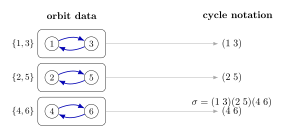
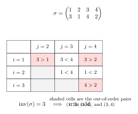
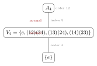
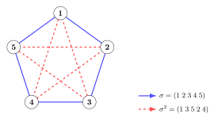

This chapter deepens permutation theory in two directions. First, it interprets cycles as orbit data. Second, it introduces parity, which separates permutations into even and odd classes and leads to the alternating groups. The main conceptual point is that parity is a **structural invariant**, not a bookkeeping accident. By the end, $A_n$ emerges as the kernel of a canonical homomorphism $\operatorname{sgn}: S_n \to \mathbb{Z}_2$, giving the first natural example of a quotient group beyond trivial cases.

---

## §9.1 Orbits of a permutation

### Definition 9.1

Let $\sigma$ be a permutation of a finite set $X$. The **orbit of $x$ under $\sigma$** is
$$
\operatorname{Orb}_\sigma(x) = \{x, \sigma(x), \sigma^2(x), \ldots\} = \{\sigma^n(x) : n \in \mathbb{Z}\}.
$$
Since $X$ is finite and $\sigma$ is a bijection, repeated application must eventually return to $x$: there exists a smallest positive integer $k$ such that $\sigma^k(x) = x$, and the orbit is $\{x, \sigma(x), \ldots, \sigma^{k-1}(x)\}$.

### Theorem 9.2 (Orbits partition the set)

Let $\sigma \in S_n$. The orbits of $\sigma$ partition $\{1, 2, \ldots, n\}$.

> [!info]- Proof
>
> We must show that the orbits are nonempty, their union is all of $\{1,\ldots,n\}$, and distinct orbits are disjoint.
>
> **Nonempty and covering.** Every element $x \in \{1,\ldots,n\}$ belongs to $\operatorname{Orb}_\sigma(x)$ (take $n=0$, i.e., $\sigma^0(x) = x$). So every element lies in at least one orbit.
>
> **Disjoint or equal.** Suppose $\operatorname{Orb}_\sigma(x) \cap \operatorname{Orb}_\sigma(y) \neq \varnothing$. Then there exist integers $r, s$ with $\sigma^r(x) = \sigma^s(y)$. Since $\sigma$ is bijective, $x = \sigma^{s-r}(y)$. Therefore for any $t$,
> $$
> \sigma^t(x) = \sigma^{t+s-r}(y) \in \operatorname{Orb}_\sigma(y).
> $$
> This shows $\operatorname{Orb}_\sigma(x) \subseteq \operatorname{Orb}_\sigma(y)$. By the symmetric argument, $\operatorname{Orb}_\sigma(y) \subseteq \operatorname{Orb}_\sigma(x)$. Hence the two orbits are equal.
>
> Therefore orbits are either equal or disjoint, and their union is $\{1,\ldots,n\}$. $\blacksquare$

**Example.** Let $\sigma = \begin{pmatrix} 1 & 2 & 3 & 4 & 5 & 6 \\ 3 & 5 & 1 & 6 & 2 & 4 \end{pmatrix} \in S_6$.

Trace the orbits:
- Start at $1$: $1 \to 3 \to 1$. Orbit: $\{1, 3\}$.
- Start at $2$: $2 \to 5 \to 2$. Orbit: $\{2, 5\}$.
- Start at $4$: $4 \to 6 \to 4$. Orbit: $\{4, 6\}$.

Partition: $\{1,3\} \sqcup \{2,5\} \sqcup \{4,6\} = \{1,2,3,4,5,6\}$. Check.

---

## §9.2 Cycle structure and orbits

### Theorem 9.3 (Orbits are cycles)

The nontrivial orbits of $\sigma$ (those of size $\geq 2$) correspond exactly to the cycles in the disjoint cycle decomposition of $\sigma$. Fixed points (orbits of size $1$) correspond to $1$-cycles, which are conventionally omitted.

> [!info]- Proof
>
> Let $O = \{x, \sigma(x), \sigma^2(x), \ldots, \sigma^{k-1}(x)\}$ be an orbit of size $k$. Then $\sigma$ restricted to $O$ acts as the cycle $(x\;\sigma(x)\;\sigma^2(x)\;\cdots\;\sigma^{k-1}(x))$: it sends each element to the next, and the last element back to $x$.
>
> Conversely, if $(a_1\,a_2\,\cdots\,a_k)$ is a cycle in the disjoint cycle decomposition, then $\sigma(a_i) = a_{i+1}$ for $i < k$ and $\sigma(a_k) = a_1$, so $\{a_1, \ldots, a_k\}$ is exactly the orbit of $a_1$.
>
> Since the orbits partition $\{1,\ldots,n\}$ and the disjoint cycles partition the non-fixed elements, the correspondence is bijective. $\blacksquare$

**Example (continued).** The permutation $\sigma$ above has orbits $\{1,3\}$, $\{2,5\}$, $\{4,6\}$. The disjoint cycle decomposition is
$$
\sigma = (1\;3)(2\;5)(4\;6).
$$
Each orbit of size $2$ gives a $2$-cycle. The orbits and cycles carry the same information.

Figure: orbit partition and disjoint cycle notation for the same permutation.

Each orbit loop on the left becomes one disjoint cycle on the right. The theorem is not adding new data; it is telling you that cycle notation is just a compressed way of recording the orbit partition together with the action of $\sigma$ on each orbit.

---

## §9.3 Transpositions

### Definition 9.4

A **transposition** is a $2$-cycle $(a\;b)$, which swaps $a$ and $b$ and fixes everything else.

### Theorem 9.5 (Transposition decomposition)

Every permutation $\sigma \in S_n$ can be written as a product of transpositions.

> [!info]- Proof
>
> By the disjoint cycle decomposition theorem (Chapter 8), every permutation is a product of disjoint cycles. So it suffices to write each $k$-cycle as a product of transpositions:
> $$
> (a_1\;a_2\;\cdots\;a_k) = (a_1\;a_k)(a_1\;a_{k-1})\cdots(a_1\;a_3)(a_1\;a_2).
> $$
> **Verification:** Apply the right-hand side to $a_1$: $(a_1\;a_2)$ sends $a_1 \mapsto a_2$, and no subsequent transposition moves $a_2$ (it does not appear later). So $a_1 \mapsto a_2$. Apply to $a_j$ for $2 \leq j \leq k-1$: $(a_1\;a_2)$ fixes $a_j$; then each $(a_1\;a_i)$ for $i > j$ fixes $a_j$; the transposition $(a_1\;a_j)$ sends $a_j \mapsto a_1$; then $(a_1\;a_{j+1})$ sends $a_1 \mapsto a_{j+1}$; and subsequent transpositions fix $a_{j+1}$. So $a_j \mapsto a_{j+1}$. Apply to $a_k$: $(a_1\;a_k)$ sends $a_k \mapsto a_1$, and no further transposition moves $a_1$. So $a_k \mapsto a_1$. This matches the cycle. $\blacksquare$

**Warning.** The transposition decomposition is **not unique**. For example:
$$
(1\;2\;3) = (1\;3)(1\;2) = (2\;3)(1\;3) = (1\;3)(1\;2)(1\;3)(1\;3).
$$
The last expression uses four transpositions instead of two. But notice: $2$ and $4$ are both **even**. This is not a coincidence.

---

## §9.4 Even and odd permutations --- the Parity Theorem

This is the hardest theorem of the chapter. The punch line is that while the transposition decomposition of $\sigma$ is not unique, the **parity** (even or odd number of transpositions) is always the same.

### Definition 9.6 (Inversions)

For $\sigma \in S_n$, an **inversion** is a pair $(i,j)$ with $i < j$ and $\sigma(i) > \sigma(j)$. The **inversion number** is
$$
\operatorname{inv}(\sigma) = |\{(i,j) : 1 \leq i < j \leq n,\; \sigma(i) > \sigma(j)\}|.
$$

**Example.** Let $\sigma = \begin{pmatrix} 1&2&3&4 \\ 3&1&4&2 \end{pmatrix} \in S_4$. List all pairs $(i,j)$ with $i < j$:

| $(i,j)$ | $\sigma(i)$ vs $\sigma(j)$ | Inversion? |
|---|---|---|
| $(1,2)$ | $3 > 1$ | Yes |
| $(1,3)$ | $3 < 4$ | No |
| $(1,4)$ | $3 > 2$ | Yes |
| $(2,3)$ | $1 < 4$ | No |
| $(2,4)$ | $1 < 2$ | No |
| $(3,4)$ | $4 > 2$ | Yes |

So $\operatorname{inv}(\sigma) = 3$, which is odd.

Figure: inversion pairs shown as shaded cells.

The shaded cells are precisely the inversion pairs $(1,2)$, $(1,4)$, and $(3,4)$. This is worth looking at slowly: parity is not an arbitrary sign convention here, but the parity of the number of out-of-order pairs. Lemma 9.7 works because an adjacent transposition changes this count by one modulo $2$.

### Lemma 9.7 (Adjacent transposition and inversions)

If $\tau_k = (k\;\;k{+}1)$ is an adjacent transposition, then for any $\sigma \in S_n$:
$$
\operatorname{inv}(\sigma \tau_k) = \operatorname{inv}(\sigma) \pm 1.
$$
In particular, $\operatorname{inv}(\sigma\tau_k) \equiv \operatorname{inv}(\sigma) + 1 \pmod{2}$.

> [!info]- Proof
>
> The transposition $\tau_k$ swaps the values in positions $k$ and $k+1$, leaving all other positions unchanged. Consider pairs $(i,j)$ with $i < j$:
>
> - If neither $i$ nor $j$ is in $\{k, k+1\}$: the pair contributes identically to $\operatorname{inv}(\sigma)$ and $\operatorname{inv}(\sigma\tau_k)$.
> - If exactly one of $i,j$ is in $\{k, k+1\}$: say $j = k$ and $i < k$. Then $\sigma\tau_k(i) = \sigma(i)$ and $\sigma\tau_k(k) = \sigma(k+1)$. The relative order of $\sigma(i)$ vs $\sigma(k)$ might differ from $\sigma(i)$ vs $\sigma(k+1)$, but for the pair $(k, k+1)$ specifically, this is what changes.
> - The only pair whose inversion status is guaranteed to flip is $(k, k+1)$ itself: if $\sigma(k) < \sigma(k+1)$ (not an inversion), then $\sigma\tau_k(k) = \sigma(k+1) > \sigma(k) = \sigma\tau_k(k+1)$ (an inversion), and vice versa.
>
> More precisely: define $f(i,j)$ as the contribution of pair $(i,j)$ to the inversion count. For all pairs except $(k, k+1)$, consider the effect. For a pair $(i, k)$ with $i < k$: $\sigma\tau_k(i) = \sigma(i)$ and $\sigma\tau_k(k) = \sigma(k+1)$. For the pair $(i, k+1)$: $\sigma\tau_k(i) = \sigma(i)$ and $\sigma\tau_k(k+1) = \sigma(k)$. So the pairs $(i,k)$ and $(i,k+1)$ collectively swap their inversion contributions from $\{\sigma(k), \sigma(k+1)\}$ to $\{\sigma(k+1), \sigma(k)\}$, which means each gains what the other loses. The net change from these pairs is zero. Similarly for pairs $(k, j)$ and $(k+1, j)$ with $j > k+1$.
>
> Therefore the total change in inversion count comes solely from the pair $(k, k+1)$, which flips exactly once. So $\operatorname{inv}(\sigma\tau_k) = \operatorname{inv}(\sigma) \pm 1$. $\blacksquare$

### Lemma 9.8 (Any transposition is a product of an odd number of adjacent transpositions)

For $i < j$, the transposition $(i\;j)$ can be written as
$$
(i\;j) = (i\;\;i{+}1)(i{+}1\;\;i{+}2)\cdots(j{-}1\;\;j)\cdots(i{+}1\;\;i{+}2)(i\;\;i{+}1),
$$
which consists of $2(j-i) - 1$ adjacent transpositions (an odd number).

> [!info]- Proof
>
> Think of the elements in positions $i, i+1, \ldots, j$. The transposition $(i\;j)$ moves $i$ to position $j$ by "bubbling" it through $j-i$ adjacent swaps, then moves $j$ (now displaced) back by $j-i-1$ swaps. Total: $(j-i) + (j-i-1) = 2(j-i)-1$, which is odd.
>
> Explicitly: first apply $(j{-}1\;\;j)$, then $(j{-}2\;\;j{-}1)$, ..., then $(i\;\;i{+}1)$, bringing $j$ to position $i$ and shifting $i, i+1, \ldots, j-1$ each one step right. Then apply $(i{+}1\;\;i{+}2)$, ..., $(j{-}1\;\;j)$ to restore the elements $i+1, \ldots, j-1$ to their original positions. The net effect is that only positions $i$ and $j$ are swapped. $\blacksquare$

### Theorem 9.9 (Parity Theorem --- the key theorem of the chapter)

If $\sigma \in S_n$ can be written as a product of $r$ transpositions and also as a product of $s$ transpositions, then $r \equiv s \pmod{2}$.

> [!info]- Proof (via inversion counting)
>
> Write $\sigma = \tau_1 \tau_2 \cdots \tau_r$ where each $\tau_i$ is a transposition. Start from the identity $e$, which has $\operatorname{inv}(e) = 0$ (even).
>
> By Lemma 9.8, each transposition $\tau_i$ is a product of an odd number of adjacent transpositions. By Lemma 9.7, each adjacent transposition changes the parity of $\operatorname{inv}$. An odd number of parity changes is a net parity change. Therefore each transposition $\tau_i$ flips the parity of $\operatorname{inv}$.
>
> Applying $r$ transpositions to $e$:
> $$
> \operatorname{inv}(\sigma) \equiv \operatorname{inv}(e) + r \equiv r \pmod{2}.
> $$
> Similarly, from the other decomposition:
> $$
> \operatorname{inv}(\sigma) \equiv s \pmod{2}.
> $$
> Therefore $r \equiv s \pmod{2}$. $\blacksquare$

### Definition 9.10 (Even and odd permutations)

A permutation $\sigma \in S_n$ is **even** if it can be written as a product of an even number of transpositions, and **odd** if it can be written as a product of an odd number. By the Parity Theorem, this classification is well-defined: $\sigma$ cannot be both.

Equivalently, $\sigma$ is even if and only if $\operatorname{inv}(\sigma)$ is even.

---

## §9.5 The sign homomorphism

### Definition 9.11 (Sign of a permutation)

Define $\operatorname{sgn}: S_n \to \{+1, -1\}$ by
$$
\operatorname{sgn}(\sigma) =
\begin{cases}
+1 & \text{if } \sigma \text{ is even}, \\
-1 & \text{if } \sigma \text{ is odd}.
\end{cases}
$$
Equivalently, if $\sigma = \tau_1\cdots\tau_r$ is any transposition decomposition, then $\operatorname{sgn}(\sigma) = (-1)^r$.

### Theorem 9.12 (sgn is a group homomorphism)

The map $\operatorname{sgn}: S_n \to (\{+1,-1\}, \cdot)$ is a well-defined surjective group homomorphism.

> [!info]- Proof
>
> **Well-defined:** By the Parity Theorem (Theorem 9.9), $(-1)^r$ depends only on $\sigma$, not on the choice of transposition decomposition.
>
> **Homomorphism:** Let $\sigma = \tau_1\cdots\tau_r$ and $\rho = \mu_1\cdots\mu_s$ be transposition decompositions. Then
> $$
> \sigma\rho = \tau_1\cdots\tau_r\mu_1\cdots\mu_s
> $$
> is a product of $r + s$ transpositions. Hence
> $$
> \operatorname{sgn}(\sigma\rho) = (-1)^{r+s} = (-1)^r \cdot (-1)^s = \operatorname{sgn}(\sigma) \cdot \operatorname{sgn}(\rho).
> $$
>
> **Surjective:** For $n \geq 2$, the transposition $(1\;2)$ has $\operatorname{sgn}(1\;2) = -1$, and the identity has $\operatorname{sgn}(e) = +1$. So both elements of $\{+1,-1\}$ are hit. $\blacksquare$

### Corollary 9.13

For all $\sigma, \tau \in S_n$:
1. $\operatorname{sgn}(\sigma\tau) = \operatorname{sgn}(\sigma)\operatorname{sgn}(\tau)$.
2. $\operatorname{sgn}(\sigma^{-1}) = \operatorname{sgn}(\sigma)$.
3. $\operatorname{sgn}(e) = +1$.

> [!info]- Proof
>
> (1) is the homomorphism property. For (2): $\operatorname{sgn}(\sigma)\operatorname{sgn}(\sigma^{-1}) = \operatorname{sgn}(\sigma\sigma^{-1}) = \operatorname{sgn}(e) = (-1)^0 = 1$, so $\operatorname{sgn}(\sigma^{-1}) = \operatorname{sgn}(\sigma)^{-1} = \operatorname{sgn}(\sigma)$ since $(\pm 1)^{-1} = \pm 1$. Part (3) is immediate from the empty product. $\blacksquare$

---

## §9.6 Parity of a $k$-cycle

### Theorem 9.14 (Sign of a cycle)

A $k$-cycle is a product of exactly $k-1$ transpositions. Therefore:
$$
\operatorname{sgn}(a_1\;a_2\;\cdots\;a_k) = (-1)^{k-1}.
$$
A $k$-cycle is **even if and only if $k$ is odd**.

> [!info]- Proof
>
> The transposition decomposition is:
> $$
> (a_1\;a_2\;\cdots\;a_k) = (a_1\;a_k)(a_1\;a_{k-1})\cdots(a_1\;a_3)(a_1\;a_2).
> $$
> This is a product of $k-1$ transpositions. (Verification was given in Theorem 9.5.)
>
> Therefore $\operatorname{sgn}(a_1\;\cdots\;a_k) = (-1)^{k-1}$.
>
> Now $(-1)^{k-1} = +1$ iff $k-1$ is even iff $k$ is odd. $\blacksquare$

**Quick reference table:**

| Cycle length $k$ | Number of transpositions $k-1$ | Parity |
|---|---|---|
| $1$ (fixed point) | $0$ | Even |
| $2$ (transposition) | $1$ | Odd |
| $3$ | $2$ | Even |
| $4$ | $3$ | Odd |
| $5$ | $4$ | Even |

### Theorem 9.15 (Sign from cycle type)

If $\sigma$ has disjoint cycle decomposition with cycle lengths $k_1, k_2, \ldots, k_r$ (including $1$-cycles for fixed points, so $k_1 + k_2 + \cdots + k_r = n$), then
$$
\operatorname{sgn}(\sigma) = (-1)^{(k_1 - 1) + (k_2 - 1) + \cdots + (k_r - 1)} = (-1)^{n - r} = (-1)^{n - c(\sigma)},
$$
where $c(\sigma)$ is the total number of cycles including fixed points.

> [!info]- Proof
>
> Since the disjoint cycles commute, $\operatorname{sgn}$ factors:
> $$
> \operatorname{sgn}(\sigma) = \prod_{i=1}^r \operatorname{sgn}(\text{$k_i$-cycle}) = \prod_{i=1}^r (-1)^{k_i - 1} = (-1)^{\sum(k_i - 1)} = (-1)^{(\sum k_i) - r} = (-1)^{n - r}. \quad \blacksquare
> $$

**Example.** The permutation $\sigma = (1\;3\;5)(2\;4) \in S_5$ has cycle lengths $3, 2$ (and no fixed points to list explicitly, but thinking of it in $S_5$, the full cycle type is $3, 2$, and $n = 5$). The number of "cycles" here depends on convention. Using the formula with only nontrivial cycles: $\operatorname{sgn}(\sigma) = (-1)^{3-1} \cdot (-1)^{2-1} = (+1)(-1) = -1$. Or: include the implicit identity, $c(\sigma) = 2$ nontrivial cycles, but $n - c(\sigma)$ requires counting fixed points. In $S_5$, there are no fixed points, so $c(\sigma) = 2$ and $\operatorname{sgn} = (-1)^{5-2} = (-1)^3 = -1$. Both agree.

---

## §9.7 The alternating group $A_n$

### Definition 9.16

The **alternating group** is
$$
A_n = \ker(\operatorname{sgn}) = \{\sigma \in S_n : \sigma \text{ is even}\}.
$$

### Theorem 9.17 (Properties of $A_n$)

1. $A_n$ is a **normal subgroup** of $S_n$ (it is the kernel of a homomorphism).
2. $|A_n| = \dfrac{n!}{2}$ for $n \geq 2$.
3. $S_n / A_n \cong \mathbb{Z}_2$.

> [!info]- Proof
>
> **(1)** The kernel of any group homomorphism is a normal subgroup. Since $\operatorname{sgn}: S_n \to \{+1,-1\}$ is a homomorphism, $A_n = \ker(\operatorname{sgn})$ is normal in $S_n$.
>
> **(2)** By the First Isomorphism Theorem, $S_n / \ker(\operatorname{sgn}) \cong \operatorname{im}(\operatorname{sgn})$. For $n \geq 2$, $\operatorname{sgn}$ is surjective (Theorem 9.12), so $\operatorname{im}(\operatorname{sgn}) = \{+1,-1\}$, which has order $2$. Therefore
> $$
> [S_n : A_n] = |S_n / A_n| = 2, \qquad \text{so} \qquad |A_n| = \frac{|S_n|}{2} = \frac{n!}{2}.
> $$
>
> **(3)** $S_n / A_n \cong \operatorname{im}(\operatorname{sgn}) = \{+1,-1\} \cong \mathbb{Z}_2$, since $\{+1,-1\}$ under multiplication is cyclic of order $2$. $\blacksquare$

### Theorem 9.18 ($A_n$ is generated by $3$-cycles for $n \geq 3$)

Every element of $A_n$ can be written as a product of $3$-cycles.

> [!info]- Proof
>
> An even permutation is, by definition, a product of an even number of transpositions. So it suffices to show that any product of **two** transpositions can be written as a product of $3$-cycles. There are two cases:
>
> **Case 1: The two transpositions share an element.** Say $\sigma = (a\;b)(a\;c)$ where $b \neq c$. Then:
> - $a \mapsto c \mapsto c$ (under $(a\;c)$ first, then $(a\;b)$ fixes $c$ if $c \neq b$, which it is). Wait, let us compute carefully.
> - Apply $(a\;c)$ first: $a \mapsto c$. Then $(a\;b)$: $c \mapsto c$ (since $c \neq a, b$). So $a \mapsto c$.
> - Apply $(a\;c)$ first: $c \mapsto a$. Then $(a\;b)$: $a \mapsto b$. So $c \mapsto b$.
> - Apply $(a\;c)$ first: $b \mapsto b$. Then $(a\;b)$: $b \mapsto a$. So $b \mapsto a$.
>
> Therefore $(a\;b)(a\;c) = (a\;c\;b)$, a $3$-cycle.
>
> **Case 2: The two transpositions are disjoint.** Say $\sigma = (a\;b)(c\;d)$ where $\{a,b\} \cap \{c,d\} = \varnothing$. Introduce a "bridge" element. One can verify:
> $$
> (a\;b)(c\;d) = (a\;c\;b)(a\;c\;d).
> $$
> Check: Apply $(a\;c\;d)$ first, then $(a\;c\;b)$.
> - $a$: $(a\;c\;d)$ sends $a \mapsto c$; $(a\;c\;b)$ sends $c \mapsto b$. So $a \mapsto b$. $\checkmark$
> - $b$: $(a\;c\;d)$ fixes $b$; $(a\;c\;b)$ sends $b \mapsto a$. So $b \mapsto a$. $\checkmark$
> - $c$: $(a\;c\;d)$ sends $c \mapsto d$; $(a\;c\;b)$ fixes $d$. So $c \mapsto d$. $\checkmark$
> - $d$: $(a\;c\;d)$ sends $d \mapsto a$; $(a\;c\;b)$ sends $a \mapsto c$. So $d \mapsto c$. $\checkmark$
>
> Both cases produce products of $3$-cycles. By induction on the number of transposition pairs, every even permutation is a product of $3$-cycles. $\blacksquare$

---

## §9.8 Explicit small cases

### $A_3$

$|A_3| = 3!/2 = 3$. The elements of $S_3$ with their signs:

| Permutation | Cycle type | $\operatorname{sgn}$ |
|---|---|---|
| $e$ | $(1)(2)(3)$ | $+1$ |
| $(1\;2\;3)$ | $3$-cycle | $+1$ |
| $(1\;3\;2)$ | $3$-cycle | $+1$ |
| $(1\;2)$ | transposition | $-1$ |
| $(1\;3)$ | transposition | $-1$ |
| $(2\;3)$ | transposition | $-1$ |

So
$$
A_3 = \{e, (1\;2\;3), (1\;3\;2)\} \cong \mathbb{Z}_3.
$$
This is cyclic, generated by either $3$-cycle: $(1\;2\;3)^2 = (1\;3\;2)$ and $(1\;2\;3)^3 = e$.

### $A_4$

$|A_4| = 24/2 = 12$. Classify the even permutations by cycle type:

**Identity** (1 element):
$$
e
$$

**$3$-cycles** (8 elements): A $3$-cycle has sign $(-1)^2 = +1$, so all $3$-cycles in $S_4$ lie in $A_4$. Choose $3$ elements from $\{1,2,3,4\}$ and form a cycle: $\binom{4}{3} \cdot 2 = 8$ three-cycles (each set of $3$ gives $2$ distinct cycles).
$$
(1\;2\;3),\; (1\;3\;2),\; (1\;2\;4),\; (1\;4\;2),\; (1\;3\;4),\; (1\;4\;3),\; (2\;3\;4),\; (2\;4\;3).
$$

**Products of two disjoint transpositions** (3 elements): A single transposition is odd, but a product of two disjoint transpositions has sign $(-1)(-1) = +1$.
$$
(1\;2)(3\;4), \quad (1\;3)(2\;4), \quad (1\;4)(2\;3).
$$

**Total:** $1 + 8 + 3 = 12 = |A_4|$. $\checkmark$

### The Klein four-group $V_4 \trianglelefteq A_4$

The set
$$
V_4 = \{e,\; (1\;2)(3\;4),\; (1\;3)(2\;4),\; (1\;4)(2\;3)\}
$$
is a subgroup of $A_4$ isomorphic to $\mathbb{Z}_2 \times \mathbb{Z}_2$ (the Klein four-group). One can verify closure:

| $\cdot$ | $e$ | $(1\;2)(3\;4)$ | $(1\;3)(2\;4)$ | $(1\;4)(2\;3)$ |
|---|---|---|---|---|
| $e$ | $e$ | $(1\;2)(3\;4)$ | $(1\;3)(2\;4)$ | $(1\;4)(2\;3)$ |
| $(1\;2)(3\;4)$ | $(1\;2)(3\;4)$ | $e$ | $(1\;4)(2\;3)$ | $(1\;3)(2\;4)$ |
| $(1\;3)(2\;4)$ | $(1\;3)(2\;4)$ | $(1\;4)(2\;3)$ | $e$ | $(1\;2)(3\;4)$ |
| $(1\;4)(2\;3)$ | $(1\;4)(2\;3)$ | $(1\;3)(2\;4)$ | $(1\;2)(3\;4)$ | $e$ |

Every nonidentity element has order $2$, and the group is abelian. This is the Klein four-group.

**$V_4$ is normal in $A_4$** (and in fact in $S_4$): The set of double transpositions is closed under conjugation in $S_4$, since conjugation preserves cycle type. Since $V_4$ is the union of the identity and all elements of cycle type $(2,2)$ in $S_4$, it is invariant under conjugation. In particular, it is normal in $A_4$.

This is noteworthy: $A_4$ is a group of order $12$ that has **no subgroup of order $6$**, despite the fact that $6 \mid 12$. The converse of Lagrange's theorem fails already at $A_4$. Figure: the normal subgroup lattice of $A_4$.

$V_4$ is the unique normal subgroup of order $4$, and there are four cyclic subgroups of order $3$ (none of which are normal).

---

## §9.9 Powers of cycles and the homework connection

### Theorem 9.19 (Structure of powers of a cycle)

Let $\sigma = (a_1\;a_2\;\cdots\;a_k)$ be a $k$-cycle, and let $m$ be a positive integer. Set $d = \gcd(m, k)$. Then $\sigma^m$ consists of $d$ disjoint cycles, each of length $k/d$.

> [!info]- Proof
>
> Consider the action of $\sigma^m$ on the elements $\{a_1, a_2, \ldots, a_k\}$ (indices taken mod $k$). We have $\sigma^m(a_i) = a_{i+m}$ (indices mod $k$). The orbit of $a_i$ under $\sigma^m$ is
> $$
> \{a_i, a_{i+m}, a_{i+2m}, \ldots\}
> $$
> where indices are taken mod $k$. This orbit has size equal to the smallest positive integer $t$ such that $tm \equiv 0 \pmod{k}$, i.e., $t = k/\gcd(m,k) = k/d$.
>
> Each orbit has size $k/d$, and there are $k$ elements total, so the number of orbits is $k/(k/d) = d$.
>
> Therefore $\sigma^m$ decomposes into $d = \gcd(m,k)$ disjoint cycles, each of length $k/d$. $\blacksquare$

**Corollary.** $\sigma^m$ is itself a cycle (i.e., a single cycle plus fixed points) if and only if $\gcd(m, k) = 1$.

### Application: Homework 1 Problem 2 --- cycles in $S_5$ with $\sigma^2$ also a cycle

**Problem (Homework 1, Problem 2).** Count the **cycles** $\sigma$ in $S_5$ such that $\sigma^2$ is also a cycle. (The identity is considered a cycle.)

**Solution.** The key constraint is that $\sigma$ must itself be a single cycle (not a product of disjoint cycles). The possible cycle lengths for a single cycle in $S_5$ are $k = 1, 2, 3, 4, 5$.

By Theorem 9.19, for a $k$-cycle $\sigma$, the permutation $\sigma^2$ consists of $\gcd(2,k)$ disjoint cycles of length $k/\gcd(2,k)$. So $\sigma^2$ is a single cycle iff $\gcd(2,k) = 1$ (i.e., $k$ is odd) or $k \leq 2$ (where $\sigma^2 = e$, which we count as a cycle).

| Cycle length $k$ | $\sigma^2$ structure | $\sigma^2$ a cycle? | Count in $S_5$ |
|---|---|---|---|
| $1$ (identity) | identity | Yes | $1$ |
| $2$ (transposition) | identity | Yes | $\binom{5}{2} \cdot 1! = 10$ |
| $3$ | $3$-cycle | Yes | $\binom{5}{3} \cdot 2! = 20$ |
| $4$ | product of two $2$-cycles | **No** | $0$ (excluded) |
| $5$ | $5$-cycle | Yes | $\binom{5}{5} \cdot 4! = 24$ |

**Total:** $1 + 10 + 20 + 0 + 24 = \boxed{55}$.

> [!warning]- Common misreading of this problem
>
> A tempting mistake is to interpret "cycles $\sigma$ in $S_5$ such that $\sigma^2$ is a cycle" as "**permutations** $\sigma$ in $S_5$ such that $\sigma^2$ is a cycle." These are different questions.
>
> If $\sigma$ is allowed to be any permutation (not just a single cycle), then one must also consider:
>
> - **$\sigma = (a\;b\;c)(d\;e)$** (a 3-cycle times a disjoint transposition). Here $\sigma^2 = (a\;c\;b)$, which *is* a cycle. There are $\binom{5}{3} \cdot 2 \cdot 1 = 20$ such permutations. But $\sigma$ itself is **not a cycle** — it is a product of two disjoint cycles. So these should **not** be counted.
>
> - **$\sigma = (a\;b)(c\;d)$** (two disjoint transpositions). Here $\sigma^2 = e$, and the identity is a cycle. But again, $\sigma$ is not a single cycle.
>
> A second mistake goes the other way: excluding the identity and transpositions because "$\sigma^2 = e$ is trivial." But the problem explicitly states that the identity counts as a cycle, so $\sigma^2 = e$ qualifies.
>
> The correct reading is: $\sigma$ must be a **single** cycle (including the identity as a 1-cycle), and $\sigma^2$ must also be a single cycle.
>
> | Miscount | Error | Effect |
> |---|---|---|
> | Including $(abc)(de)$-types | $\sigma$ is not a cycle | Overcounts by $20$ |
> | Excluding $e$ and transpositions | $\sigma^2 = e$ is still a cycle | Undercounts by $11$ |
> | Both errors simultaneously | $55 + 20 - 11 = 64$ | Wrong answer $64$ |
>
> The moral: in algebra, **read the quantifier carefully**. "Cycles $\sigma$" restricts the domain; "such that $\sigma^2$ is a cycle" restricts the codomain.

### The pentagon/pentagram picture

Figure: a $5$-cycle on a pentagon and its square on the pentagram.

A $5$-cycle $\sigma = (1\;2\;3\;4\;5)$ rotates the vertices of a regular pentagon (blue). Then $\sigma^2 = (1\;3\;5\;2\;4)$ "skips every other vertex," tracing a **pentagram** (red, dashed). This is because $\gcd(2,5) = 1$: squaring a $5$-cycle still visits all $5$ vertices, but in a different order.

By contrast, $\sigma^2$ for a $4$-cycle $(1\;2\;3\;4)$ gives $(1\;3)(2\;4)$: two disjoint $2$-cycles, because $\gcd(2,4) = 2$. The square of a square's rotation swaps opposite vertices --- it does not trace out a single cycle.

---

## §9.10 Worked computations

### Example 1: Determine parity of $\sigma = (1\;3\;5\;2)(4\;6) \in S_6$

Cycle lengths: $4$ and $2$. Sign:
$$
\operatorname{sgn}(\sigma) = (-1)^{4-1} \cdot (-1)^{2-1} = (-1)^3 \cdot (-1)^1 = (-1)(-1) = +1.
$$
So $\sigma$ is **even**, and $\sigma \in A_6$.

**Alternative via the formula** $\operatorname{sgn}(\sigma) = (-1)^{n - c(\sigma)}$: Here $n = 6$, and $c(\sigma) = 2$ (nontrivial cycles) plus the fixed points. But there are no fixed points (all of $\{1,2,3,4,5,6\}$ are moved). So $c(\sigma) = 2$ and $\operatorname{sgn} = (-1)^{6-2} = (-1)^4 = +1$. $\checkmark$

### Example 2: Express $\sigma = (1\;4\;3)(2\;5) \in S_5$ as transpositions and determine parity

$$
(1\;4\;3) = (1\;3)(1\;4), \qquad (2\;5) = (2\;5).
$$
So
$$
\sigma = (1\;3)(1\;4)(2\;5),
$$
which is $3$ transpositions (odd). Therefore $\operatorname{sgn}(\sigma) = -1$ and $\sigma \notin A_5$.

**Check via sign formula:** $(-1)^{3-1} \cdot (-1)^{2-1} = (+1)(-1) = -1$. $\checkmark$

### Example 3: Verify sgn is multiplicative

Let $\alpha = (1\;2\;3)$ and $\beta = (1\;2)(3\;4)$ in $S_4$.

- $\operatorname{sgn}(\alpha) = (-1)^{3-1} = +1$.
- $\operatorname{sgn}(\beta) = (-1)^1 \cdot (-1)^1 = +1$.

Compute $\alpha\beta$: apply $\beta$ first, then $\alpha$.
- $1 \xrightarrow{\beta} 2 \xrightarrow{\alpha} 3$.
- $2 \xrightarrow{\beta} 1 \xrightarrow{\alpha} 2$. (Fixed!)
- $3 \xrightarrow{\beta} 4 \xrightarrow{\alpha} 4$. (Fixed!)
- $4 \xrightarrow{\beta} 3 \xrightarrow{\alpha} 1$.

A very common first-pass mistake is to stop too early and think this is just $(1\;3)$. The point where many people slip is forgetting to keep tracing $3$ and $4$ carefully:
- $1 \mapsto 3$.
- $3 \xrightarrow{\beta} 4 \xrightarrow{\alpha} 4$, so $3 \mapsto 4$.
- $4 \xrightarrow{\beta} 3 \xrightarrow{\alpha} 1$, so $4 \mapsto 1$.
- $2$ is fixed.

Hence
$$
\alpha\beta = (1\;3\;4).
$$

$\operatorname{sgn}(\alpha\beta) = (-1)^{3-1} = +1 = (+1)(+1) = \operatorname{sgn}(\alpha)\operatorname{sgn}(\beta)$. $\checkmark$

### Example 4: Parity of a permutation in $S_6$ given in two-line notation

$$
\sigma = \begin{pmatrix} 1&2&3&4&5&6 \\ 2&4&6&1&3&5 \end{pmatrix}.
$$

Disjoint cycle decomposition: $1 \to 2 \to 4 \to 1$ gives $(1\;2\;4)$. Then $3 \to 6 \to 5 \to 3$ gives $(3\;6\;5)$. So $\sigma = (1\;2\;4)(3\;6\;5)$.

Sign: $(-1)^{3-1} \cdot (-1)^{3-1} = (+1)(+1) = +1$. So $\sigma \in A_6$.

Transposition decomposition: $(1\;2\;4) = (1\;4)(1\;2)$ and $(3\;6\;5) = (3\;5)(3\;6)$. So $\sigma = (1\;4)(1\;2)(3\;5)(3\;6)$, four transpositions (even). $\checkmark$

### Example 5: Rewrite $(1\;2)(3\;4)(5\;6) \in A_6$?

$\operatorname{sgn} = (-1)^3 = -1$. So $(1\;2)(3\;4)(5\;6)$ is **odd** and does **not** belong to $A_6$.

### Example 6: Express $(1\;3)(2\;4) \in A_4$ as a product of $3$-cycles

Using the disjoint-transposition formula from Theorem 9.18:
$$
(1\;3)(2\;4) = (1\;2\;3)(1\;2\;4).
$$
Verify: Apply $(1\;2\;4)$ first, then $(1\;2\;3)$:
- $1 \xrightarrow{(1\;2\;4)} 2 \xrightarrow{(1\;2\;3)} 3$. So $1 \mapsto 3$. $\checkmark$
- $3 \xrightarrow{(1\;2\;4)} 3 \xrightarrow{(1\;2\;3)} 1$. So $3 \mapsto 1$. $\checkmark$
- $2 \xrightarrow{(1\;2\;4)} 4 \xrightarrow{(1\;2\;3)} 4$. So $2 \mapsto 4$. $\checkmark$
- $4 \xrightarrow{(1\;2\;4)} 1 \xrightarrow{(1\;2\;3)} 2$. So $4 \mapsto 2$. $\checkmark$

So $(1\;3)(2\;4) = (1\;2\;3)(1\;2\;4)$. $\checkmark$

---

## §9.11 Standard traps

1. **A $k$-cycle requires $k-1$ transpositions, not $k$.** The cycle $(1\;2\;3) = (1\;3)(1\;2)$ uses **two** transpositions, not three.

2. **Odd-length cycles are even permutations.** This is the most confusing naming clash in the chapter. A $3$-cycle is even. A $5$-cycle is even. The word "odd" in "odd-length" refers to the length of the cycle, while "even" refers to the parity of the number of transpositions ($k-1$). Since $3 - 1 = 2$ is even, a $3$-cycle is an even permutation.

3. **The transposition decomposition is not unique, but parity is.** You can always throw in pairs of identical transpositions $(\tau\tau = e)$ to change the number of transpositions by $2$ without changing the permutation. What you cannot do is change the parity.

4. **Disjoint cycles commute; overlapping cycles do not.** When computing signs, you can freely reorder disjoint cycles. But $(1\;2)(1\;3) \neq (1\;3)(1\;2)$: the left side gives $(1\;3\;2)$ while the right gives $(1\;2\;3)$.

5. **The identity is even.** It is a product of zero transpositions ($0$ is even). Every fixed point contributes a $1$-cycle with $0$ transpositions.

---

## §9.12 Lang's structural perspective

Lang would frame this chapter through the short exact sequence
$$
1 \longrightarrow A_n \longrightarrow S_n \xrightarrow{\;\operatorname{sgn}\;} \mathbb{Z}_2 \longrightarrow 1.
$$
Here $\mathbb{Z}_2 = \{+1,-1\}$ under multiplication (equivalently, $\mathbb{Z}/2\mathbb{Z}$ under addition). The sequence is exact because:
- $A_n = \ker(\operatorname{sgn})$, so the image of $A_n \hookrightarrow S_n$ equals the kernel of $\operatorname{sgn}$.
- $\operatorname{sgn}$ is surjective for $n \geq 2$.

**What the exact sequence tells us:**
- $A_n$ is a **normal** subgroup of $S_n$ of index $2$.
- The quotient $S_n / A_n \cong \mathbb{Z}_2$ is the simplest possible nontrivial quotient.
- This is the **first natural example** of a quotient group that arises organically (not by fiat). Earlier examples of quotient groups were either $G/G \cong \{e\}$ or $G/\{e\} \cong G$. Now we have a genuinely interesting kernel.

**Why index $2$ subgroups are always normal.** If $[G:H] = 2$, then there are exactly two cosets: $H$ and $G \setminus H$. For any $g \in G$, either $g \in H$ (so $gH = H = Hg$) or $g \notin H$ (so $gH = G \setminus H = Hg$). Hence $gH = Hg$ for all $g$, and $H \trianglelefteq G$. The sign homomorphism is the clean proof that $[S_n : A_n] = 2$, but even without it, knowing the index suffices for normality.

**Connection to determinants.** In linear algebra, the determinant of a permutation matrix equals $\operatorname{sgn}(\sigma)$. This is not a coincidence: $\det: GL_n \to \mathbb{R}^*$ restricts to $\operatorname{sgn}$ on the permutation matrices embedded in $GL_n$. The alternating group is the intersection of $SL_n(\mathbb{R})$ (matrices of determinant $1$) with the symmetric group. This is the structural reason why $\operatorname{sgn}$ is multiplicative.

---

## §9.14 Flashcard-ready summary

**Orbit of $x$ under $\sigma$:** $\operatorname{Orb}_\sigma(x) = \{x, \sigma(x), \sigma^2(x), \ldots\}$. Orbits partition $\{1,\ldots,n\}$.

**Orbits $\leftrightarrow$ cycles:** Nontrivial orbits of $\sigma$ correspond to cycles in the disjoint cycle decomposition.

**Transposition decomposition:** Every permutation is a product of transpositions. A $k$-cycle uses $k-1$ transpositions.

**Parity Theorem:** The number of transpositions in any decomposition of $\sigma$ always has the same parity. Proved via inversion counting.

**Even/odd:** $\sigma$ is even if it decomposes into an even number of transpositions, odd otherwise.

**Sign homomorphism:** $\operatorname{sgn}: S_n \to \{+1,-1\}$, $\operatorname{sgn}(\sigma) = (-1)^{\text{# transpositions}}$. It is a surjective group homomorphism.

**Sign of a $k$-cycle:** $(-1)^{k-1}$. A $k$-cycle is even iff $k$ is odd.

**General sign formula:** $\operatorname{sgn}(\sigma) = (-1)^{n - c(\sigma)}$, where $c(\sigma)$ = number of cycles including fixed points.

**Alternating group:** $A_n = \ker(\operatorname{sgn})$, $|A_n| = n!/2$, $A_n \trianglelefteq S_n$, $S_n/A_n \cong \mathbb{Z}_2$.

**$A_n$ generated by $3$-cycles** ($n \geq 3$): $(a\;b)(a\;c) = (a\;c\;b)$ and $(a\;b)(c\;d) = (a\;c\;b)(a\;c\;d)$.

**Small cases:** $A_3 \cong \mathbb{Z}_3$. $|A_4| = 12$; elements are $e$, eight $3$-cycles, three double transpositions. $V_4 = \{e, (12)(34), (13)(24), (14)(23)\} \trianglelefteq A_4$.

**Powers of cycles:** $\sigma^m$ for a $k$-cycle consists of $\gcd(m,k)$ disjoint cycles of length $k/\gcd(m,k)$.

**Exact sequence:** $1 \to A_n \to S_n \xrightarrow{\operatorname{sgn}} \mathbb{Z}_2 \to 1$.

---

## §9.15 What should be mastered before leaving Chapter 09

- [ ] Compute orbits of a permutation and relate them to the disjoint cycle decomposition.
- [ ] Decompose any permutation into transpositions.
- [ ] Explain why parity is well-defined (state the inversion-counting argument).
- [ ] Compute $\operatorname{sgn}(\sigma)$ quickly from the cycle type.
- [ ] State and use the formula: a $k$-cycle is even iff $k$ is odd (requiring $k-1$ transpositions).
- [ ] Apply the general formula $\operatorname{sgn}(\sigma) = (-1)^{n-c(\sigma)}$.
- [ ] Know the definition of $A_n$, prove $|A_n| = n!/2$, and explain why $A_n \trianglelefteq S_n$.
- [ ] Write any even permutation as a product of $3$-cycles (handle both cases: shared element and disjoint).
- [ ] List the elements of $A_3$ and $A_4$ by cycle type, and identify $V_4 \trianglelefteq A_4$.
- [ ] Use the cycle-power theorem: $\sigma^m$ for a $k$-cycle gives $\gcd(m,k)$ cycles of length $k/\gcd(m,k)$.
- [ ] Explain the short exact sequence $1 \to A_n \to S_n \to \mathbb{Z}_2 \to 1$ and why it matters.
- [ ] Avoid the standard traps: $k-1$ transpositions (not $k$), odd-length $=$ even parity, decomposition not unique but parity is.
