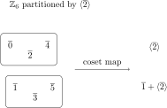

# Chapter 10 -- Cosets and the Theorem of Lagrange

> **Fraleigh, *A First Course in Abstract Algebra*, 7th edition, Section 10.**
> Study companion for SNU Abstract Algebra (26-1).

Cosets are translated copies of a subgroup. Lagrange's theorem converts that geometric picture into a divisibility statement: the size of every subgroup divides the size of the group. This is the first time subgroup structure produces a serious counting theorem, and it is the true precursor to quotient groups (Chapter 14).

---

## §10.1 Left and Right Cosets

**Definition 10.1 (Left coset).** Let $H \le G$ and $a \in G$. The *left coset of $H$ determined by $a$* is
$$
aH = \{ah : h \in H\}.
$$

**Definition 10.2 (Right coset).** The *right coset of $H$ determined by $a$* is
$$
Ha = \{ha : h \in H\}.
$$

In an abelian group $aH = Ha$ for every $a$, because $ah = ha$. In a non-abelian group they can differ.

### Worked examples of cosets

**Example 10.3 (Cosets in $\mathbb{Z}$).** Take $G = \mathbb{Z}$ (additive) and $H = 3\mathbb{Z} = \{0, \pm 3, \pm 6, \dots\}$. Since $\mathbb{Z}$ is abelian, left and right cosets agree. Writing cosets additively:
$$
0 + 3\mathbb{Z} = 3\mathbb{Z} = \{\dots, -6, -3, 0, 3, 6, \dots\},
$$
$$
1 + 3\mathbb{Z} = \{\dots, -5, -2, 1, 4, 7, \dots\},
$$
$$
2 + 3\mathbb{Z} = \{\dots, -4, -1, 2, 5, 8, \dots\}.
$$
These are exactly the residue classes modulo $3$. Every integer lies in exactly one of them, so the three cosets partition $\mathbb{Z}$.

**Example 10.4 (Cosets in $\mathbb{Z}_6$).** Let $G = \mathbb{Z}_6 = \{0,1,2,3,4,5\}$ and $H = \langle 2 \rangle = \{0, 2, 4\}$. Then
$$
0 + H = \{0, 2, 4\}, \qquad 1 + H = \{1, 3, 5\}.
$$
Note $2 + H = \{2, 4, 0\} = 0 + H$ and $3 + H = \{3, 5, 1\} = 1 + H$. There are exactly two distinct cosets, and $[G:H] = 6/3 = 2$.

Figure: the coset partition of $\mathbb{Z}_6$ by $\langle \bar{2}\rangle$.

The two rounded boxes are the two cosets; this is the finite model of the general statement that cosets partition the group.

**Example 10.5 (Left and right cosets in $S_3$).** Let $G = S_3$ and $H = \{e, (1\;2\;3), (1\;3\;2)\} = \langle (1\;2\;3) \rangle$. Since $|H| = 3$ and $|S_3| = 6$, there are $[S_3 : H] = 2$ cosets.

*Left cosets:*
$$
eH = H = \{e,\; (1\;2\;3),\; (1\;3\;2)\}.
$$
Take the transposition $(1\;2) \notin H$:
$$
(1\;2)H = \{(1\;2)e,\; (1\;2)(1\;2\;3),\; (1\;2)(1\;3\;2)\} = \{(1\;2),\; (2\;3),\; (1\;3)\}.
$$
Indeed,
$$
(1\;2)(1\;2\;3) = (2\;3), \qquad (1\;2)(1\;3\;2) = (1\;3),
$$
so the left coset is exactly the set of transpositions.

*Right cosets:*
$$
He = H = \{e,\; (1\;2\;3),\; (1\;3\;2)\}.
$$
$$
H(1\;2) = \{(1\;2),\; (1\;2\;3)(1\;2),\; (1\;3\;2)(1\;2)\}.
$$
Indeed,
$$
(1\;2\;3)(1\;2) = (1\;3), \qquad (1\;3\;2)(1\;2) = (2\;3),
$$
so the right coset is also the set of transpositions.

In this case the left and right cosets happen to be the same *as sets* (both give $\{H, \{(1\;2),(1\;3),(2\;3)\}\}$). This is because $H$ has index $2$ in $S_3$, and index-$2$ subgroups are always normal (see §10.8 and Chapter 14).

---

## §10.1a Reading Coset Structure from a Cayley Table

The Cayley table (or *group table*) of a finite group $G$ is the $|G| \times |G|$ multiplication table: the entry in row $a$, column $b$ is the product $ab$. Every finite group is completely determined by its Cayley table, and the table encodes subgroup and coset information in a visually striking way. This section develops the technique of *coset shading* that Fraleigh uses in Tables 10.5--10.9.

### Quick review: what a Cayley table tells you

For a group $G = \{g_1, g_2, \dots, g_n\}$, the Cayley table is:

|  | $g_1$ | $g_2$ | $\cdots$ | $g_n$ |
|---|---|---|---|---|
| $g_1$ | $g_1 g_1$ | $g_1 g_2$ | $\cdots$ | $g_1 g_n$ |
| $g_2$ | $g_2 g_1$ | $g_2 g_2$ | $\cdots$ | $g_2 g_n$ |
| $\vdots$ | $\vdots$ | $\vdots$ | $\ddots$ | $\vdots$ |
| $g_n$ | $g_n g_1$ | $g_n g_2$ | $\cdots$ | $g_n g_n$ |

Two fundamental properties:

1. **Latin square property.** Every element of $G$ appears exactly once in each row and each column. (Proof: left multiplication $g \mapsto ag$ is a bijection on $G$.)
2. **Identity row/column.** If $g_1 = e$, then the first row is just $g_1, g_2, \dots, g_n$ in order, and so is the first column.

### Coset shading: the main idea

Suppose $H \le G$ with index $[G:H] = k$. The left cosets $a_1H, a_2H, \dots, a_kH$ partition $G$ into $k$ blocks of equal size. Now **rearrange the rows and columns** of the Cayley table so that elements within the same coset are adjacent (grouped together). Then **assign each coset a shade** (say light, medium, dark, etc.) and color every entry $ab$ according to the coset that $ab$ belongs to.

The resulting shaded table reveals whether the cosets themselves form a group.

### Example: $\mathbb{Z}_6$ with $H = \{0, 3\}$

This is Fraleigh's Example 10.4. Take $G = \mathbb{Z}_6$ and $H = \{0, 3\}$, so $|H| = 2$ and $[G:H] = 3$. The three cosets are:
$$
C_0 = \{0, 3\}, \qquad C_1 = \{1, 4\}, \qquad C_2 = \{2, 5\}.
$$
Rearrange the Cayley table of $(\mathbb{Z}_6, +_6)$ so elements are grouped by coset: $0, 3 \mid 1, 4 \mid 2, 5$.

| $+_6$ | $0$ | $3$ | $1$ | $4$ | $2$ | $5$ |
|---|---|---|---|---|---|---|
| $0$ | $0$ | $3$ | $1$ | $4$ | $2$ | $5$ |
| $3$ | $3$ | $0$ | $4$ | $1$ | $5$ | $2$ |
| $1$ | $1$ | $4$ | $2$ | $5$ | $3$ | $0$ |
| $4$ | $4$ | $1$ | $5$ | $2$ | $0$ | $3$ |
| $2$ | $2$ | $5$ | $3$ | $0$ | $4$ | $1$ |
| $5$ | $5$ | $2$ | $0$ | $3$ | $1$ | $4$ |

Now shade by coset membership. Write <b class="cl">LT</b> (light) for $C_0 = \{0,3\}$, <b class="cm">MD</b> (medium) for $C_1 = \{1,4\}$, <b class="cd">DK</b> (dark) for $C_2 = \{2,5\}$:

| $+_6$ | $0$ | $3$ | $1$ | $4$ | $2$ | $5$ |
|---|---|---|---|---|---|---|
| $0$ | <b class="cl">LT</b> | <b class="cl">LT</b> | <b class="cm">MD</b> | <b class="cm">MD</b> | <b class="cd">DK</b> | <b class="cd">DK</b> |
| $3$ | <b class="cl">LT</b> | <b class="cl">LT</b> | <b class="cm">MD</b> | <b class="cm">MD</b> | <b class="cd">DK</b> | <b class="cd">DK</b> |
| $1$ | <b class="cm">MD</b> | <b class="cm">MD</b> | <b class="cd">DK</b> | <b class="cd">DK</b> | <b class="cl">LT</b> | <b class="cl">LT</b> |
| $4$ | <b class="cm">MD</b> | <b class="cm">MD</b> | <b class="cd">DK</b> | <b class="cd">DK</b> | <b class="cl">LT</b> | <b class="cl">LT</b> |
| $2$ | <b class="cd">DK</b> | <b class="cd">DK</b> | <b class="cl">LT</b> | <b class="cl">LT</b> | <b class="cm">MD</b> | <b class="cm">MD</b> |
| $5$ | <b class="cd">DK</b> | <b class="cd">DK</b> | <b class="cl">LT</b> | <b class="cl">LT</b> | <b class="cm">MD</b> | <b class="cm">MD</b> |

**The critical observation.** Look at the $2 \times 2$ blocks formed by grouping rows and columns by coset. Each block is a *single, solid shade*. This means that whenever $a$ and $a'$ are in the same left coset and $b$ and $b'$ are in the same left coset, the products $ab$ and $a'b'$ land in the same coset. In other words, the coset to which $ab$ belongs depends only on the cosets of $a$ and $b$, not on the particular representatives.

This is exactly the condition needed for the set of cosets to form a group under the induced operation. Reading off the shading gives a $3 \times 3$ "coset multiplication table":

|  | <b class="cl">LT</b> | <b class="cm">MD</b> | <b class="cd">DK</b> |
|---|---|---|---|
| <b class="cl">LT</b> | <b class="cl">LT</b> | <b class="cm">MD</b> | <b class="cd">DK</b> |
| <b class="cm">MD</b> | <b class="cm">MD</b> | <b class="cd">DK</b> | <b class="cl">LT</b> |
| <b class="cd">DK</b> | <b class="cd">DK</b> | <b class="cl">LT</b> | <b class="cm">MD</b> |

Replacing LT $\to 0$, MD $\to 1$, DK $\to 2$, this is exactly the Cayley table of $\mathbb{Z}_3$. So the three cosets of $H$ in $\mathbb{Z}_6$, with the operation "add representatives and take the coset of the result," form a group isomorphic to $\mathbb{Z}_3$. This is the *factor group* $\mathbb{Z}_6 / H \cong \mathbb{Z}_3$, studied properly in Chapter 14.

### Why solid blocks mean "well-defined coset multiplication"

The factor group construction requires a *well-defined* binary operation on cosets:
$$
(aH)(bH) := (ab)H.
$$
The danger is that $aH = a'H$ and $bH = b'H$ (i.e., $a, a'$ are in the same coset, and $b, b'$ are in the same coset) but $(ab)H \ne (a'b')H$. If that happened, the "operation" would depend on which representative we pick, and would not actually be a function on cosets.

In the shaded Cayley table, a solid block means: for *every* pair of entries in that block, the product lands in the same coset. So solid blocks $\Leftrightarrow$ well-defined coset multiplication $\Leftrightarrow$ the cosets form a group.

**This is precisely the condition that $H$ is a normal subgroup** ($aH = Ha$ for all $a \in G$). The full proof is in Chapter 14, but the shaded table gives you a concrete, visual diagnostic.

### Counterexample: $S_3$ with a non-normal subgroup

Fraleigh's Tables 10.8--10.9 illustrate the failure. Take $G = S_3$ with the notation from Chapter 8:
$$
\rho_0 = e, \quad \rho_1 = (1\;2\;3), \quad \rho_2 = (1\;3\;2), \quad \mu_1 = (2\;3), \quad \mu_2 = (1\;3), \quad \mu_3 = (1\;2).
$$

Consider the subgroup $H = \{\rho_0, \mu_1\}$ of order $2$, with index $[S_3 : H] = 3$.

*Left cosets:*
$$
\rho_0 H = \{\rho_0, \mu_1\}, \quad \rho_1 H = \{\rho_1, \mu_3\}, \quad \rho_2 H = \{\rho_2, \mu_2\}.
$$
(Verify: $\rho_1 \mu_1 = (1\;2\;3)(2\;3) = (1\;2) = \mu_3$, and $\rho_2 \mu_1 = (1\;3\;2)(2\;3) = (1\;3) = \mu_2$.)

Now write the Cayley table of $S_3$ with elements grouped by left coset: $\rho_0, \mu_1 \mid \rho_1, \mu_3 \mid \rho_2, \mu_2$, and shade by coset membership.

|  | $\rho_0$ | $\mu_1$ | $\rho_1$ | $\mu_3$ | $\rho_2$ | $\mu_2$ |
|---|---|---|---|---|---|---|
| $\rho_0$ | <b class="cl">LT</b> | <b class="cl">LT</b> | <b class="cm">MD</b> | <b class="cm">MD</b> | <b class="cd">DK</b> | <b class="cd">DK</b> |
| $\mu_1$ | <b class="cl">LT</b> | <b class="cl">LT</b> | <b class="cd">DK</b> | <b class="cd">DK</b> | <b class="cm">MD</b> | <b class="cm">MD</b> |
| $\rho_1$ | <b class="cm">MD</b> | <b class="cm">MD</b> | <b class="cd">DK</b> | <b class="cd">DK</b> | <b class="cl">LT</b> | <b class="cl">LT</b> |
| $\mu_3$ | <b class="cm">MD</b> | <b class="cd">DK</b> | <b class="cl">LT</b> | <b class="cm">MD</b> | <b class="cd">DK</b> | <b class="cl">LT</b> |
| $\rho_2$ | <b class="cd">DK</b> | <b class="cd">DK</b> | <b class="cl">LT</b> | <b class="cl">LT</b> | <b class="cm">MD</b> | <b class="cm">MD</b> |
| $\mu_2$ | <b class="cd">DK</b> | <b class="cm">MD</b> | <b class="cm">MD</b> | <b class="cl">LT</b> | <b class="cl">LT</b> | <b class="cd">DK</b> |

(Entries computed from the full $S_3$ multiplication table in Chapter 8.)

Look at the $2 \times 2$ blocks. **They are not solid.** For instance, the block in rows $\{\mu_3\}$ and columns $\{\rho_0, \mu_1\}$ has entries MD and DK -- two different shades in the same block. This means coset multiplication is *not well-defined*: different representatives of the same coset can give products in different cosets.

Concretely: $\rho_1$ and $\mu_3$ are both in coset $C_1 = \{\rho_1, \mu_3\}$, and $\rho_0$ is in $C_0$. But $\rho_1 \cdot \rho_0 = \rho_1 \in C_1$ while $\mu_3 \cdot \rho_0 = \mu_3 \in C_1$ -- that one is fine. However, looking at other blocks: $\mu_3 \cdot \mu_1 = (1\;2)(2\;3) = (1\;2\;3) = \rho_1 \in C_1$, but $\mu_3 \cdot \rho_1 = (1\;2)(1\;2\;3) = (2\;3) = \mu_1 \in C_0$. Same row-coset, same column-coset, different result-cosets. The block is not solid, and coset multiplication breaks down.

**Diagnosis.** $H = \{\rho_0, \mu_1\}$ is not normal in $S_3$: the left coset $\rho_1 H = \{\rho_1, \mu_3\}$ but the right coset $H\rho_1 = \{\rho_1, \mu_2\}$, so $\rho_1 H \ne H\rho_1$.

### Contrast: $S_3$ with the normal subgroup $\langle \rho_1 \rangle$

Now take $H = \{\rho_0, \rho_1, \rho_2\} = \langle (1\;2\;3) \rangle$, which has index $2$. The two cosets are:
$$
C_0 = \{\rho_0, \rho_1, \rho_2\}, \qquad C_1 = \{\mu_1, \mu_2, \mu_3\}.
$$
Group the Cayley table by coset and shade:

|  | $\rho_0$ | $\rho_1$ | $\rho_2$ | $\mu_1$ | $\mu_2$ | $\mu_3$ |
|---|---|---|---|---|---|---|
| $\rho_0$ | <b class="cl">LT</b> | <b class="cl">LT</b> | <b class="cl">LT</b> | <b class="cd">DK</b> | <b class="cd">DK</b> | <b class="cd">DK</b> |
| $\rho_1$ | <b class="cl">LT</b> | <b class="cl">LT</b> | <b class="cl">LT</b> | <b class="cd">DK</b> | <b class="cd">DK</b> | <b class="cd">DK</b> |
| $\rho_2$ | <b class="cl">LT</b> | <b class="cl">LT</b> | <b class="cl">LT</b> | <b class="cd">DK</b> | <b class="cd">DK</b> | <b class="cd">DK</b> |
| $\mu_1$ | <b class="cd">DK</b> | <b class="cd">DK</b> | <b class="cd">DK</b> | <b class="cl">LT</b> | <b class="cl">LT</b> | <b class="cl">LT</b> |
| $\mu_2$ | <b class="cd">DK</b> | <b class="cd">DK</b> | <b class="cd">DK</b> | <b class="cl">LT</b> | <b class="cl">LT</b> | <b class="cl">LT</b> |
| $\mu_3$ | <b class="cd">DK</b> | <b class="cd">DK</b> | <b class="cd">DK</b> | <b class="cl">LT</b> | <b class="cl">LT</b> | <b class="cl">LT</b> |

Every $3 \times 3$ block is a solid shade. Reading off the coset table:

|  | <b class="cl">LT</b> | <b class="cd">DK</b> |
|---|---|---|
| <b class="cl">LT</b> | <b class="cl">LT</b> | <b class="cd">DK</b> |
| <b class="cd">DK</b> | <b class="cd">DK</b> | <b class="cl">LT</b> |

This is $\mathbb{Z}_2$. So $S_3 / \langle (1\;2\;3) \rangle \cong \mathbb{Z}_2$, as expected for an index-$2$ subgroup.

### Summary: the shading diagnostic

| Condition | What the shaded table looks like | Consequence |
|---|---|---|
| $H \trianglelefteq G$ (normal) | Every coset-block is a single solid shade | Cosets form a group ($G/H$ is well-defined) |
| $H$ not normal | Some blocks contain mixed shades | No well-defined coset multiplication |

The technique works for *any* finite group. In practice: write the Cayley table, group elements by coset, shade, and check whether the blocks are uniform. Uniform blocks mean you have a factor group; mixed blocks mean the subgroup is not normal and no factor group exists via those cosets.

This visual approach is revisited in full generality in Chapter 14, where we prove that the cosets of $H$ form a group under $(aH)(bH) = abH$ if and only if $H \trianglelefteq G$.

---

## §10.2 Cosets Partition the Group

The key idea: define a relation on $G$ by
$$
a \sim b \iff a^{-1}b \in H.
$$

**Theorem 10.6.** The relation $\sim$ is an equivalence relation on $G$, and the equivalence class of $a$ is the left coset $aH$.

> [!info]- Proof that $\sim$ is an equivalence relation
> We verify the three axioms.
>
> **Reflexive.** For any $a \in G$, $a^{-1}a = e \in H$ (since $H$ is a subgroup). So $a \sim a$.
>
> **Symmetric.** Suppose $a \sim b$, i.e.\ $a^{-1}b \in H$. Since $H$ is a subgroup, $(a^{-1}b)^{-1} = b^{-1}a \in H$. Hence $b \sim a$.
>
> **Transitive.** Suppose $a \sim b$ and $b \sim c$, i.e.\ $a^{-1}b \in H$ and $b^{-1}c \in H$. Since $H$ is closed under multiplication,
> $$
> a^{-1}c = (a^{-1}b)(b^{-1}c) \in H.
> $$
> Hence $a \sim c$. $\blacksquare$

> [!info]- Proof that the equivalence class of $a$ is $aH$
> The equivalence class of $a$ is $[a] = \{b \in G : a \sim b\} = \{b \in G : a^{-1}b \in H\}$.
>
> ($\subseteq$) If $b \in [a]$, then $a^{-1}b = h$ for some $h \in H$, so $b = ah \in aH$.
>
> ($\supseteq$) If $b \in aH$, then $b = ah$ for some $h \in H$, so $a^{-1}b = h \in H$, meaning $b \in [a]$.
>
> Therefore $[a] = aH$. $\blacksquare$

**Corollary 10.7.** The distinct left cosets of $H$ in $G$ form a partition of $G$. That is, every element of $G$ belongs to exactly one left coset, and two left cosets are either identical or disjoint.

> [!info]- Proof
> This is a direct consequence of the fundamental theorem on equivalence relations: the equivalence classes of any equivalence relation on a set $S$ partition $S$. By Theorem 10.6, the equivalence classes of $\sim$ are exactly the left cosets of $H$. $\blacksquare$

---

## §10.3 All Cosets Have the Same Size

**Theorem 10.8.** For any $a \in G$, $|aH| = |H|$.

> [!info]- Proof
> Define $\varphi : H \to aH$ by $\varphi(h) = ah$.
>
> **Well-defined:** Clear, since $ah \in aH$ for every $h \in H$.
>
> **Injective:** Suppose $\varphi(h_1) = \varphi(h_2)$, i.e.\ $ah_1 = ah_2$. Left-multiplying by $a^{-1}$ gives $h_1 = h_2$.
>
> **Surjective:** Every element of $aH$ has the form $ah$ for some $h \in H$, and $\varphi(h) = ah$.
>
> Since $\varphi$ is a bijection, $|aH| = |H|$. $\blacksquare$

**Remark.** The same argument shows $|Ha| = |H|$ via the bijection $h \mapsto ha$.

---

## §10.4 Lagrange's Theorem

**Theorem 10.9 (Lagrange's Theorem).** If $G$ is a finite group and $H \le G$, then $|H|$ divides $|G|$.

> [!info]- Proof
> By Corollary 10.7, the distinct left cosets $a_1H, a_2H, \dots, a_rH$ partition $G$:
> $$
> G = a_1H \;\dot\cup\; a_2H \;\dot\cup\; \cdots \;\dot\cup\; a_rH.
> $$
> Taking cardinalities,
> $$
> |G| = |a_1H| + |a_2H| + \cdots + |a_rH|.
> $$
> By Theorem 10.8, $|a_iH| = |H|$ for each $i$, so
> $$
> |G| = r \cdot |H|.
> $$
> In particular, $|H|$ divides $|G|$, and $r = |G|/|H|$. $\blacksquare$

**Definition 10.10 (Index).** The *index of $H$ in $G$*, written $[G:H]$, is the number of distinct left cosets of $H$ in $G$. By the proof above, if $G$ is finite then
$$
[G:H] = \frac{|G|}{|H|}.
$$

**Example 10.11.** $[\mathbb{Z}_6 : \langle 2 \rangle] = 6/3 = 2$. $[S_3 : \langle (1\;2\;3) \rangle] = 6/3 = 2$.

---

## §10.5 Corollaries of Lagrange's Theorem

**Corollary 10.12 (Order of an element divides $|G|$).** If $G$ is a finite group and $a \in G$, then the order $|a|$ divides $|G|$.

> [!info]- Proof
> The cyclic subgroup $\langle a \rangle$ has order $|a|$ and is a subgroup of $G$. By Lagrange, $|a| = |\langle a \rangle|$ divides $|G|$. $\blacksquare$

**Corollary 10.13.** If $G$ is a finite group with $|G| = n$, then $a^n = e$ for all $a \in G$.

> [!info]- Proof
> By Corollary 10.12, $|a|$ divides $n$, so $n = |a| \cdot k$ for some positive integer $k$. Then
> $$
> a^n = a^{|a| \cdot k} = (a^{|a|})^k = e^k = e. \qquad \blacksquare
> $$

**Corollary 10.14 (Groups of prime order are cyclic).** If $|G| = p$ where $p$ is prime, then $G$ is cyclic and every non-identity element is a generator.

> [!info]- Proof
> Let $a \in G$ with $a \ne e$. Then $|a| > 1$ and $|a|$ divides $p$ (Corollary 10.12). Since $p$ is prime, the only divisors of $p$ are $1$ and $p$. Thus $|a| = p$, so $\langle a \rangle = G$, and $G$ is cyclic with generator $a$. $\blacksquare$

**Corollary 10.15 (Fermat's Little Theorem).** If $p$ is prime and $\gcd(a, p) = 1$, then
$$
a^{p-1} \equiv 1 \pmod{p}.
$$

> [!info]- Proof
> Consider the multiplicative group $\mathbb{Z}_p^* = \{1, 2, \dots, p-1\}$ under multiplication mod $p$. This is a group of order $p - 1$. Since $\gcd(a, p) = 1$, the residue class $\bar{a} \in \mathbb{Z}_p^*$. By Corollary 10.13,
> $$
> \bar{a}^{\,p-1} = \bar{1},
> $$
> which means $a^{p-1} \equiv 1 \pmod{p}$. $\blacksquare$

**Example.** Take $p = 7$, $a = 3$. Then $3^6 = 729$. Now $729 = 104 \cdot 7 + 1$, so $3^6 \equiv 1 \pmod{7}$, confirming Fermat.

**Corollary 10.16 (Euler's Theorem).** If $\gcd(a, n) = 1$, then
$$
a^{\phi(n)} \equiv 1 \pmod{n},
$$
where $\phi(n) = |\mathbb{Z}_n^*|$ is Euler's totient function.

> [!info]- Proof
> The group $\mathbb{Z}_n^*$ of units modulo $n$ has order $\phi(n)$. Since $\gcd(a,n) = 1$, we have $\bar{a} \in \mathbb{Z}_n^*$. By Corollary 10.13,
> $$
> \bar{a}^{\,\phi(n)} = \bar{1},
> $$
> i.e., $a^{\phi(n)} \equiv 1 \pmod{n}$. $\blacksquare$

**Remark.** Fermat's little theorem is the special case $n = p$ prime, since $\phi(p) = p - 1$.

---

## §10.6 The Converse of Lagrange is FALSE

A natural question: if $d$ divides $|G|$, must $G$ have a subgroup of order $d$? The answer is **no**.

**Theorem 10.17.** The alternating group $A_4$ has order $12$ but no subgroup of order $6$.

> [!info]- Proof
> $A_4$ consists of the $12$ even permutations of $\{1,2,3,4\}$:
> - the identity $e$,
> - eight $3$-cycles: $(1\;2\;3)$, $(1\;3\;2)$, $(1\;2\;4)$, $(1\;4\;2)$, $(1\;3\;4)$, $(1\;4\;3)$, $(2\;3\;4)$, $(2\;4\;3)$,
> - three products of disjoint transpositions: $(1\;2)(3\;4)$, $(1\;3)(2\;4)$, $(1\;4)(2\;3)$.
>
> Suppose for contradiction that $H \le A_4$ with $|H| = 6$. Then $[A_4 : H] = 12/6 = 2$.
>
> **Claim:** A subgroup of index $2$ is always normal. Indeed, for any $g \in G$, the two left cosets are $H$ and $gH$, and the two right cosets are $H$ and $Hg$. Since $G = H \;\dot\cup\; gH = H \;\dot\cup\; Hg$ and these partitions have only two blocks, we must have $gH = Hg$ for every $g$, so $H \trianglelefteq G$.
>
> So $H$ would be a normal subgroup of $A_4$ of order $6$.
>
> **Claim:** $H$ must contain all eight $3$-cycles. If $\sigma$ is a $3$-cycle, then $|\sigma| = 3$. The element $\sigma$ generates $\langle \sigma \rangle$ of order $3$. By Lagrange applied to $H$, the order of $\sigma$ in $H$ must divide $|H| = 6$, which is fine. But we can argue more precisely: since $H$ is normal in $A_4$ and $H$ has index $2$, for any $a \in A_4$, $a^2 \in H$ (because in $A_4/H \cong \mathbb{Z}_2$, the square of every element is the identity). Every $3$-cycle $\sigma$ satisfies $\sigma^2 = \sigma^{-1}$, which is also a $3$-cycle. But $\sigma^2 \in H$ implies $\sigma^{-1} \in H$, which implies $\sigma = (\sigma^{-1})^{-1} \in H$.
>
> So all eight $3$-cycles lie in $H$, plus $e \in H$, giving at least $9$ elements. But $|H| = 6 < 9$, a contradiction. Therefore no subgroup of order $6$ exists. $\blacksquare$

**Remark.** The converse of Lagrange *does* hold for some classes of groups -- for instance, finite abelian groups, and more generally $p$-groups by Sylow theory (Chapter 36 in Fraleigh). The full Sylow theorems guarantee subgroups of order $p^k$ for prime powers dividing $|G|$.

---

## §10.7 Worked Coset Computations

### Cosets of $\langle 3 \rangle$ in $\mathbb{Z}_{12}$

Let $G = \mathbb{Z}_{12}$ and $H = \langle 3 \rangle = \{0, 3, 6, 9\}$. Then $|H| = 4$, so $[G:H] = 12/4 = 3$. The three cosets:
$$
0 + H = \{0, 3, 6, 9\},
$$
$$
1 + H = \{1, 4, 7, 10\},
$$
$$
2 + H = \{2, 5, 8, 11\}.
$$
Check: $3 + H = \{3, 6, 9, 0\} = 0 + H$, $4 + H = \{4, 7, 10, 1\} = 1 + H$, etc. Every element of $\mathbb{Z}_{12}$ appears in exactly one coset.

### Cosets of $\langle 2 \rangle$ in $\mathbb{Z}_8$

Let $G = \mathbb{Z}_8$ and $H = \langle 2 \rangle = \{0, 2, 4, 6\}$. Then $|H| = 4$, $[G : H] = 8/4 = 2$. The cosets:
$$
0 + H = \{0, 2, 4, 6\}, \qquad 1 + H = \{1, 3, 5, 7\}.
$$
These are the even and odd elements of $\mathbb{Z}_8$.

### Left vs.\ right cosets: an example where they differ

Let $G = S_3$ and $K = \{e, (1\;2)\}$. Then $|K| = 2$ and $[S_3 : K] = 3$.

*Left cosets:*
$$
eK = \{e, (1\;2)\},
$$
$$
(1\;2\;3)K = \{(1\;2\;3),\; (1\;2\;3)(1\;2)\} = \{(1\;2\;3),\; (1\;3)\},
$$
$$
(1\;3\;2)K = \{(1\;3\;2),\; (1\;3\;2)(1\;2)\} = \{(1\;3\;2),\; (2\;3)\}.
$$
(Verify: $(1\;2\;3)(1\;2)$: $1\to 2\to 2\to 1$... applying $(1\;2)$ first then $(1\;2\;3)$: $1\to 2\to 3$, $2\to 1\to 2$, $3\to 3\to 1$. That is $(1\;3)$. And $(1\;3\;2)(1\;2)$: $1\to 2\to 1$, $2\to 1\to 3$, $3\to 3\to 2$, giving $(2\;3)$.)

*Right cosets:*
$$
Ke = \{e, (1\;2)\},
$$
$$
K(1\;2\;3) = \{(1\;2\;3),\; (1\;2)(1\;2\;3)\} = \{(1\;2\;3),\; (2\;3)\},
$$
$$
K(1\;3\;2) = \{(1\;3\;2),\; (1\;2)(1\;3\;2)\} = \{(1\;3\;2),\; (1\;3)\}.
$$
(Verify: $(1\;2)(1\;2\;3)$: apply $(1\;2\;3)$ first, then $(1\;2)$: $1\to 2\to 1$, $2\to 3\to 3$, $3\to 1\to 2$. That is $(2\;3)$. And $(1\;2)(1\;3\;2)$: apply $(1\;3\;2)$ first, then $(1\;2)$: $1\to 3\to 3$, $2\to 1\to 2$, $3\to 2\to 1$. That is $(1\;3)$.)

Compare:

| Left coset | Right coset |
|---|---|
| $\{e, (1\;2)\}$ | $\{e, (1\;2)\}$ |
| $\{(1\;2\;3), (1\;3)\}$ | $\{(1\;2\;3), (2\;3)\}$ |
| $\{(1\;3\;2), (2\;3)\}$ | $\{(1\;3\;2), (1\;3)\}$ |

The left and right cosets are **different**. For instance, $(1\;3)$ sits in the coset $(1\;2\;3)K$ on the left, but in $K(1\;3\;2)$ on the right. This happens because $K = \{e, (1\;2)\}$ is **not a normal subgroup** of $S_3$.

---

## §10.8 When Left Cosets Equal Right Cosets -- Preview of Normal Subgroups

**Definition 10.18 (Normal subgroup, preview).** A subgroup $H \le G$ is *normal*, written $H \trianglelefteq G$, if $aH = Ha$ for every $a \in G$.

When $H$ is normal, the set of cosets $G/H = \{aH : a \in G\}$ itself becomes a group under the operation $(aH)(bH) = abH$. This is the *factor group* or *quotient group* (Chapter 14).

**Observation 10.19.** Every subgroup of index $2$ is normal.

> [!info]- Proof
> Let $[G:H] = 2$. There are exactly two left cosets: $H$ and $G \setminus H$. Likewise, there are exactly two right cosets: $H$ and $G \setminus H$. For any $a \in G$:
> - If $a \in H$, then $aH = H = Ha$.
> - If $a \notin H$, then $aH = G \setminus H = Ha$.
>
> In either case $aH = Ha$, so $H \trianglelefteq G$. $\blacksquare$

This is why the cosets of $\langle (1\;2\;3) \rangle$ in $S_3$ (Example 10.5) had the same left and right decomposition: the index was $2$.

---

## §10.9 Counting Argument Applications

Lagrange's theorem is a powerful tool for restricting the structure of a group without knowing the group's multiplication table.

**Example 10.20.** Let $|G| = 12$. By Lagrange, the possible orders of subgroups are the divisors of $12$: $1, 2, 3, 4, 6, 12$. The possible orders of elements are also restricted to these values.

**Example 10.21.** Let $|G| = 35 = 5 \cdot 7$. Then every element has order dividing $35$, so the possible element orders are $1, 5, 7, 35$. In particular, no element has order $2$ or $3$.

**Example 10.22.** Suppose $G$ is a group of order $6$ with an element $a$ of order $6$. Then $\langle a \rangle = G$, so $G$ is cyclic. On the other hand, $S_3$ has order $6$ but no element of order $6$ (the elements have orders $1, 2, 3$), so $S_3$ is not cyclic. These are in fact the only two groups of order $6$, up to isomorphism.

**Example 10.23 (Subgroup lattice of $\mathbb{Z}_{12}$).** The subgroups of $\mathbb{Z}_{12}$ are:
- $\langle 1 \rangle = \mathbb{Z}_{12}$ (order $12$),
- $\langle 2 \rangle = \{0,2,4,6,8,10\}$ (order $6$),
- $\langle 3 \rangle = \{0,3,6,9\}$ (order $4$),
- $\langle 4 \rangle = \{0,4,8\}$ (order $3$),
- $\langle 6 \rangle = \{0,6\}$ (order $2$),
- $\langle 0 \rangle = \{0\}$ (order $1$).

Every subgroup order ($1,2,3,4,6,12$) divides $12$, as Lagrange guarantees. The index of each is $[G:H] = 12/|H|$.

---

## §10.10 Lang's Perspective -- Cosets as Fibers

Serge Lang (*Algebra*, Ch. I) views cosets through the lens of the natural projection. If $H \le G$, define the surjection
$$
\pi : G \to G/H, \qquad \pi(a) = aH,
$$
where $G/H$ denotes the set of left cosets (not necessarily a group unless $H$ is normal). The *fiber* of $\pi$ over the coset $aH$ is
$$
\pi^{-1}(aH) = \{g \in G : gH = aH\} = aH.
$$
So each fiber is a left coset, and the fibers partition $G$.

Lagrange's theorem becomes a statement about fibers of a surjection: all fibers have the same cardinality $|H|$, and there are $[G:H]$ fibers, so $|G| = [G:H] \cdot |H|$.

This viewpoint generalizes beyond groups: whenever a surjection $f: X \to Y$ between finite sets has all fibers of the same size $n$, then $|X| = n \cdot |Y|$. Lagrange's theorem says that the natural projection of a group onto its coset space always has this equi-fiber property.

When $H \trianglelefteq G$, the set $G/H$ is itself a group and $\pi$ is a group homomorphism. Lagrange then becomes the special case of the first isomorphism theorem where the homomorphism is the projection.

---

## Productive Struggle -- what Lagrange does and does not give you

> [!warning] Common wrong guess 1
> If $d$ divides $|G|$, then $G$ must contain a subgroup of order $d$.
>
> **Where it breaks.** Lagrange's theorem only says that subgroup orders must divide $|G|$. It is a necessary condition, not a sufficient one. The counterexample in §10.6 is the standard warning: $A_4$ has order $12$, but no subgroup of order $6$.
>
> **Repaired method.** Use Lagrange as a restriction tool:
> - to rule subgroup orders out,
> - to restrict possible element orders,
> - to guide a search.
>
> But do not treat divisibility as an existence theorem. Existence usually requires an actual construction, extra structure, or deeper results such as the Sylow theorems.

> [!warning] Common wrong guess 2
> Left cosets and right cosets are just two notations for the same translated copy.
>
> **Where it breaks.** In a nonabelian group, left and right multiplication can move a subgroup differently. The computation with $K=\{e,(1\;2)\}\le S_3$ shows exactly this: $(1\;2\;3)K$ and $K(1\;2\;3)$ are different sets.
>
> **Repaired method.** Treat the equality $aH=Ha$ as a theorem-level statement, not a notation-level convenience. If left and right cosets agree for every $a$, that is precisely the preview of normality that opens the door to quotient groups in Chapter 14.

These two mistakes are worth keeping side by side. The first overreads a counting theorem into an existence theorem. The second overreads a notation pattern into a structural symmetry. Both are examples of why Chapter 10 must be read carefully rather than slogan-first.

---

