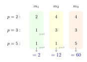
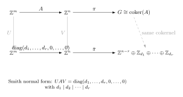

This chapter introduces the first systematic construction for building new groups from old ones, and culminates in the classification of all finitely generated abelian groups — one of the cleanest structural theorems in algebra.

---

## §11.1 External direct products

### Definition 11.1 (External direct product)

Let $(G_1, \ast_1), (G_2, \ast_2), \ldots, (G_n, \ast_n)$ be groups. The **external direct product** $G_1 \times G_2 \times \cdots \times G_n$ is the set of all $n$-tuples
$$
\{(g_1, g_2, \ldots, g_n) : g_i \in G_i\}
$$
with the **componentwise operation**
$$
(g_1, \ldots, g_n)(h_1, \ldots, h_n) = (g_1 \ast_1 h_1, \ldots, g_n \ast_n h_n).
$$

> [!info]- Theorem 11.2. $G_1 \times \cdots \times G_n$ is a group.
>
> **Proof.** We verify each axiom.
>
> *Closure.* Each $g_i \ast_i h_i \in G_i$ since $G_i$ is a group, so the tuple lies in the product.
>
> *Associativity.* For any three tuples $(a_i), (b_i), (c_i)$:
> $$
> \bigl((a_i)(b_i)\bigr)(c_i) = (a_i b_i)(c_i) = ((a_i b_i)c_i) = (a_i(b_i c_i)) = (a_i)\bigl((b_i)(c_i)\bigr),
> $$
> where the key step uses associativity in each $G_i$.
>
> *Identity.* The tuple $(e_1, e_2, \ldots, e_n)$ where $e_i$ is the identity in $G_i$.
>
> *Inverses.* The inverse of $(g_1, \ldots, g_n)$ is $(g_1^{-1}, \ldots, g_n^{-1})$. $\blacksquare$

**Notation.** We write $\prod_{i=1}^n G_i$ or simply $G_1 \times G_2 \times \cdots \times G_n$.

### Canonical maps

Every direct product comes with built-in homomorphisms:

- **Projections** $\pi_j : \prod G_i \to G_j$ defined by $\pi_j(g_1, \ldots, g_n) = g_j$. These are surjective homomorphisms.
- **Inclusions** $\iota_j : G_j \to \prod G_i$ defined by $\iota_j(g) = (e_1, \ldots, g, \ldots, e_n)$ with $g$ in the $j$-th slot. These are injective homomorphisms.

> [!info]- Universal property of the direct product
>
> The direct product satisfies the following universal property: for any group $X$ with homomorphisms $f_i : X \to G_i$ for each $i$, there exists a **unique** homomorphism $\varphi : X \to \prod G_i$ such that $\pi_i \circ \varphi = f_i$. Explicitly,
> $$
> \varphi(x) = (f_1(x), f_2(x), \ldots, f_n(x)).
> $$
> This makes $\prod G_i$ the categorical product in **Grp**.

---

## §11.2 Orders of elements in direct products

### Theorem 11.3 (Order formula)

Let $g = (g_1, g_2, \ldots, g_n) \in G_1 \times \cdots \times G_n$ where each $g_i$ has finite order $r_i$ in $G_i$. Then
$$
\operatorname{ord}(g) = \operatorname{lcm}(r_1, r_2, \ldots, r_n).
$$

> [!info]- Proof
>
> Since the operation is componentwise, $g^t = (g_1^t, \ldots, g_n^t)$. Thus $g^t = (e_1, \ldots, e_n)$ if and only if $g_i^t = e_i$ for all $i$, which holds if and only if $r_i \mid t$ for all $i$. The smallest such positive $t$ is $\operatorname{lcm}(r_1, \ldots, r_n)$. $\blacksquare$

### Worked computations

**Example 11.4.** In $\mathbb{Z}_4 \times \mathbb{Z}_6$:

| Element | Orders of coordinates | $\operatorname{lcm}$ | Order in product |
|---|---|---|---|
| $(\bar{1}, \bar{1})$ | $\operatorname{ord}(\bar{1}) = 4$, $\operatorname{ord}(\bar{1}) = 6$ | $\operatorname{lcm}(4,6) = 12$ | $12$ |
| $(\bar{2}, \bar{3})$ | $\operatorname{ord}(\bar{2}) = 2$, $\operatorname{ord}(\bar{3}) = 2$ | $\operatorname{lcm}(2,2) = 2$ | $2$ |
| $(\bar{1}, \bar{2})$ | $\operatorname{ord}(\bar{1}) = 4$, $\operatorname{ord}(\bar{2}) = 3$ | $\operatorname{lcm}(4,3) = 12$ | $12$ |
| $(\bar{2}, \bar{2})$ | $\operatorname{ord}(\bar{2}) = 2$, $\operatorname{ord}(\bar{2}) = 3$ | $\operatorname{lcm}(2,3) = 6$ | $6$ |
| $(\bar{0}, \bar{0})$ | $1, 1$ | $1$ | $1$ |

Since $|\mathbb{Z}_4 \times \mathbb{Z}_6| = 24$ but no element has order $24$, this group is **not cyclic**.

> [!tip] Quick check
> The maximum possible order in $\mathbb{Z}_m \times \mathbb{Z}_n$ is $\operatorname{lcm}(m,n)$. The product is cyclic iff this equals $mn$, iff $\gcd(m,n) = 1$.

**Example 11.5.** In $\mathbb{Z}_3 \times \mathbb{Z}_5$:

$(\bar{1}, \bar{1})$ has order $\operatorname{lcm}(3, 5) = 15 = |\mathbb{Z}_3 \times \mathbb{Z}_5|$, so this element generates the entire group: $\mathbb{Z}_3 \times \mathbb{Z}_5 \cong \mathbb{Z}_{15}$.

---

## §11.3 When is $\mathbb{Z}_m \times \mathbb{Z}_n$ cyclic?

### Theorem 11.6 (Cyclicity criterion)

$$
\mathbb{Z}_m \times \mathbb{Z}_n \text{ is cyclic} \quad\Longleftrightarrow\quad \gcd(m,n) = 1.
$$
When this holds, $\mathbb{Z}_m \times \mathbb{Z}_n \cong \mathbb{Z}_{mn}$.

> [!info]- Proof
>
> $(\Rightarrow)$ **Contrapositive.** Suppose $d = \gcd(m,n) > 1$. Then for every $(a,b) \in \mathbb{Z}_m \times \mathbb{Z}_n$:
> $$
> \operatorname{ord}(\bar{a}, \bar{b}) = \operatorname{lcm}(\operatorname{ord}(\bar{a}), \operatorname{ord}(\bar{b})) \;\Big|\; \operatorname{lcm}(m, n) = \frac{mn}{d} < mn.
> $$
> So no element has order $mn = |\mathbb{Z}_m \times \mathbb{Z}_n|$, and the group cannot be cyclic.
>
> $(\Leftarrow)$ If $\gcd(m,n) = 1$, then $\operatorname{lcm}(m,n) = mn$, and
> $$
> \operatorname{ord}(\bar{1}, \bar{1}) = \operatorname{lcm}(m, n) = mn = |\mathbb{Z}_m \times \mathbb{Z}_n|,
> $$
> so $(\bar{1}, \bar{1})$ generates the group. $\blacksquare$

### Corollary 11.7 (General product of cyclic groups)

$$
\mathbb{Z}_{m_1} \times \mathbb{Z}_{m_2} \times \cdots \times \mathbb{Z}_{m_k} \cong \mathbb{Z}_{m_1 m_2 \cdots m_k} \quad\Longleftrightarrow\quad \gcd(m_i, m_j) = 1 \text{ for all } i \neq j.
$$

> [!info]- Proof
>
> Apply Theorem 11.6 inductively. If the $m_i$ are pairwise coprime, then
> $$
> \operatorname{lcm}(m_1, \ldots, m_k) = m_1 \cdots m_k,
> $$
> so $(\bar{1}, \ldots, \bar{1})$ generates the product.
>
> Conversely, if $\gcd(m_i, m_j) > 1$ for some pair, then one can show no element achieves order $m_1 \cdots m_k$, by the same lcm argument as Theorem 11.6. $\blacksquare$

---

## §11.3½ The Chinese Remainder Theorem

Corollary 11.7 is precisely the **Chinese Remainder Theorem** (CRT) in the language of cyclic groups. We state it as a standalone theorem because of its central importance.

### Theorem 11.7½ (Chinese Remainder Theorem — Group form)

Let $m_1, m_2, \ldots, m_k$ be pairwise coprime positive integers, and let $n = m_1 m_2 \cdots m_k$. Then
$$
\mathbb{Z}_n \cong \mathbb{Z}_{m_1} \times \mathbb{Z}_{m_2} \times \cdots \times \mathbb{Z}_{m_k}.
$$

In particular, if $n = p_1^{a_1} p_2^{a_2} \cdots p_s^{a_s}$ is the prime factorization, then
$$
\mathbb{Z}_n \cong \mathbb{Z}_{p_1^{a_1}} \times \mathbb{Z}_{p_2^{a_2}} \times \cdots \times \mathbb{Z}_{p_s^{a_s}}.
$$

> [!info]- Proof
>
> This is Corollary 11.7. The prime-power factors are pairwise coprime, so the product is cyclic of order $n$, hence isomorphic to $\mathbb{Z}_n$. $\blacksquare$

### Theorem 11.7¾ (Chinese Remainder Theorem — Ring form)

If $\gcd(m,n) = 1$, then
$$
\mathbb{Z}/mn\mathbb{Z} \cong \mathbb{Z}/m\mathbb{Z} \times \mathbb{Z}/n\mathbb{Z}
$$
as **rings** (not just as groups). The isomorphism is $\bar{a} \mapsto (\bar{a} \bmod m,\; \bar{a} \bmod n)$.

> [!tip] Why the ring version matters
> The ring isomorphism preserves multiplication as well as addition. This means:
> - $(\mathbb{Z}/mn\mathbb{Z})^\times \cong (\mathbb{Z}/m\mathbb{Z})^\times \times (\mathbb{Z}/n\mathbb{Z})^\times$, recovering the formula $\varphi(mn) = \varphi(m)\varphi(n)$ for coprime $m,n$.
> - Systems of simultaneous congruences can be solved by working modulo each factor independently, then recombining.
>
> This will reappear when we study ring theory (quotient rings, ideals).

### Worked example: solving a system of congruences

**Problem.** Solve $x \equiv 2 \pmod{3}$, $x \equiv 3 \pmod{5}$.

**Solution.** By CRT, $\mathbb{Z}_{15} \cong \mathbb{Z}_3 \times \mathbb{Z}_5$ via $\bar{a} \mapsto (\bar{a} \bmod 3, \bar{a} \bmod 5)$. We need the preimage of $(\bar{2}, \bar{3})$.

Try $x = 2$: gives $(2, 2)$. Try $x = 8$: gives $(2, 3)$. Check: $8 \equiv 2 \pmod 3$ ✓ and $8 \equiv 3 \pmod 5$ ✓.

So $x \equiv 8 \pmod{15}$ is the unique solution modulo 15.

**Systematic method.** Find $e_1, e_2$ with $e_1 \equiv 1 \pmod 3$, $e_1 \equiv 0 \pmod 5$ and $e_2 \equiv 0 \pmod 3$, $e_2 \equiv 1 \pmod 5$. Then $e_1 = 10$ (since $10 = 2 \times 5$ and $10 \equiv 1 \pmod 3$) and $e_2 = 6$ (since $6 = 2 \times 3$ and $6 \equiv 1 \pmod 5$). The solution is $x \equiv 2 \cdot 10 + 3 \cdot 6 = 38 \equiv 8 \pmod{15}$.

### Standard applications

| Decomposition | Justification |
|---|---|
| $\mathbb{Z}_6 \cong \mathbb{Z}_2 \times \mathbb{Z}_3$ | $\gcd(2,3)=1$ |
| $\mathbb{Z}_{12} \cong \mathbb{Z}_4 \times \mathbb{Z}_3$ | $\gcd(4,3)=1$ |
| $\mathbb{Z}_{60} \cong \mathbb{Z}_4 \times \mathbb{Z}_3 \times \mathbb{Z}_5$ | pairwise coprime |
| $\mathbb{Z}_{12} \not\cong \mathbb{Z}_6 \times \mathbb{Z}_2$ | $\gcd(6,2)=2 \neq 1$ |

> [!warning] CRT requires pairwise coprimality
> $\mathbb{Z}_{12} \not\cong \mathbb{Z}_6 \times \mathbb{Z}_2$ even though $12 = 6 \times 2$. You must factor into pairwise coprime pieces: $\mathbb{Z}_{12} \cong \mathbb{Z}_4 \times \mathbb{Z}_3$.

Figure: a small direct-product grid.

The grid makes the coordinatewise law visible: each move changes one factor at a time, while the full group element records both coordinates at once.

---

## §11.4 The Fundamental Theorem of Finitely Generated Abelian Groups

This is the main structural result of the chapter and one of the most important theorems in the first half of the course.

### Theorem 11.8 (FTFGAG — Invariant factor form)

Every finitely generated abelian group $G$ is isomorphic to a group of the form
$$
\mathbb{Z}^r \times \mathbb{Z}_{n_1} \times \mathbb{Z}_{n_2} \times \cdots \times \mathbb{Z}_{n_s}
$$
where $r \geq 0$ and
$$
n_1 \mid n_2 \mid \cdots \mid n_s, \qquad n_i > 1.
$$
The integer $r$ (the **free rank** or **Betti number**) and the integers $n_1, \ldots, n_s$ (the **invariant factors**) are **uniquely determined** by $G$.

### Theorem 11.9 (FTFGAG — Elementary divisor form)

Equivalently, every finitely generated abelian group $G$ is isomorphic to
$$
\mathbb{Z}^r \times \mathbb{Z}_{p_1^{a_1}} \times \mathbb{Z}_{p_2^{a_2}} \times \cdots \times \mathbb{Z}_{p_t^{a_t}}
$$
where the $p_i$ are (not necessarily distinct) primes and each $a_i \geq 1$. The prime powers $p_1^{a_1}, \ldots, p_t^{a_t}$ (the **elementary divisors**) are uniquely determined up to reordering.

> [!warning] The theorem is stated without proof in Fraleigh
> The full proof requires the theory of modules over PIDs (developed in Lang, Chapter III). At this level, we accept it and focus on *using* it.

### The two forms determine each other

The invariant factors and elementary divisors encode the same information in two different ways. **Being able to convert between them is essential.**

### Worked example 11.9a (one group written in both languages)

Suppose a finite abelian group $G$ has elementary divisors
$$
2,\;4,\;8,\;3,\;3,\;9.
$$
Then
$$
G \cong \mathbb{Z}_2 \times \mathbb{Z}_4 \times \mathbb{Z}_8 \times \mathbb{Z}_3 \times \mathbb{Z}_3 \times \mathbb{Z}_9.
$$

To convert to invariant factors, organize by prime:

- $p=2$: $2,4,8$
- $p=3$: $3,3,9$

The lists already have the same length, namely $3$, so no padding is needed. Multiply columnwise:

| Prime | Col 1 | Col 2 | Col 3 |
| --- | --- | --- | --- |
| $2$-part | $2$ | $4$ | $8$ |
| $3$-part | $3$ | $3$ | $9$ |
| Product | $6$ | $12$ | $72$ |

Therefore the invariant factors are
$$
6,\;12,\;72,
$$
so
$$
G \cong \mathbb{Z}_6 \times \mathbb{Z}_{12} \times \mathbb{Z}_{72}.
$$

Now go back the other way to check the work:
$$
\mathbb{Z}_6 \cong \mathbb{Z}_2 \times \mathbb{Z}_3,\qquad
\mathbb{Z}_{12} \cong \mathbb{Z}_4 \times \mathbb{Z}_3,\qquad
\mathbb{Z}_{72} \cong \mathbb{Z}_8 \times \mathbb{Z}_9.
$$
Collecting the prime-power pieces again gives
$$
2,\;4,\;8,\;3,\;3,\;9.
$$
So the two descriptions really do encode the same group.

---

## §11.5 Converting between elementary divisors and invariant factors

Figure: elementary divisors grouped into invariant factors.

Read the figure columnwise: each column produces one invariant factor by multiplying the prime-power entries in that column.

### Algorithm: Elementary divisors → Invariant factors

**Input:** A list of prime-power elementary divisors.

**Procedure:**
1. For each prime $p$, collect all the $p$-power elementary divisors and sort them in **non-decreasing** order.
2. Let $r$ be the maximum number of elementary divisors for any single prime. Pad each prime's list on the **left** with $1$'s to make all lists length $r$.
3. The $j$-th invariant factor $n_j$ is the product of the $j$-th entries across all primes.

**Why it works:** Each column contains at most one power of each prime, so the entries in each column are pairwise coprime. By the CRT (Corollary 11.7), $\mathbb{Z}_{n_j}$ is isomorphic to the product of the cyclic groups in column $j$. The left-padding ensures $n_1 \mid n_2 \mid \cdots \mid n_r$ because within each row the powers are non-decreasing.

### Algorithm: Invariant factors → Elementary divisors

**Input:** Invariant factors $n_1 \mid n_2 \mid \cdots \mid n_r$ with each $n_i > 1$.

**Procedure:** Factor each $n_j$ into prime powers using the CRT:
$$
\mathbb{Z}_{n_j} \cong \prod_p \mathbb{Z}_{p^{v_p(n_j)}}
$$
where $v_p(n_j)$ is the $p$-adic valuation of $n_j$. Collect all the resulting prime powers (discarding any $\mathbb{Z}_1$ factors). These are the elementary divisors.

### Productive struggle: where the conversion algorithm breaks if you rush

> [!warning] Common wrong guess
> Once the prime-power factors have been listed, you can combine them in any order and still get the right invariant factors.
>
> **Where it breaks.** The divisibility chain can fail immediately. For example, take elementary divisors
> $$
> 2,\;4,\;3.
> $$
> The correct procedure is:
> - $2$-part list: $2,4$
> - $3$-part list: pad on the **left** to get $1,3$
>
> Then the invariant factors are
> $$
> 2,\;12.
> $$
> If you pad on the right instead, you would get columns $2\cdot 3=6$ and $4\cdot 1=4$, producing
> $$
> 6,\;4,
> $$
> which is not an invariant-factor decomposition because $6 \nmid 4$.
>
> **Repaired method.** Always:
> - sort each prime list in non-decreasing order,
> - pad on the left with $1$'s,
> - multiply columnwise.
>
> The point of the padding is not cosmetic. It is exactly what preserves the divisibility chain.

---

## §11.6 Worked classification examples

### Example 11.10. Classify all abelian groups of order $8 = 2^3$.

The elementary divisor partitions of $2^3$ are the partitions of the exponent $3$:

| Partition of $3$ | Elementary divisors | Invariant factors | Group |
|---|---|---|---|
| $3$ | $2^3 = 8$ | $8$ | $\mathbb{Z}_8$ |
| $2 + 1$ | $2^2 = 4,\; 2^1 = 2$ | $2, 4$ | $\mathbb{Z}_2 \times \mathbb{Z}_4$ |
| $1 + 1 + 1$ | $2, 2, 2$ | $2, 2, 2$ | $\mathbb{Z}_2 \times \mathbb{Z}_2 \times \mathbb{Z}_2$ |

**Distinguishing them by element orders:**
- $\mathbb{Z}_8$: has an element of order $8$
- $\mathbb{Z}_2 \times \mathbb{Z}_4$: max order is $\operatorname{lcm}(2,4) = 4$, and it has elements of order $4$
- $\mathbb{Z}_2^3$: every nonidentity element has order $2$

So the three groups are pairwise non-isomorphic. $\square$

### Example 11.11. Classify all abelian groups of order $72 = 2^3 \cdot 3^2$.

For the $2$-primary part ($2^3$), the partitions of $3$ give: $\{8\}$, $\{4, 2\}$, $\{2, 2, 2\}$.

For the $3$-primary part ($3^2$), the partitions of $2$ give: $\{9\}$, $\{3, 3\}$.

Each combination gives one isomorphism class: $3 \times 2 = 6$ groups total.

| $2$-part | $3$-part | Group (elementary divisor form) | Invariant factors |
|---|---|---|---|
| $\{8\}$ | $\{9\}$ | $\mathbb{Z}_8 \times \mathbb{Z}_9$ | $72$ |
| $\{8\}$ | $\{3,3\}$ | $\mathbb{Z}_8 \times \mathbb{Z}_3 \times \mathbb{Z}_3$ | $3, 24$ |
| $\{4,2\}$ | $\{9\}$ | $\mathbb{Z}_4 \times \mathbb{Z}_2 \times \mathbb{Z}_9$ | $2, 36$ |
| $\{4,2\}$ | $\{3,3\}$ | $\mathbb{Z}_4 \times \mathbb{Z}_2 \times \mathbb{Z}_3 \times \mathbb{Z}_3$ | $6, 12$ |
| $\{2,2,2\}$ | $\{9\}$ | $\mathbb{Z}_2^3 \times \mathbb{Z}_9$ | $2, 2, 18$ |
| $\{2,2,2\}$ | $\{3,3\}$ | $\mathbb{Z}_2^3 \times \mathbb{Z}_3^2$ | $2, 6, 6$ |

> [!info]- Detailed invariant factor computation for $\mathbb{Z}_4 \times \mathbb{Z}_2 \times \mathbb{Z}_3 \times \mathbb{Z}_3$
>
> Elementary divisors: $4, 2, 3, 3$.
>
> Group by prime:
> - $p = 2$: $\{2, 4\}$ (sorted non-decreasing)
> - $p = 3$: $\{3, 3\}$
>
> Both lists have length $2$ (max), so $r = 2$. No padding needed.
>
> | Prime | Col 1 | Col 2 |
> |---|---|---|
> | $p = 2$ | $2$ | $4$ |
> | $p = 3$ | $3$ | $3$ |
> | **Product** | $n_1 = 6$ | $n_2 = 12$ |
>
> Check: $6 \mid 12$ ✓ and $6 \times 12 = 72$ ✓.
>
> So $\mathbb{Z}_4 \times \mathbb{Z}_2 \times \mathbb{Z}_3 \times \mathbb{Z}_3 \cong \mathbb{Z}_6 \times \mathbb{Z}_{12}$.

### Example 11.12. The homework problem: $\mathbb{Z}_6 \times \mathbb{Z}_{12} \times \mathbb{Z}_{20}$.

This is exactly the computation from Homework 1, Problem 3. We include it here as a model.

**Step 1.** Prime factorizations: $6 = 2 \cdot 3$, $12 = 2^2 \cdot 3$, $20 = 2^2 \cdot 5$.

**Step 2.** Apply CRT to each factor:
$$
\mathbb{Z}_6 \cong \mathbb{Z}_2 \times \mathbb{Z}_3, \qquad
\mathbb{Z}_{12} \cong \mathbb{Z}_4 \times \mathbb{Z}_3, \qquad
\mathbb{Z}_{20} \cong \mathbb{Z}_4 \times \mathbb{Z}_5.
$$

**Step 3.** Collect elementary divisors by prime:
- $p = 2$: $2, 4, 4$
- $p = 3$: $3, 3$
- $p = 5$: $5$

**Step 4.** Build the invariant factor table (max list length $r = 3$, pad with $1$'s on the left):

| Prime | Col 1 | Col 2 | Col 3 |
|---|---|---|---|
| $p = 2$ | $2$ | $4$ | $4$ |
| $p = 3$ | $1$ | $3$ | $3$ |
| $p = 5$ | $1$ | $1$ | $5$ |
| **$n_j$** | **$2$** | **$12$** | **$60$** |

**Invariant factors:** $m_1 = 2$, $m_2 = 12$, $m_3 = 60$.

**Verification:** $2 \mid 12 \mid 60$, and $2 \times 12 \times 60 = 1440 = 6 \times 12 \times 20$.

---

## §11.7 The exponent of a group

### Definition 11.13

The **exponent** of a finite group $G$ is the smallest positive integer $m$ such that $g^m = e$ for all $g \in G$. Equivalently, $\exp(G) = \operatorname{lcm}\{\operatorname{ord}(g) : g \in G\}$.

> [!info]- Connection to invariant factors
>
> For a finite abelian group $G \cong \mathbb{Z}_{n_1} \times \cdots \times \mathbb{Z}_{n_s}$ with $n_1 \mid \cdots \mid n_s$, the exponent is the **largest invariant factor** $n_s$.
>
> *Proof.* The maximum order of any element is $\operatorname{lcm}(n_1, \ldots, n_s) = n_s$ (since $n_i \mid n_s$ for all $i$, the lcm collapses to $n_s$). And this maximum is achieved by the element $(\bar{0}, \ldots, \bar{0}, \bar{1})$. $\blacksquare$

**Example 11.14.** The exponent of $\mathbb{Z}_2 \times \mathbb{Z}_{12} \times \mathbb{Z}_{60}$ is $60$. The exponent of $\mathbb{Z}_2 \times \mathbb{Z}_2 \times \mathbb{Z}_2$ is $2$.

---

## §11.8 Internal direct products

When a group $G$ contains subgroups $H$ and $K$ that "behave like" the factors of an external direct product, we say $G$ is an **internal direct product**.

### Definition 11.15

A group $G$ is the **internal direct product** of subgroups $H$ and $K$ if:
1. Every element of $G$ can be written as $hk$ for some $h \in H$, $k \in K$.
2. $hk = kh$ for all $h \in H$, $k \in K$.
3. $H \cap K = \{e\}$.

### Theorem 11.16. If $G$ is the internal direct product of $H$ and $K$, then $G \cong H \times K$.

> [!info]- Proof (the map $\varphi(h,k) = hk$)
>
> Define $\varphi : H \times K \to G$ by $\varphi(h, k) = hk$.
>
> **Homomorphism.** For $(h_1, k_1), (h_2, k_2) \in H \times K$:
> $$
> \varphi(h_1 h_2, k_1 k_2) = h_1 h_2 k_1 k_2.
> $$
> $$
> \varphi(h_1, k_1)\varphi(h_2, k_2) = h_1 k_1 h_2 k_2 = h_1 (k_1 h_2) k_2 \overset{(2)}{=} h_1 (h_2 k_1) k_2 = h_1 h_2 k_1 k_2.
> $$
>
> **Surjective.** By condition (1).
>
> **Injective.** If $hk = e$, then $h = k^{-1} \in H \cap K = \{e\}$ by (3), so $h = k = e$.
>
> Therefore $\varphi$ is an isomorphism. $\blacksquare$

This is exactly **Homework 1, Problem 4**. The conditions (a)–(c) in the homework are precisely the definition of an internal direct product.

> [!info]- Alternative proof: uniqueness of the $hk$ representation
>
> One can also work from $G$ to $H \times K$. If $h_1 k_1 = h_2 k_2$, then $h_2^{-1}h_1 = k_2 k_1^{-1}$. The left side lies in $H$, the right in $K$, so both lie in $H \cap K = \{e\}$. Hence $h_1 = h_2$ and $k_1 = k_2$: every element has a **unique** factorization $g = hk$.
>
> Define $\psi : G \to H \times K$ by $\psi(g) = (h, k)$ where $g = hk$. This is well-defined by uniqueness, is evidently inverse to $\varphi$, and condition (2) makes it a homomorphism.

### Remark 11.17 (Connection to normality)

In a general (possibly non-abelian) group, the standard definition of internal direct product replaces condition (2) with the requirement that both $H$ and $K$ are **normal** in $G$. For abelian groups every subgroup is normal, so the two definitions coincide. The general version will reappear in the theory of semidirect products.

---

## §11.9 Recognizing isomorphic decompositions

A common exercise type: given two different-looking products of cyclic groups, determine whether they are isomorphic.

**Strategy.** Reduce both to their elementary divisor forms (factor each $\mathbb{Z}_n$ into prime-power pieces using CRT). If the multisets of prime-power factors agree, the groups are isomorphic.

### Example 11.18.

Is $\mathbb{Z}_4 \times \mathbb{Z}_6 \cong \mathbb{Z}_{12} \times \mathbb{Z}_2$?

Decompose:
$$
\mathbb{Z}_4 \times \mathbb{Z}_6 \cong \mathbb{Z}_4 \times \mathbb{Z}_2 \times \mathbb{Z}_3,
$$
$$
\mathbb{Z}_{12} \times \mathbb{Z}_2 \cong \mathbb{Z}_4 \times \mathbb{Z}_3 \times \mathbb{Z}_2.
$$

Same elementary divisors: $\{4, 3, 2\}$. **Yes, isomorphic.** $\square$

### Example 11.19.

Is $\mathbb{Z}_4 \times \mathbb{Z}_4 \cong \mathbb{Z}_2 \times \mathbb{Z}_8$?

Decompose: left side has elementary divisors $\{4, 4\}$. Right side has $\{2, 8\}$. **Not isomorphic.**

Alternative quick argument: the left side has no element of order $8$ (max order $= \operatorname{lcm}(4,4) = 4$), while the right side does. $\square$

### Example 11.20.

Is $\mathbb{Z}_2 \times \mathbb{Z}_3 \times \mathbb{Z}_5 \cong \mathbb{Z}_{30}$?

Since $\gcd(2,3) = \gcd(2,5) = \gcd(3,5) = 1$, the CRT gives $\mathbb{Z}_2 \times \mathbb{Z}_3 \times \mathbb{Z}_5 \cong \mathbb{Z}_{30}$. **Yes.** $\square$

---

## §11.10 Counting and distinguishing abelian groups of a given order

### Theorem 11.21

The number of non-isomorphic abelian groups of order $n = p_1^{a_1} \cdots p_k^{a_k}$ is
$$
\prod_{i=1}^k P(a_i),
$$
where $P(a_i)$ is the number of partitions of $a_i$.

> [!info]- Why partitions?
>
> By the FTFGAG, the $p_i$-primary component of a finite abelian group of order $n$ is a product $\mathbb{Z}_{p_i^{b_1}} \times \cdots \times \mathbb{Z}_{p_i^{b_j}}$ where $b_1 + \cdots + b_j = a_i$ and each $b_k \geq 1$. The possible choices for $(b_1, \ldots, b_j)$ (unordered) are exactly the partitions of $a_i$.

**Example 11.22.** Number of abelian groups of order $360 = 2^3 \cdot 3^2 \cdot 5$:
$$
P(3) \cdot P(2) \cdot P(1) = 3 \cdot 2 \cdot 1 = 6.
$$

---

## §11.11 Structural perspective (Lang)

Lang's version of this chapter begins one layer deeper than Fraleigh's. The key move is:

**Do not think of a finitely generated abelian group merely as a group. Think of it as a module over $\mathbb{Z}$.**

That single change of viewpoint explains why integer matrices, divisibility chains, and prime-power decompositions appear so naturally.

### Abelian groups are exactly $\mathbb{Z}$-modules

**Definition 11.23 ($\mathbb{Z}$-module viewpoint).** If $A$ is an abelian group written additively, define
$$
n \cdot a =
\begin{cases}
\underbrace{a+\cdots+a}_{n\text{ times}} & n>0,\\
0 & n=0,\\
-(|n|\cdot a) & n<0.
\end{cases}
$$
Then $A$ becomes a module over the ring $\mathbb{Z}$.

**Proposition 11.24.** Giving an abelian group is equivalent to giving a $\mathbb{Z}$-module.

> [!info]- Proof of Proposition 11.24
> If $A$ is an abelian group, the scalar multiplication above satisfies the module axioms:
> $$
> (m+n)a = ma + na,\qquad m(a+b)=ma+mb,\qquad (mn)a = m(na),\qquad 1a=a.
> $$
> These identities are just repeated-addition identities.
>
> Conversely, a $\mathbb{Z}$-module is by definition an abelian group under addition together with compatible integer scalar multiplication. So no new algebraic object has been introduced; we have only changed language. $\blacksquare$

This is why finitely generated abelian groups belong to the same world as linear algebra. The ring is not a field, so the theory is subtler than vector spaces, but the organizing principle is the same: generators, relations, matrices, reduction to canonical form.

### Presentations: generators and relations become integer matrices

Suppose $G$ is a finitely generated abelian group with generators $g_1,\dots,g_n$. Then there is a surjective homomorphism
$$
\pi:\mathbb{Z}^n \to G,\qquad \pi(e_i)=g_i,
$$
where $e_1,\dots,e_n$ are the standard basis vectors.

The kernel $\ker(\pi)$ is the subgroup of all integer relations among the generators:
$$
\ker(\pi)=\{(a_1,\dots,a_n)\in\mathbb{Z}^n : a_1g_1+\cdots+a_ng_n=0\}.
$$
So
$$
G \cong \mathbb{Z}^n/\ker(\pi).
$$

That is the first really important Lang move: every finitely generated abelian group is a quotient of a free module $\mathbb{Z}^n$.

If $\ker(\pi)$ is generated by relation vectors $r_1,\dots,r_m \in \mathbb{Z}^n$, place those vectors as the rows of an integer matrix $A$. Then one writes
$$
G \cong \operatorname{coker}(A) = \mathbb{Z}^n/\operatorname{im}(A^T)
$$
up to the usual row/column convention. The exact convention matters less than the idea: **a finitely generated abelian group is encoded by an integer matrix**.

### Smith normal form is the engine behind the classification theorem

Figure: Smith normal form as the roadmap from an integer matrix to the classified abelian group.

The point of the diagram is that matrix reduction is not separate from classification; it is the mechanism that produces the invariant factors.

**Theorem 11.25 (Smith normal form, group-theoretic consequence).** Let $A$ be an integer matrix. Then there exist invertible integer matrices $U$ and $V$ such that
$$
UAV=\operatorname{diag}(d_1,\dots,d_r,0,\dots,0)
$$
with
$$
d_1 \mid d_2 \mid \cdots \mid d_r,\qquad d_i>0.
$$
Consequently,
$$
\operatorname{coker}(A)\cong \mathbb{Z}^{\,n-r}\oplus \mathbb{Z}_{d_1}\oplus\cdots\oplus \mathbb{Z}_{d_r}.
$$

> [!info]- Why Theorem 11.25 gives the classification
> Row operations on $A$ change the chosen generators for the relation module; column operations change the chosen generators for the free module $\mathbb{Z}^n$. Because both changes are effected by invertible integer matrices, they do not change the isomorphism type of the cokernel.
>
> So one may replace $A$ by its Smith normal form. But the cokernel of the diagonal map is easy to read:
> - each diagonal entry $d_i$ contributes a cyclic torsion summand $\mathbb{Z}_{d_i}$;
> - each zero diagonal entry contributes a free copy of $\mathbb{Z}$.
>
> The divisibility chain $d_1\mid \cdots \mid d_r$ is exactly the invariant-factor condition. $\blacksquare$

This is the real origin of Theorem 11.8. The invariant factors are not mysterious integers pulled out of nowhere; they are the diagonal entries of the Smith normal form of a presentation matrix.

### Why the elementary divisors and invariant factors are two faces of the same theorem

Once the diagonal form
$$
\mathbb{Z}^{\,r}\oplus \mathbb{Z}_{d_1}\oplus\cdots\oplus \mathbb{Z}_{d_s}
$$
has been reached, two equally natural ways of reading it appear.

1. **Keep the diagonal entries $d_i$ intact.** This gives the **invariant factor decomposition**:
   $$
   \mathbb{Z}^{\,r}\oplus \mathbb{Z}_{d_1}\oplus\cdots\oplus \mathbb{Z}_{d_s},
   \qquad d_1\mid d_2\mid\cdots\mid d_s.
   $$

2. **Factor each $d_i$ into prime powers and then split those prime-power parts apart using the CRT.** This gives the **elementary divisor decomposition**.

So:
- the **invariant factors** come from the Smith normal form as written;
- the **elementary divisors** come from further prime-power decomposition of the diagonal entries.

That is why the conversion algorithm in §11.5 works. It is not an isolated trick; it is the CRT applied after Smith normal form.

### A small Smith-normal-form style example

Consider the abelian group presented by generators $x,y$ and relations
$$
2x+4y=0,\qquad 6y=0.
$$
Its relation matrix is
$$
A=\begin{pmatrix}
2 & 4\\
0 & 6
\end{pmatrix}.
$$
One can reduce $A$ over $\mathbb{Z}$ to Smith normal form:
$$
\begin{pmatrix}
2 & 4\\
0 & 6
\end{pmatrix}
\sim
\begin{pmatrix}
2 & 0\\
0 & 6
\end{pmatrix}.
$$
Therefore the group is
$$
\operatorname{coker}(A)\cong \mathbb{Z}_2 \times \mathbb{Z}_6.
$$

Why this example matters: it shows exactly how a relations problem turns into a canonical product of cyclic groups. The classification theorem is the global version of this calculation.

### Worked example 11.25a (a presentation matrix that does not read itself)

Consider the abelian group
$$
G=\langle x,y \mid 4x+6y=0,\; 2x+8y=0\rangle.
$$
Its presentation matrix is
$$
A=\begin{pmatrix}
4 & 6\\
2 & 8
\end{pmatrix}.
$$

At first glance, a rushed reader may try to read the first row as "something like a $\mathbb{Z}_4$ relation" and the second row as "something like a $\mathbb{Z}_8$ relation." That is exactly the wrong instinct, because both relations involve the same generators.

Reduce $A$ to Smith normal form:
$$
\begin{pmatrix}
4 & 6\\
2 & 8
\end{pmatrix}
\sim
\begin{pmatrix}
2 & 8\\
4 & 6
\end{pmatrix}
\sim
\begin{pmatrix}
2 & 8\\
0 & -10
\end{pmatrix}
\sim
\begin{pmatrix}
2 & 0\\
0 & -10
\end{pmatrix}
\sim
\begin{pmatrix}
2 & 0\\
0 & 10
\end{pmatrix}.
$$

Here is what each move is doing:

1. Swap the two rows so that the smaller pivot $2$ appears first.
2. Replace row $2$ by row $2-2\cdot$row $1$.
3. Replace column $2$ by column $2-4\cdot$column $1$.
4. Multiply the second row by $-1$.

So the Smith normal form is
$$
\operatorname{diag}(2,10).
$$
Therefore
$$
G\cong \mathbb{Z}_2 \times \mathbb{Z}_{10}.
$$

Notice what the calculation reveals. The original presentation did not visibly advertise a factor of order $10$. That factor only appears after changing bases in the generator module and in the relation module. This is exactly why Smith normal form is the correct tool.

### Productive struggle: why reading relations row by row fails

> [!warning] Common wrong guess
> If a presentation matrix has two rows, then each row should correspond to one cyclic factor of the answer.
>
> **Where it breaks.** Relations are constraints on the same generators, so they interact. In the example above, neither row by itself suggests the factor $\mathbb{Z}_{10}$, but the combined relation system does.
>
> **Repaired method.** Do not read a presentation matrix row-by-row as though each relation lives in isolation. Package all relations together, allow integer row and column operations, and read the group only after Smith normal form has separated the independent torsion directions.

### What Lang's viewpoint explains that Fraleigh leaves implicit

- **Why integer matrices appear:** a finitely generated abelian group is a quotient of $\mathbb{Z}^n$, so relations are integer linear combinations.
- **Why divisibility chains appear:** they are built into Smith normal form.
- **Why the torsion-free part is $\mathbb{Z}^r$:** zero diagonal entries survive as free coordinates.
- **Why the theorem is unique:** Smith normal form is unique up to units, which in $\mathbb{Z}$ means up to signs.
- **Why CRT enters twice:** once to split cyclic groups of coprime order, and again to pass between invariant factors and elementary divisors.

At the level of this course, one usually accepts the full module proof as background. But knowing this machinery is present behind the scenes makes the theorem feel earned rather than miraculous.

---

## Bridge to Chapters 13 and 14 -- products, free objects, and quotients

This chapter points in two structural directions at once.

First, the early sections on direct products prepare [Chapter 13 - Homomorphisms](./Chapter%2013%20-%20Homomorphisms.md), where the direct product is characterized by a universal property: maps into a product are the same as compatible coordinate maps.

Second, the presentation-matrix sections prepare [Chapter 14 - Factor Groups](./Chapter%2014%20-%20Factor%20Groups.md), because every finitely generated abelian group is presented as
$$
\mathbb{Z}^n/R
$$
for a subgroup of relations $R \le \mathbb{Z}^n$.

So the structural route is:

- free abelian group $\mathbb{Z}^n$;
- quotient by a relation subgroup $R$;
- canonical projection $\mathbb{Z}^n \twoheadrightarrow \mathbb{Z}^n/R$;
- classification by putting the relations into Smith normal form.

That is why this chapter belongs on both sides of the course:

- it still looks computational and finite, like Fraleigh;
- but it already has the quotient-and-factorization architecture that Chapters 13 through 15 will make explicit.

---

## §11.13 Flashcard-ready summary

> [!tip] Key facts to memorize
>
> 1. $\operatorname{ord}(g_1, \ldots, g_n) = \operatorname{lcm}(\operatorname{ord}(g_1), \ldots, \operatorname{ord}(g_n))$.
> 2. $\mathbb{Z}_m \times \mathbb{Z}_n \cong \mathbb{Z}_{mn}$ iff $\gcd(m,n) = 1$.
> 3. Number of abelian groups of order $p_1^{a_1} \cdots p_k^{a_k}$ is $P(a_1) \cdots P(a_k)$.
> 4. Largest invariant factor = exponent of the group.
> 5. To test isomorphism of abelian groups: reduce to elementary divisors and compare.
> 6. Internal direct product of $H, K \leq G$: need $G = HK$, elements of $H$ and $K$ commute, $H \cap K = \{e\}$.

---

## What should be mastered before leaving Chapter 11

You should be able to:
- Compute orders in direct products using the lcm formula
- State and apply both forms of the FTFGAG
- Convert between elementary divisor and invariant factor forms (the column algorithm)
- Classify all finite abelian groups of a given order
- Determine when two products of cyclic groups are isomorphic
- Prove the internal-direct-product theorem (it appeared on Homework 1)
- Count elements of a given order in a product of cyclic groups
- Explain why finitely generated abelian groups are the same thing as finitely generated $\mathbb{Z}$-modules
- Explain how a presentation matrix and Smith normal form produce the invariant-factor decomposition
