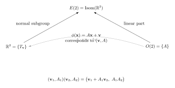

Plane isometries are geometric realizations of group structure. Instead of manipulating abstract symbols, one composes rigid motions of the Euclidean plane. This chapter matters because it shows how algebra records symmetry, and because it gives concrete nonabelian groups that can actually be pictured. The classification of plane isometries into exactly four types is one of the cleanest theorems in elementary geometry, and the finite subgroups of the isometry group turn out to be precisely the cyclic and dihedral groups from earlier chapters.

---

## §12.1 Isometries of the plane

### Definition 12.1 (Plane isometry)

A **plane isometry** (or **rigid motion**) is a bijection $\phi : \mathbb{R}^2 \to \mathbb{R}^2$ that preserves Euclidean distance:
$$
|\phi(\mathbf{x}) - \phi(\mathbf{y})| = |\mathbf{x} - \mathbf{y}|
$$
for all $\mathbf{x}, \mathbf{y} \in \mathbb{R}^2$.

### Theorem 12.2. The set of all plane isometries forms a group under composition.

> [!info]- Proof
>
> We verify the group axioms.
>
> *Closure.* If $\phi$ and $\psi$ are distance-preserving bijections, then $\phi \circ \psi$ is also a bijection (composition of bijections), and
> $$
> |(\phi \circ \psi)(\mathbf{x}) - (\phi \circ \psi)(\mathbf{y})| = |\phi(\psi(\mathbf{x})) - \phi(\psi(\mathbf{y}))| = |\psi(\mathbf{x}) - \psi(\mathbf{y})| = |\mathbf{x} - \mathbf{y}|.
> $$
> So $\phi \circ \psi$ is an isometry.
>
> *Associativity.* Composition of functions is always associative.
>
> *Identity.* The identity map $\operatorname{id}(\mathbf{x}) = \mathbf{x}$ is trivially an isometry.
>
> *Inverses.* Since $\phi$ is a bijection, it has an inverse $\phi^{-1}$. For any $\mathbf{x}, \mathbf{y} \in \mathbb{R}^2$, apply $\phi$ to the points $\phi^{-1}(\mathbf{x})$ and $\phi^{-1}(\mathbf{y})$:
> $$
> |\phi^{-1}(\mathbf{x}) - \phi^{-1}(\mathbf{y})|
> = |\phi(\phi^{-1}(\mathbf{x})) - \phi(\phi^{-1}(\mathbf{y}))|
> = |\mathbf{x} - \mathbf{y}|.
> $$
> Hence $\phi^{-1}$ also preserves distance, so it is an isometry. $\blacksquare$

This group is called the **Euclidean group** of the plane, or the **isometry group** $\operatorname{Isom}(\mathbb{R}^2)$.

### Theorem 12.3 (Affine form of an isometry)

Every plane isometry can be written in the form
$$
\phi(\mathbf{x}) = A\mathbf{x} + \mathbf{b},
$$
where $A \in O(2)$ is an orthogonal $2 \times 2$ matrix (satisfying $A^T A = I$) and $\mathbf{b} \in \mathbb{R}^2$.

> [!info]- Proof outline
>
> **Step 1.** An isometry that fixes the origin is linear. If $\phi(\mathbf{0}) = \mathbf{0}$ and $\phi$ preserves all distances, then it preserves all inner products (by the polarization identity $\langle \mathbf{x}, \mathbf{y} \rangle = \frac{1}{2}(|\mathbf{x}|^2 + |\mathbf{y}|^2 - |\mathbf{x} - \mathbf{y}|^2)$). A linear map preserving the inner product is orthogonal, so $\phi(\mathbf{x}) = A\mathbf{x}$ with $A \in O(2)$.
>
> **Step 2.** For a general isometry $\phi$, define $\psi(\mathbf{x}) = \phi(\mathbf{x}) - \phi(\mathbf{0})$. Then $\psi$ is an isometry fixing the origin, so $\psi(\mathbf{x}) = A\mathbf{x}$ for some $A \in O(2)$. Setting $\mathbf{b} = \phi(\mathbf{0})$, we get $\phi(\mathbf{x}) = A\mathbf{x} + \mathbf{b}$. $\blacksquare$

Since $A \in O(2)$, we have $\det(A) = \pm 1$. This determinant is the key invariant that separates orientation-preserving from orientation-reversing isometries.

---

## §12.2 The four types: classification theorem

### Theorem 12.4 (Classification of plane isometries)

Every plane isometry is exactly one of the following:

| Type | Orientation | Fixed points |
|---|---|---|
| Translation | Preserving ($\det = +1$) | None (unless $\mathbf{v} = \mathbf{0}$, i.e., identity) |
| Rotation | Preserving ($\det = +1$) | Exactly one (the center) |
| Reflection | Reversing ($\det = -1$) | An entire line (the axis) |
| Glide reflection | Reversing ($\det = -1$) | None |

> [!info]- Proof outline via fixed-point analysis
>
> Let $\phi(\mathbf{x}) = A\mathbf{x} + \mathbf{b}$ be a plane isometry.
>
> **Case 1: $\det(A) = +1$ and $A = I$.**
> Then $\phi(\mathbf{x}) = \mathbf{x} + \mathbf{b}$, which is a **translation**.
>
> **Case 2: $\det(A) = +1$ and $A \neq I$.**
> Then $A$ is a nontrivial rotation matrix $R_\theta = \begin{pmatrix} \cos\theta & -\sin\theta \\ \sin\theta & \cos\theta \end{pmatrix}$. The fixed-point equation $\mathbf{x} = A\mathbf{x} + \mathbf{b}$ becomes $(I - A)\mathbf{x} = \mathbf{b}$. Since $A \neq I$ and $\det(A) = 1$, one checks that $\det(I - A) = 2 - 2\cos\theta \neq 0$ for $\theta \not\equiv 0 \pmod{2\pi}$. Hence there is a unique fixed point, and $\phi$ is a **rotation** about that point.
>
> **Case 3: $\det(A) = -1$ and $\phi$ has a fixed point $\mathbf{p}$.**
> Conjugating by the translation $\mathbf{x} \mapsto \mathbf{x} - \mathbf{p}$, we may assume $\phi(\mathbf{0}) = \mathbf{0}$, so $\phi(\mathbf{x}) = A\mathbf{x}$ with $A \in O(2)$, $\det(A) = -1$. Such $A$ has eigenvalues $+1$ and $-1$, so $\phi$ is a **reflection** across the eigenspace for $+1$.
>
> **Case 4: $\det(A) = -1$ and $\phi$ has no fixed point.**
> Then $\phi$ is a **glide reflection**: a reflection across some line followed by a nonzero translation parallel to that line. (The glide component is the part of $\mathbf{b}$ parallel to the reflection axis; if it were zero, $\phi$ would have fixed points.) $\blacksquare$

This classification is exhaustive and mutually exclusive. The identity map is conventionally grouped with translations ($\mathbf{v} = \mathbf{0}$) or with rotations ($\theta = 0$); either convention is harmless.

---

## §12.3 Translations

### Definition 12.5 (Translation)

For $\mathbf{v} \in \mathbb{R}^2$, the **translation by $\mathbf{v}$** is
$$
T_{\mathbf{v}}(\mathbf{x}) = \mathbf{x} + \mathbf{v}.
$$

### Theorem 12.6. The set of translations forms a subgroup isomorphic to $(\mathbb{R}^2, +)$.

> [!info]- Proof
>
> Define $\mathcal{T} = \{T_{\mathbf{v}} : \mathbf{v} \in \mathbb{R}^2\}$. We verify:
>
> - *Closure:* $T_{\mathbf{v}} \circ T_{\mathbf{w}}(\mathbf{x}) = (\mathbf{x} + \mathbf{w}) + \mathbf{v} = \mathbf{x} + (\mathbf{v} + \mathbf{w}) = T_{\mathbf{v}+\mathbf{w}}(\mathbf{x})$.
> - *Identity:* $T_{\mathbf{0}} = \operatorname{id}$.
> - *Inverses:* $T_{\mathbf{v}}^{-1} = T_{-\mathbf{v}}$.
>
> The map $\mathbf{v} \mapsto T_{\mathbf{v}}$ is a group isomorphism $(\mathbb{R}^2, +) \xrightarrow{\sim} \mathcal{T}$ since $T_{\mathbf{v}} \circ T_{\mathbf{w}} = T_{\mathbf{v}+\mathbf{w}}$. $\blacksquare$

### Remark 12.7

The group of translations is **abelian** (since vector addition is commutative) and is a **normal subgroup** of $\operatorname{Isom}(\mathbb{R}^2)$: for any isometry $\phi(\mathbf{x}) = A\mathbf{x} + \mathbf{b}$,
$$
\phi \circ T_{\mathbf{v}} \circ \phi^{-1} = T_{A\mathbf{v}},
$$
which is again a translation. This normality is fundamental to the semidirect product structure of the Euclidean group (see Section 12.10).

---

## §12.4 Rotations

### Definition 12.8 (Rotation)

The **rotation by angle $\theta$ about point $P$** is the isometry
$$
R_{\theta, P}(\mathbf{x}) = R_\theta(\mathbf{x} - P) + P,
$$
where $R_\theta = \begin{pmatrix} \cos\theta & -\sin\theta \\ \sin\theta & \cos\theta \end{pmatrix}$ is the standard rotation matrix. In the special case $P = \mathbf{0}$:
$$
R_{\theta, \mathbf{0}}(\mathbf{x}) = R_\theta \mathbf{x}.
$$

### Theorem 12.9. The rotations about the origin form a group isomorphic to $SO(2) \cong S^1$.

> [!info]- Proof
>
> The set $\{R_\theta : \theta \in \mathbb{R}\}$ is closed under composition ($R_\theta \circ R_\varphi = R_{\theta + \varphi}$), has identity $R_0 = I$, and inverses $R_\theta^{-1} = R_{-\theta}$. The map $\theta \mapsto R_\theta$ is a surjective homomorphism $\mathbb{R} \to SO(2)$ with kernel $2\pi\mathbb{Z}$, so
> $$
> SO(2) \cong \mathbb{R} / 2\pi\mathbb{Z} \cong S^1
> $$
> where $S^1$ is the circle group (unit complex numbers under multiplication). $\blacksquare$

### Remark 12.10

A rotation $R_{\theta, P}$ has a unique fixed point, namely $P$. The order of $R_{\theta, \mathbf{0}}$ in $SO(2)$ is finite if and only if $\theta / (2\pi)$ is rational. Concretely, $R_{2\pi/n}$ has order $n$ and generates a cyclic subgroup $C_n \leq SO(2)$.

---

## §12.5 Reflections

### Definition 12.11 (Reflection)

The **reflection across a line $\ell$** is the isometry $\sigma_\ell$ that sends each point $\mathbf{x}$ to its mirror image across $\ell$. In coordinates, if $\ell$ passes through the origin at angle $\alpha$ from the $x$-axis, then
$$
\sigma_\ell(\mathbf{x}) = M_\alpha \mathbf{x}, \qquad M_\alpha = \begin{pmatrix} \cos 2\alpha & \sin 2\alpha \\ \sin 2\alpha & -\cos 2\alpha \end{pmatrix}.
$$

### Theorem 12.12. Every reflection has order $2$.

> [!info]- Proof
>
> $M_\alpha^2 = I$ (direct computation, or: reflecting twice across the same line returns every point to its original position). Hence $\sigma_\ell^2 = \operatorname{id}$ and $\sigma_\ell \neq \operatorname{id}$ (it moves points not on $\ell$), so $\operatorname{ord}(\sigma_\ell) = 2$. $\blacksquare$

The fixed-point set of a reflection is exactly the line $\ell$.

### Theorem 12.13 (Two reflections: the two key cases)

The composition of two reflections yields either a translation or a rotation, depending on whether the reflection axes are parallel or intersecting.

> [!info]- Case 1: Parallel lines yield a translation
>
> Choose coordinates so the two parallel lines are $\ell_1: x = 0$ and $\ell_2: x = a$. Then:
> $$
> \sigma_{\ell_1}(x, y) = (-x, y), \qquad \sigma_{\ell_2}(x, y) = (2a - x, y).
> $$
> Their composition is
> $$
> \sigma_{\ell_2} \circ \sigma_{\ell_1}(x, y) = \sigma_{\ell_2}(-x, y) = (2a + x, y) = (x, y) + (2a, 0).
> $$
> This is translation by $\mathbf{v} = (2a, 0)$, a vector perpendicular to the lines with magnitude twice the distance between them. $\blacksquare$

> [!info]- Case 2: Intersecting lines yield a rotation
>
> Let two lines $\ell_1$ and $\ell_2$ meet at a point $P$ with angle $\alpha$ between them. In coordinates centered at $P$ with $\ell_1$ along the $x$-axis:
> $$
> \sigma_{\ell_1} = \begin{pmatrix} 1 & 0 \\ 0 & -1 \end{pmatrix}, \qquad \sigma_{\ell_2} = \begin{pmatrix} \cos 2\alpha & \sin 2\alpha \\ \sin 2\alpha & -\cos 2\alpha \end{pmatrix}.
> $$
> Their composition is:
> $$
> \sigma_{\ell_2} \circ \sigma_{\ell_1} = \begin{pmatrix} \cos 2\alpha & \sin 2\alpha \\ \sin 2\alpha & -\cos 2\alpha \end{pmatrix}\begin{pmatrix} 1 & 0 \\ 0 & -1 \end{pmatrix} = \begin{pmatrix} \cos 2\alpha & -\sin 2\alpha \\ \sin 2\alpha & \cos 2\alpha \end{pmatrix} = R_{2\alpha}.
> $$
> This is rotation by $2\alpha$ about the intersection point $P$. $\blacksquare$

### Corollary 12.14

Every plane isometry is a product of at most three reflections.

> [!info]- Proof sketch
>
> - A reflection is itself one reflection.
> - A rotation is a composition of two reflections (in intersecting lines).
> - A translation is a composition of two reflections (in parallel lines).
> - A glide reflection is a composition of three reflections (a reflection plus a translation, which is itself two reflections). $\blacksquare$

---

## §12.6 Glide reflections

### Definition 12.15 (Glide reflection)

A **glide reflection** is the composition of a reflection $\sigma_\ell$ across a line $\ell$ with a nonzero translation $T_{\mathbf{v}}$ where $\mathbf{v}$ is parallel to $\ell$:
$$
G = T_{\mathbf{v}} \circ \sigma_\ell, \qquad \mathbf{v} \parallel \ell, \quad \mathbf{v} \neq \mathbf{0}.
$$

### Remark 12.16

A glide reflection has **no fixed points**: if $G(\mathbf{x}) = \mathbf{x}$, then $\sigma_\ell(\mathbf{x}) = \mathbf{x} - \mathbf{v}$. But $\sigma_\ell$ maps $\ell$ to $\ell$ and moves points off $\ell$ to the opposite side, so $\mathbf{x}$ would have to lie on $\ell$ and simultaneously satisfy $\mathbf{x} = \mathbf{x} + \mathbf{v}$, contradicting $\mathbf{v} \neq \mathbf{0}$.

The requirement $\mathbf{v} \neq \mathbf{0}$ is essential: with $\mathbf{v} = \mathbf{0}$ the map reduces to a reflection.

**Example 12.17.** The map $(x, y) \mapsto (x + 3, -y)$ is a glide reflection: it reflects across the $x$-axis and then translates by $(3, 0)$.

---

## §12.7 Orientation

### Definition 12.18 (Orientation of an isometry)

An isometry $\phi(\mathbf{x}) = A\mathbf{x} + \mathbf{b}$ is called:

- **Orientation-preserving** if $\det(A) = +1$.
- **Orientation-reversing** if $\det(A) = -1$.

### Theorem 12.19. The orientation-preserving isometries form a normal subgroup of index $2$ in $\operatorname{Isom}(\mathbb{R}^2)$.

> [!info]- Proof
>
> The map $\phi \mapsto \det(A_\phi)$ is a group homomorphism $\operatorname{Isom}(\mathbb{R}^2) \to \{+1, -1\}$ (since $\det(A_\phi A_\psi) = \det(A_\phi)\det(A_\psi)$). Its kernel is the set of orientation-preserving isometries, hence a normal subgroup. Its image is $\{+1, -1\}$, so the index is $2$. $\blacksquare$

### Summary table

| Type | $\det(A)$ | Orientation | Fixed points |
|---|---|---|---|
| Translation ($\mathbf{v} \neq 0$) | $+1$ | Preserving | None |
| Rotation ($\theta \neq 0$) | $+1$ | Preserving | One point (center) |
| Reflection | $-1$ | Reversing | A line (axis) |
| Glide reflection | $-1$ | Reversing | None |

---

## §12.8 Finite subgroups of the isometry group

### Theorem 12.20 (Leonardo's theorem)

Every finite subgroup of $\operatorname{Isom}(\mathbb{R}^2)$ is isomorphic to either:
- a cyclic group $C_n$ (consisting of $n$ rotations about a common center), or
- a dihedral group $D_n$ (consisting of $n$ rotations and $n$ reflections).

> [!info]- Proof outline
>
> Let $G$ be a finite subgroup of $\operatorname{Isom}(\mathbb{R}^2)$.
>
> **Step 1.** $G$ contains no translations (other than the identity) and no glide reflections. A nonidentity translation has infinite order (applying $T_{\mathbf{v}}$ repeatedly never returns to the identity), so it cannot belong to a finite group. Similarly, a glide reflection $G_{\mathbf{v},\ell}$ satisfies $G_{\mathbf{v},\ell}^2 = T_{2\mathbf{v}}$, so it also generates an infinite subgroup.
>
> **Step 2.** Therefore $G$ consists only of rotations and reflections. All rotations in $G$ share a common fixed point (the center), and all reflection axes pass through this point. (If two rotations had different centers, their composition would produce translations.)
>
> **Step 3.** The subgroup of rotations in $G$ is a finite subgroup of $SO(2) \cong S^1$, hence cyclic: $\langle R_{2\pi/n} \rangle \cong C_n$ for some $n$.
>
> **Step 4.** If $G$ contains no reflections, then $G \cong C_n$. If $G$ contains at least one reflection $\sigma$, then $G = \langle R_{2\pi/n}, \sigma \rangle$ and the relation $\sigma R_{2\pi/n} \sigma = R_{-2\pi/n}$ gives the presentation of $D_n$. $\blacksquare$

### Definition 12.21 (Dihedral group, geometric definition)

The **dihedral group** $D_n$ is the group of all symmetries of a regular $n$-gon. It has order $2n$ and is generated by a rotation $r = R_{2\pi/n}$ and a reflection $s$ subject to:
$$
r^n = e, \qquad s^2 = e, \qquad srs^{-1} = r^{-1} \quad (\text{equivalently, } sr = r^{-1}s).
$$
The elements are $\{e, r, r^2, \ldots, r^{n-1}, s, sr, sr^2, \ldots, sr^{n-1}\}$.

### Example 12.22 (Symmetry groups of familiar figures)

| Figure | Symmetry group | Order | Generators |
|---|---|---|---|
| Equilateral triangle | $D_3 \cong S_3$ | $6$ | Rotation $120°$, any reflection |
| Square | $D_4$ | $8$ | Rotation $90°$, any reflection |
| Regular $n$-gon | $D_n$ | $2n$ | Rotation $2\pi/n$, any reflection |
| Circle | $O(2)$ | $\infty$ | All rotations, any one reflection |

The orientation-preserving symmetries of a regular $n$-gon form the cyclic subgroup $C_n = \langle r \rangle \leq D_n$, which has index $2$ and is therefore normal.

---

## §12.9 Connection to Chapter 8: $D_n$ as a permutation group

Label the vertices of the regular $n$-gon as $1, 2, \ldots, n$. Each symmetry permutes these vertices, giving a faithful action $D_n \hookrightarrow S_n$. This embeds $D_n$ as a subgroup of $S_n$.

### Example 12.23 ($D_3 \hookrightarrow S_3$)

Label the vertices of the triangle $1, 2, 3$ (clockwise). Then:

| Symmetry | Permutation |
|---|---|
| Identity $e$ | $\iota$ |
| Rotation $r$ ($120°$) | $(1\;2\;3)$ |
| Rotation $r^2$ ($240°$) | $(1\;3\;2)$ |
| Reflection $s$ (axis through vertex $1$) | $(2\;3)$ |
| Reflection $sr$ (axis through vertex $2$) | $(1\;3)$ |
| Reflection $sr^2$ (axis through vertex $3$) | $(1\;2)$ |

Since $|D_3| = 6 = |S_3|$ and $D_3 \hookrightarrow S_3$ is injective, we have $D_3 \cong S_3$.

### Example 12.24 ($D_4 \hookrightarrow S_4$)

Label the vertices of a square $1, 2, 3, 4$ (clockwise). Then the rotation $r = (1\;2\;3\;4)$ and the reflection $s = (2\;4)$ (across the vertical axis through vertices $1$ and $3$) generate $D_4$. Since $|D_4| = 8 < 24 = |S_4|$, the embedding $D_4 \hookrightarrow S_4$ is proper. $D_4$ is a subgroup of $S_4$ but not the whole group.

The relation $sr = r^{-1}s$ can be verified in cycle notation:
$$
sr = (2\;4)(1\;2\;3\;4) = (1\;4\;3\;2)(2\;4) = r^{-1}s. \quad\checkmark
$$

---

## §12.10 Lang's perspective: the Euclidean group

From Lang's viewpoint, this chapter is the first place where a naturally occurring nontrivial **semidirect product** becomes impossible to ignore.

### Definition 12.25 (Semidirect product)

Let $N$ and $H$ be groups, and let
$$
\alpha : H \to \operatorname{Aut}(N)
$$
be a homomorphism describing an action of $H$ on $N$ by automorphisms. The **semidirect product** $N \rtimes_\alpha H$ is the set $N \times H$ with multiplication
$$
(n_1,h_1)(n_2,h_2)=\bigl(n_1\,\alpha(h_1)(n_2),\ h_1h_2\bigr).
$$

If the action is trivial, so that $\alpha(h)=\operatorname{id}_N$ for every $h$, then this reduces to the direct product:
$$
(n_1,h_1)(n_2,h_2)=(n_1n_2,h_1h_2).
$$
So semidirect products are the correct generalization of direct products when one factor twists the other by conjugation.

### Theorem 12.26. $\operatorname{Isom}(\mathbb{R}^2) \cong \mathbb{R}^2 \rtimes O(2)$.

Here the action of $O(2)$ on $\mathbb{R}^2$ is the obvious linear action:
$$
A \cdot \mathbf{v} = A\mathbf{v}.
$$

Figure: the Euclidean group as a semidirect product.

Translations form the normal subgroup, orthogonal maps supply the linear part, and the action arrow records how rotations and reflections twist translations by conjugation.

> [!info]- Proof of Theorem 12.26
> By Theorem 12.3, every isometry has a unique affine form
> $$
> \phi(\mathbf{x})=A\mathbf{x}+\mathbf{v}
> $$
> with $A\in O(2)$ and $\mathbf{v}\in \mathbb{R}^2$.
>
> Define
> $$
> \Phi:\mathbb{R}^2\rtimes O(2)\to \operatorname{Isom}(\mathbb{R}^2),\qquad
> \Phi(\mathbf{v},A)(\mathbf{x})=A\mathbf{x}+\mathbf{v}.
> $$
>
> **Homomorphism.** Compute:
> $$
> \Phi(\mathbf{v}_1,A_1)\bigl(\Phi(\mathbf{v}_2,A_2)(\mathbf{x})\bigr)
> =A_1(A_2\mathbf{x}+\mathbf{v}_2)+\mathbf{v}_1
> =(A_1A_2)\mathbf{x}+(A_1\mathbf{v}_2+\mathbf{v}_1).
> $$
> This is exactly
> $$
> \Phi(\mathbf{v}_1+A_1\mathbf{v}_2,\ A_1A_2)(\mathbf{x}),
> $$
> so the multiplication law in the semidirect product is
> $$
> (\mathbf{v}_1,A_1)(\mathbf{v}_2,A_2)=\bigl(\mathbf{v}_1+A_1\mathbf{v}_2,\ A_1A_2\bigr).
> $$
>
> **Injective.** If $\Phi(\mathbf{v},A)$ is the identity isometry, then
> $$
> A\mathbf{x}+\mathbf{v}=\mathbf{x}\qquad\text{for all }\mathbf{x}.
> $$
> Setting $\mathbf{x}=\mathbf{0}$ gives $\mathbf{v}=\mathbf{0}$, and then $A\mathbf{x}=\mathbf{x}$ for all $\mathbf{x}$, so $A=I$.
>
> **Surjective.** Every isometry is of the form $A\mathbf{x}+\mathbf{v}$ by Theorem 12.3, so every isometry lies in the image of $\Phi$.
>
> Therefore $\Phi$ is an isomorphism. $\blacksquare$

### Why this is not a direct product

The distinction matters. Let $R=R_{90^\circ}$ be rotation by $90^\circ$ about the origin, and let $T=T_{(1,0)}$ be translation by $(1,0)$.

Then
$$
R\circ T(\mathbf{x})=R(\mathbf{x}+(1,0))=R(\mathbf{x})+(0,1),
$$
while
$$
T\circ R(\mathbf{x})=R(\mathbf{x})+(1,0).
$$
These are different isometries. So the rotation subgroup and translation subgroup do **not** commute elementwise, which rules out a direct product decomposition.

This is the concrete content of the twisting term $A_1\mathbf{v}_2$ in the semidirect product law.

### The normal subgroup and the quotient

Let
$$
\mathcal{T}=\{T_{\mathbf{v}}:\mathbf{v}\in \mathbb{R}^2\}\cong \mathbb{R}^2
$$
be the translation subgroup. We already know from Remark 12.7 that $\mathcal{T}\trianglelefteq E(2)$.

The quotient by translations is
$$
E(2)/\mathcal{T}\cong O(2),
$$
because the quotient remembers only the linear part $A$. So the Euclidean group sits in a short exact sequence
$$
1\to \mathbb{R}^2 \to E(2)\to O(2)\to 1.
$$
The semidirect product description says this sequence **splits**: there is an actual subgroup of $E(2)$ isomorphic to $O(2)$, namely the origin-fixing isometries.

### Orientation-preserving isometries

The determinant separates the full Euclidean group into two large pieces:
- $\det(A)=+1$: translations and rotations;
- $\det(A)=-1$: reflections and glide reflections.

So the orientation-preserving subgroup is
$$
E^+(2)=\mathbb{R}^2\rtimes SO(2).
$$
This is the subgroup of all isometries of the form
$$
\mathbf{x}\mapsto R_\theta \mathbf{x}+\mathbf{v}.
$$

### Why this viewpoint is worth keeping

The semidirect product structure explains several earlier facts at once:
- translations are normal because $A T_{\mathbf{v}} A^{-1}=T_{A\mathbf{v}}$;
- rotations about the origin form the complementary subgroup $SO(2)$;
- finite dihedral groups fit the same pattern:
  $$
  D_n \cong C_n \rtimes C_2,
  $$
  where the nontrivial element of $C_2$ acts on $C_n$ by inversion;
- Chapter 15's extension language will repackage this as a split exact sequence.

So Lang's lesson here is not only that plane isometries can be classified. It is that a natural geometric group already has an internal architecture:
$$
\text{translations} \quad \text{twisted by} \quad \text{orthogonal linear symmetries}.
$$

---

## Bridge to Chapter 15 -- semidirect products become split exact sequences

Chapter 12 is the first place in these notes where a semidirect product is not an artificial construction but a naturally occurring answer.

The two guiding examples are:

- the Euclidean group
  $$
  1\to \mathbb{R}^2 \to E(2)\to O(2)\to 1,
  $$
  together with
  $$
  E(2)\cong \mathbb{R}^2\rtimes O(2);
  $$
- the dihedral group
  $$
  1\to C_n\to D_n\to C_2\to 1,
  $$
  together with
  $$
  D_n\cong C_n\rtimes C_2.
  $$

The key structural point is that both quotient maps admit sections:

- the subgroup of origin-fixing orthogonal maps inside $E(2)$;
- the reflection subgroup inside $D_n$.

That is exactly the phenomenon [Chapter 15 - Factor-Group Computations and Simple Groups](./Chapter%2015%20-%20Factor-Group%20Computations%20and%20Simple%20Groups.md) will rename a **split short exact sequence**.

So the bridge is:

- Chapter 12: geometry produces semidirect products;
- Chapter 15: exact-sequence language explains why those semidirect products occur.

If you keep this bridge in mind, then Chapter 15 will feel like a clarification of Chapter 12 rather than a sudden new abstraction.

---

## §12.11 Worked examples

### Example 12.27 (Composing two reflections in parallel lines)

Let $\sigma_1$ be reflection across the line $y = 1$ and $\sigma_2$ be reflection across the line $y = 4$.

$\sigma_1(x, y) = (x, 2 - y)$ and $\sigma_2(x, y) = (x, 8 - y)$.

Their composition:
$$
\sigma_2 \circ \sigma_1(x, y) = \sigma_2(x, 2 - y) = (x, 8 - (2 - y)) = (x, y + 6).
$$
This is translation by $(0, 6)$. Note $6 = 2 \times 3$, twice the distance between the lines. $\checkmark$

### Example 12.28 (Composing two reflections in intersecting lines)

Let $\sigma_x$ be reflection across the $x$-axis and $\sigma_{45}$ be reflection across the line $y = x$ (which makes $45°$ with the $x$-axis).

$\sigma_x(x, y) = (x, -y)$ and $\sigma_{45}(x, y) = (y, x)$.

Their composition:
$$
\sigma_{45} \circ \sigma_x(x, y) = \sigma_{45}(x, -y) = (-y, x) = R_{90°}(x, y).
$$
Indeed, $2 \times 45° = 90°$. $\checkmark$

### Example 12.29 (Identifying an isometry)

The map $\phi(x, y) = (-y + 2, x - 3)$ can be written as
$$
\phi(\mathbf{x}) = \begin{pmatrix} 0 & -1 \\ 1 & 0 \end{pmatrix}\begin{pmatrix} x \\ y \end{pmatrix} + \begin{pmatrix} 2 \\ -3 \end{pmatrix}.
$$
Here $A = R_{90°}$, so $\det(A) = +1$ and $A \neq I$. By the classification, $\phi$ is a rotation. The center is the fixed point, found by solving $(I - A)\mathbf{x} = \mathbf{b}$:
$$
\begin{pmatrix} 1 & 1 \\ -1 & 1 \end{pmatrix}\begin{pmatrix} x \\ y \end{pmatrix} = \begin{pmatrix} 2 \\ -3 \end{pmatrix} \implies x = \frac{5}{2},\quad y = -\frac{1}{2}.
$$
So $\phi$ is rotation by $90°$ about $\left(\frac{5}{2}, -\frac{1}{2}\right)$.

---

## §12.13 Flashcard-ready summary

> [!tip] Key facts to memorize
>
> 1. **Isometry:** distance-preserving bijection $\mathbb{R}^2 \to \mathbb{R}^2$; always has the form $\phi(\mathbf{x}) = A\mathbf{x} + \mathbf{b}$ with $A \in O(2)$.
> 2. **Classification:** every plane isometry is exactly one of: translation, rotation, reflection, or glide reflection.
> 3. **Orientation:** $\det(A) = +1$ (translations, rotations) or $\det(A) = -1$ (reflections, glide reflections).
> 4. **Two parallel reflections** $\to$ translation (by twice the distance between the lines).
> 5. **Two intersecting reflections** $\to$ rotation (by twice the angle between the lines).
> 6. **Every isometry = product of at most 3 reflections.**
> 7. **Reflection has order 2.** Glide reflection has **infinite** order.
> 8. **Translations** form a normal subgroup $\cong (\mathbb{R}^2, +)$.
> 9. **Rotations about the origin:** $SO(2) \cong S^1 \cong \mathbb{R}/2\pi\mathbb{Z}$.
> 10. **Leonardo's theorem:** every finite subgroup of $\operatorname{Isom}(\mathbb{R}^2)$ is $C_n$ or $D_n$.
> 11. **$D_n$:** symmetry group of regular $n$-gon, order $2n$, relations $r^n = s^2 = e$, $sr = r^{-1}s$.
> 12. **$D_3 \cong S_3$** and $D_n \hookrightarrow S_n$ by labeling vertices.
> 13. **Euclidean group:** $E(2) = \mathbb{R}^2 \rtimes O(2)$ (semidirect product).

---

## What should be mastered before leaving Chapter 12

- [ ] State the definition of a plane isometry and its affine form $A\mathbf{x} + \mathbf{b}$
- [ ] Classify a given isometry into translation, rotation, reflection, or glide reflection
- [ ] Use orientation ($\det = \pm 1$) and fixed-point count to determine the type
- [ ] Compute the composition of two reflections in both key cases (parallel / intersecting)
- [ ] Know that every isometry decomposes into at most three reflections
- [ ] Identify the symmetry group of a regular $n$-gon as $D_n$ and its rotation subgroup as $C_n$
- [ ] State and justify Leonardo's theorem (finite subgroups are $C_n$ or $D_n$)
- [ ] Write elements of $D_n$ as permutations in $S_n$ by labeling vertices
- [ ] Explain the semidirect product structure $E(2) = \mathbb{R}^2 \rtimes O(2)$
- [ ] Solve classification and composition problems in coordinates
