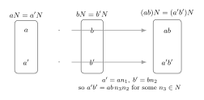
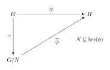
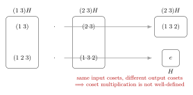

Factor groups (quotient groups) are the central construction of this chapter: given a normal subgroup $N \trianglelefteq G$, the set of cosets $G/N$ becomes a group. This is where cosets, normality, homomorphisms, and isomorphisms fuse into a single coherent picture. If Chapter 10 introduced cosets as partitions, Chapter 14 turns those partitions into groups.

**Prerequisites.** Cosets and Lagrange's theorem (Ch. 10), direct products (Ch. 11), homomorphisms and kernels (Ch. 13).

---

## §14.1 Normal Subgroups

The definition of normality is the gate through which every quotient group must pass.

**Definition 14.1 (Normal subgroup).** A subgroup $N$ of a group $G$ is **normal in $G$**, written $N \trianglelefteq G$, if
$$
gNg^{-1} = N \quad \text{for all } g \in G,
$$
where $gNg^{-1} = \{gng^{-1} : n \in N\}$.

**Theorem 14.2 (Equivalent conditions for normality).** Let $N \le G$. The following are equivalent:

1. $gNg^{-1} = N$ for all $g \in G$.
2. $gNg^{-1} \subseteq N$ for all $g \in G$.
3. $gN = Ng$ for all $g \in G$.
4. $N$ is the kernel of some homomorphism from $G$.

> [!info]- Proof of Theorem 14.2
>
> **(1) $\Rightarrow$ (2).** Immediate: equality implies inclusion.
>
> **(2) $\Rightarrow$ (1).** Assume $gNg^{-1} \subseteq N$ for all $g \in G$. Replacing $g$ by $g^{-1}$ gives
> $$
> g^{-1}Ng \subseteq N.
> $$
> Conjugating both sides by $g$:
> $$
> N = g(g^{-1}Ng)g^{-1} \subseteq gNg^{-1}.
> $$
> Combined with the hypothesis $gNg^{-1} \subseteq N$, we get $gNg^{-1} = N$.
>
> **(1) $\Rightarrow$ (3).** Suppose $gNg^{-1} = N$. For any $n \in N$, we have $gng^{-1} = n_1$ for some $n_1 \in N$, so $gn = n_1 g$. Thus $gN \subseteq Ng$. Replacing $g$ by $g^{-1}$ and conjugating gives $Ng \subseteq gN$. Hence $gN = Ng$.
>
> **(3) $\Rightarrow$ (1).** If $gN = Ng$, then every element $gn$ can be written as $n_1 g$ for some $n_1 \in N$. Then $gng^{-1} = n_1 \in N$, so $gNg^{-1} \subseteq N$. The same argument with $g^{-1}$ gives $g^{-1}Ng \subseteq N$, hence $N \subseteq gNg^{-1}$. Therefore $gNg^{-1} = N$.
>
> **(4) $\Rightarrow$ (2).** If $N = \ker(\phi)$ for some homomorphism $\phi: G \to G'$, then for $n \in N$ and $g \in G$:
> $$
> \phi(gng^{-1}) = \phi(g)\phi(n)\phi(g)^{-1} = \phi(g) e' \phi(g)^{-1} = e'.
> $$
> So $gng^{-1} \in \ker(\phi) = N$, giving $gNg^{-1} \subseteq N$.
>
> **(1) $\Rightarrow$ (4).** This requires the quotient group construction (Theorem 14.4 below). Once $G/N$ is built, the canonical projection $\gamma: G \to G/N$ satisfies $\ker(\gamma) = N$. So every normal subgroup is the kernel of some homomorphism. $\blacksquare$

**Remark.** Condition (2) is the one most often checked in practice: to show $N \trianglelefteq G$, take arbitrary $g \in G$ and $n \in N$ and verify $gng^{-1} \in N$. Condition (3) says left cosets equal right cosets, which is equivalent to saying the coset partition is compatible with the group operation.

**Corollary 14.3.** Every subgroup of an abelian group is normal. Every subgroup of index $2$ is normal.

> [!info]- Proof of Corollary 14.3
>
> If $G$ is abelian, then $gng^{-1} = gg^{-1}n = n \in N$ for all $g \in G$, $n \in N$.
>
> If $[G : N] = 2$, there are exactly two left cosets: $N$ and $G \setminus N$. The same holds for right cosets. Since $eN = N = Ne$ and there is only one other coset on each side, we must have $gN = Ng$ for all $g \in G$. $\blacksquare$

---

## §14.2 Every Kernel Is Normal; Every Normal Subgroup Is a Kernel

This is the complete characterization that ties homomorphisms to normality.

**Theorem 14.4 (Kernel--normal correspondence).** Let $G$ be a group.

1. If $\phi: G \to G'$ is a homomorphism, then $\ker(\phi) \trianglelefteq G$.
2. If $N \trianglelefteq G$, then $N = \ker(\gamma)$ where $\gamma: G \to G/N$ is the canonical projection (defined in §14.3 below).

In short: **a subgroup is normal if and only if it is the kernel of some homomorphism**.

> [!info]- Proof of Theorem 14.4
>
> **(1)** was proved during the equivalence (4) $\Rightarrow$ (2) in Theorem 14.2: for $n \in \ker(\phi)$ and $g \in G$,
> $$
> \phi(gng^{-1}) = \phi(g) e' \phi(g)^{-1} = e',
> $$
> so $gng^{-1} \in \ker(\phi)$.
>
> **(2)** requires the quotient group to exist. By Theorem 14.5 below, $G/N$ is a group and $\gamma(g) = gN$ is a surjective homomorphism. Then
> $$
> g \in \ker(\gamma) \iff \gamma(g) = N \iff gN = N \iff g \in N.
> $$
> So $\ker(\gamma) = N$. $\blacksquare$

This theorem is fundamental: it says that the concepts "normal subgroup" and "kernel of a homomorphism" are the same concept viewed from two directions.

---

## §14.3 The Quotient Group $G/N$

**Definition 14.5 (Quotient group / Factor group).** Let $N \trianglelefteq G$. The **quotient group** (or **factor group**) is the set
$$
G/N = \{gN : g \in G\}
$$
of all left cosets of $N$ in $G$, equipped with the operation
$$
(aN)(bN) = (ab)N.
$$

The critical question: **is this operation well-defined?** The product is defined by choosing representatives $a$ and $b$, so we must verify it does not depend on which representatives are chosen.

**Theorem 14.6 (Well-definedness and group structure of $G/N$).** Let $N \trianglelefteq G$. Then:

1. The operation $(aN)(bN) = (ab)N$ on $G/N$ is well-defined.
2. $G/N$ is a group under this operation, with identity $N = eN$ and inverses $(gN)^{-1} = g^{-1}N$.

> [!info]- Proof of Theorem 14.6
>
> **(1) Well-definedness.** Suppose $aN = a'N$ and $bN = b'N$. We must show $(ab)N = (a'b')N$, i.e., $(a'b')^{-1}(ab) \in N$.
>
> From $aN = a'N$ we get $a' = an_1$ for some $n_1 \in N$. From $bN = b'N$ we get $b' = bn_2$ for some $n_2 \in N$. Then:
> $$
> a'b' = an_1 \cdot bn_2.
> $$
> Since $N$ is normal, $n_1 b = b(b^{-1}n_1 b)$ and $b^{-1}n_1 b \in N$ (call it $n_3$). So:
> $$
> a'b' = a \cdot b \cdot n_3 \cdot n_2 = ab(n_3 n_2).
> $$
> Since $n_3 n_2 \in N$, we have $a'b' \in (ab)N$, giving $(a'b')N = (ab)N$.
>
> **(2) Group axioms.**
>
> - *Closure:* $(aN)(bN) = (ab)N \in G/N$ since $ab \in G$.
>
> - *Associativity:*
> $$
> ((aN)(bN))(cN) = (ab)N \cdot cN = ((ab)c)N = (a(bc))N = aN \cdot (bc)N = (aN)((bN)(cN)).
> $$
>
> - *Identity:* $N = eN$ satisfies $(eN)(gN) = (eg)N = gN$ and $(gN)(eN) = (ge)N = gN$.
>
> - *Inverses:* $(gN)(g^{-1}N) = (gg^{-1})N = eN = N$, and likewise $(g^{-1}N)(gN) = N$. $\blacksquare$

Figure: why quotient multiplication is well-defined when representatives change.

The two rows start from the same input cosets but choose different representatives. The proof shows that both products still land in the same output coset. That is exactly what "the multiplication descends to cosets" means.

**Theorem 14.7 (Normality is necessary).** If $H \le G$ and the operation $(aH)(bH) = (ab)H$ on the set of left cosets $\{gH : g \in G\}$ is well-defined, then $H \trianglelefteq G$.

> [!info]- Proof of Theorem 14.7
>
> Suppose the coset multiplication is well-defined. Let $g \in G$ and $n \in N$. We need $gng^{-1} \in H$.
>
> Consider the cosets $gH$ and $g^{-1}H$. Since $n \in H$, we have $gnH = gH$ (because $gn$ and $g$ are in the same left coset of $H$). By well-definedness:
> $$
> (gnH)(g^{-1}H) = (gH)(g^{-1}H).
> $$
> The left side equals $(gng^{-1})H$ and the right side equals $(gg^{-1})H = eH = H$. So $(gng^{-1})H = H$, which means $gng^{-1} \in H$. $\blacksquare$

Combining Theorems 14.6 and 14.7: **the coset multiplication $(aN)(bN) = (ab)N$ is well-defined if and only if $N \trianglelefteq G$.**

---

## §14.4 The Canonical Projection

**Definition 14.8 (Canonical projection).** Let $N \trianglelefteq G$. The **canonical projection** (or **natural homomorphism**) is
$$
\gamma: G \to G/N, \qquad \gamma(g) = gN.
$$

**Theorem 14.9.** The canonical projection $\gamma$ is a surjective homomorphism with $\ker(\gamma) = N$.

> [!info]- Proof of Theorem 14.9
>
> *Homomorphism:*
> $$
> \gamma(ab) = (ab)N = (aN)(bN) = \gamma(a)\gamma(b).
> $$
>
> *Surjective:* Every element of $G/N$ has the form $gN = \gamma(g)$ for some $g \in G$.
>
> *Kernel:*
> $$
> g \in \ker(\gamma) \iff \gamma(g) = N \iff gN = eN \iff g \in N.
> $$
> Hence $\ker(\gamma) = N$. $\blacksquare$

This completes the circle: every normal subgroup is the kernel of its own canonical projection, and every kernel is a normal subgroup.

### The quotient is universal among maps that kill $N$

This is the Lang formulation that turns quotient groups from constructions into universal objects.

**Theorem 14.9a (Universal property of the quotient).** Let $N \trianglelefteq G$, and let
$$
\gamma:G\to G/N,\qquad \gamma(g)=gN
$$
be the canonical projection. If $\phi:G\to H$ is a homomorphism such that
$$
N\subseteq \ker(\phi),
$$
then there exists a unique homomorphism
$$
\overline{\phi}:G/N\to H
$$
such that
$$
\phi=\overline{\phi}\circ \gamma.
$$

Equivalently: a homomorphism out of $G$ factors through $G/N$ exactly when it sends every element of $N$ to the identity.

Figure: the universal property of the quotient.

The triangle says that every homomorphism killing $N$ must factor uniquely through $G/N$.

> [!info]- Proof of Theorem 14.9a
> **Existence.** Define
> $$
> \overline{\phi}(gN)=\phi(g).
> $$
> We must first show this is well-defined. Suppose $gN=hN$. Then
> $$
> h^{-1}g\in N.
> $$
> Since $N\subseteq \ker(\phi)$, we have $\phi(h^{-1}g)=e_H$, so
> $$
> \phi(h)^{-1}\phi(g)=e_H
> $$
> and hence $\phi(g)=\phi(h)$. Therefore $\overline{\phi}(gN)$ does not depend on the representative.
>
> Now check the homomorphism law:
> $$
> \overline{\phi}((gN)(hN))=\overline{\phi}(ghN)=\phi(gh)=\phi(g)\phi(h)=\overline{\phi}(gN)\,\overline{\phi}(hN).
> $$
> So $\overline{\phi}$ is a homomorphism.
>
> Finally,
> $$
> (\overline{\phi}\circ \gamma)(g)=\overline{\phi}(gN)=\phi(g),
> $$
> so the triangle commutes.
>
> **Uniqueness.** If $\psi:G/N\to H$ is another homomorphism with $\phi=\psi\circ\gamma$, then for every coset $gN$,
> $$
> \psi(gN)=\psi(\gamma(g))=\phi(g)=\overline{\phi}(gN).
> $$
> Since every element of $G/N$ is some $gN$, we get $\psi=\overline{\phi}$. $\blacksquare$

This theorem is the cleanest way to say what the quotient does: it is the most general group obtained from $G$ by forcing every element of $N$ to become trivial.

There are two especially important special cases:
- If $N=\ker(\phi)$, then $\overline{\phi}:G/N\to \operatorname{im}(\phi)$ is an isomorphism. That is exactly the First Isomorphism Theorem.
- If $\phi$ is surjective and $N=\ker(\phi)$, then
  $$
  G/N\cong H.
  $$
  This is the practical version used throughout Chapters 14 and 15 to identify factor groups.

---

## §14.5 Concrete Quotient Group Computations

### Example 14.10: $\mathbb{Z}/n\mathbb{Z} \cong \mathbb{Z}_n$

The remainder map $\gamma_n: \mathbb{Z} \to \mathbb{Z}_n$ defined by $\gamma_n(m) = \bar{m}$ (the residue class of $m$ modulo $n$) is a surjective homomorphism with $\ker(\gamma_n) = n\mathbb{Z}$.

For $n = 4$, the cosets of $4\mathbb{Z}$ in $\mathbb{Z}$ are:
$$
\begin{aligned}
0 + 4\mathbb{Z} &= \{\ldots, -8, -4, 0, 4, 8, \ldots\}, \\
1 + 4\mathbb{Z} &= \{\ldots, -7, -3, 1, 5, 9, \ldots\}, \\
2 + 4\mathbb{Z} &= \{\ldots, -6, -2, 2, 6, 10, \ldots\}, \\
3 + 4\mathbb{Z} &= \{\ldots, -5, -1, 3, 7, 11, \ldots\}.
\end{aligned}
$$

These are exactly the four residue classes mod $4$. By the Fundamental Homomorphism Theorem,
$$
\mathbb{Z}/4\mathbb{Z} \cong \mathbb{Z}_4.
$$
More generally, $\mathbb{Z}/n\mathbb{Z} \cong \mathbb{Z}_n$ for every positive integer $n$. This is the prototypical quotient group.

### Example 14.11: $\mathbb{Z}_8 / \langle \bar{4} \rangle$ with Cayley table

Let $H = \langle \bar{4} \rangle = \{\bar{0}, \bar{4}\} \le \mathbb{Z}_8$. Since $\mathbb{Z}_8$ is abelian, $H \trianglelefteq \mathbb{Z}_8$. The quotient $\mathbb{Z}_8 / H$ has $|\mathbb{Z}_8|/|H| = 8/2 = 4$ elements:
$$
H = \{\bar{0}, \bar{4}\}, \quad \bar{1}+H = \{\bar{1}, \bar{5}\}, \quad \bar{2}+H = \{\bar{2}, \bar{6}\}, \quad \bar{3}+H = \{\bar{3}, \bar{7}\}.
$$

**Cayley table for $\mathbb{Z}_8 / \langle \bar{4} \rangle$:**

| $+$ | $H$ | $\bar{1}+H$ | $\bar{2}+H$ | $\bar{3}+H$ |
| --- | --- | --- | --- | --- |
| $H$ | $H$ | $\bar{1}+H$ | $\bar{2}+H$ | $\bar{3}+H$ |
| $\bar{1}+H$ | $\bar{1}+H$ | $\bar{2}+H$ | $\bar{3}+H$ | $H$ |
| $\bar{2}+H$ | $\bar{2}+H$ | $\bar{3}+H$ | $H$ | $\bar{1}+H$ |
| $\bar{3}+H$ | $\bar{3}+H$ | $H$ | $\bar{1}+H$ | $\bar{2}+H$ |

**Verification of one entry using different representatives:** For $(\bar{3}+H)+(\bar{3}+H)$, choose representatives $\bar{3}$ and $\bar{7}$ (both lie in $\bar{3}+H$):
$$
\bar{3} + \bar{7} = \overline{10} = \bar{2} \in \bar{2}+H. \qquad \checkmark
$$
The table is cyclic of order $4$ with generator $\bar{1}+H$, so:
$$
\mathbb{Z}_8 / \langle \bar{4} \rangle \cong \mathbb{Z}_4.
$$

### Example 14.12: $S_3 / A_3 \cong \mathbb{Z}_2$

$A_3 = \{e, (1\ 2\ 3), (1\ 3\ 2)\}$ is the alternating group on $3$ elements, with $|A_3| = 3$. Since $[S_3 : A_3] = 6/3 = 2$, the subgroup $A_3$ is normal in $S_3$ (every subgroup of index $2$ is normal, by Corollary 14.3).

The two cosets are:
$$
\begin{aligned}
A_3 &= \{e,\; (1\ 2\ 3),\; (1\ 3\ 2)\} \quad \text{(the even permutations)}, \\
(1\ 2)A_3 &= \{(1\ 2),\; (1\ 3),\; (2\ 3)\} \quad \text{(the odd permutations)}.
\end{aligned}
$$

**Cayley table for $S_3 / A_3$:**

| $\cdot$ | $A_3$ | $(1\ 2)A_3$ |
| --- | --- | --- |
| $A_3$ | $A_3$ | $(1\ 2)A_3$ |
| $(1\ 2)A_3$ | $(1\ 2)A_3$ | $A_3$ |

Check: $((1\ 2)A_3)((1\ 2)A_3) = (1\ 2)(1\ 2) A_3 = eA_3 = A_3$. Using a different representative: $((1\ 3)A_3)((2\ 3)A_3) = (1\ 3)(2\ 3)A_3 = (1\ 2\ 3)A_3 = A_3$. $\checkmark$

This is the unique group of order $2$:
$$
S_3 / A_3 \cong \mathbb{Z}_2.
$$

Alternatively: the sign homomorphism $\operatorname{sgn}: S_3 \to \{1, -1\}$ has $\ker(\operatorname{sgn}) = A_3$ and image $\{1,-1\} \cong \mathbb{Z}_2$, so the FHT gives $S_3/A_3 \cong \mathbb{Z}_2$ immediately.

### Example 14.13: $(\mathbb{Z}_4 \times \mathbb{Z}_2) / (\{0\} \times \mathbb{Z}_2) \cong \mathbb{Z}_4$

Let $N = \{0\} \times \mathbb{Z}_2 = \{(0,0),\; (0,1)\}$. The projection onto the first factor,
$$
\pi_1: \mathbb{Z}_4 \times \mathbb{Z}_2 \to \mathbb{Z}_4, \qquad \pi_1(a, b) = a,
$$
is a surjective homomorphism with $\ker(\pi_1) = \{(a,b) : a = 0\} = \{0\} \times \mathbb{Z}_2 = N$.

By the Fundamental Homomorphism Theorem:
$$
(\mathbb{Z}_4 \times \mathbb{Z}_2) / (\{0\} \times \mathbb{Z}_2) \cong \mathbb{Z}_4.
$$

Explicitly, the four cosets are:
$$
\begin{aligned}
N &= \{(0,0),\; (0,1)\}, \\
(1,0) + N &= \{(1,0),\; (1,1)\}, \\
(2,0) + N &= \{(2,0),\; (2,1)\}, \\
(3,0) + N &= \{(3,0),\; (3,1)\}.
\end{aligned}
$$

Each coset collapses the second coordinate, leaving the first coordinate as the group element in $\mathbb{Z}_4$.

### Example 14.14: $\mathbb{R}/\mathbb{Z}$ --- the circle group

The additive group $(\mathbb{R}, +)$ is abelian, so $\mathbb{Z} \trianglelefteq \mathbb{R}$. Two real numbers $x, y$ lie in the same coset of $\mathbb{Z}$ if and only if $x - y \in \mathbb{Z}$, i.e., they have the same fractional part. Each coset $x + \mathbb{Z}$ contains a unique representative in $[0, 1)$.

The map
$$
\phi: \mathbb{R} \to S^1, \qquad \phi(x) = e^{2\pi i x},
$$
where $S^1 = \{z \in \mathbb{C} : |z| = 1\}$ is the unit circle, is a surjective homomorphism of $(\mathbb{R}, +)$ onto $(S^1, \cdot)$ with
$$
\ker(\phi) = \{x \in \mathbb{R} : e^{2\pi i x} = 1\} = \mathbb{Z}.
$$
By the Fundamental Homomorphism Theorem:
$$
\mathbb{R}/\mathbb{Z} \cong S^1.
$$

This is the **circle group**: addition of real numbers modulo $1$ corresponds to multiplication of complex numbers on the unit circle. It shows quotient groups can be continuous, not just finite.

---

## §14.6 Why Well-Definedness Matters: A Non-Normal Subgroup

Consider $H = \{e, (1\ 2)\} \le S_3$. This subgroup is **not normal** in $S_3$ (since $[S_3:H] = 3 \neq 2$). Let us see the coset multiplication fail.

The left cosets of $H$ are:
$$
\begin{aligned}
H &= \{e,\; (1\ 2)\}, \\
(1\ 3)H &= \{(1\ 3),\; (1\ 2\ 3)\}, \\
(2\ 3)H &= \{(2\ 3),\; (1\ 3\ 2)\}.
\end{aligned}
$$

Attempt to compute $((1\ 3)H)((2\ 3)H)$:

- Using representatives $(1\ 3)$ and $(2\ 3)$: $(1\ 3)(2\ 3) = (1\ 3\ 2) \in (2\ 3)H$.
- Using representatives $(1\ 2\ 3)$ and $(1\ 3\ 2)$: $(1\ 2\ 3)(1\ 3\ 2) = e \in H$.

Figure: failure of quotient multiplication when the subgroup is not normal.

So $(1\ 3\ 2) \in (2\ 3)H$ but $e \in H$. Different representatives from the same cosets give products in **different cosets**. The "multiplication" depends on which representatives we pick, so it is not a function on cosets. The operation is **not well-defined**.

This is exactly what normality prevents: when $N \trianglelefteq G$, the relation $gN = Ng$ ensures that the product of cosets is independent of the choice of representatives.

---

## Productive Struggle -- how quotient intuition usually goes wrong

> [!warning] Common wrong guess 1
> Once the set of cosets has been written down, the quotient operation is automatically $(aN)(bN)=abN$.
>
> **Where it breaks.** The operation only makes sense if different representatives from the same cosets always give the same answer. The non-normal subgroup example in $S_3$ shows this can fail outright.
>
> **Repaired method.** Treat well-definedness as a theorem, not as a notation convention. Either:
> - prove normality and then use coset multiplication, or
> - build the quotient through a surjective homomorphism and use the kernel theorem.

> [!warning] Common wrong guess 2
> Once $|G/N|$ is known, the quotient structure is basically determined.
>
> **Where it breaks.** Order gives only a shortlist. A quotient of order $4$ might be $\mathbb{Z}_4$ or $V_4$. A quotient of order $8$ could be cyclic or not. Counting tells you size, not multiplication structure.
>
> **Repaired method.** After computing the order, do one of the following:
> - produce a surjective homomorphism with kernel $N$ and identify the image;
> - compute the order of one or two quotient elements;
> - build a quotient Cayley table when the quotient is small enough.

Chapter 14 becomes much easier once this is internalized: the hard part is rarely the count of cosets; it is the proof that the operation is well defined and the identification of the resulting group.

---

## §14.7 The Fundamental Homomorphism Theorem (Quotient Form)

This is the theorem that organizes the entire chapter.

**Theorem 14.15 (Fundamental Homomorphism Theorem / First Isomorphism Theorem).** Let $\phi: G \to G'$ be a group homomorphism with kernel $N = \ker(\phi)$. Then:

1. $N \trianglelefteq G$.
2. $\phi[G]$ is a subgroup of $G'$.
3. The map $\mu: G/N \to \phi[G]$ defined by $\mu(gN) = \phi(g)$ is an isomorphism.
4. If $\gamma: G \to G/N$ is the canonical projection, then $\phi = \mu \circ \gamma$.

In diagram form:
$$
G \xrightarrow{\;\gamma\;} G/N \xrightarrow{\;\mu\;\cong\;} \phi[G] \subseteq G'.
$$

> [!info]- Proof of Theorem 14.15
>
> **(1)** was proved in Theorem 14.4.
>
> **(2)** If $\phi(a), \phi(b) \in \phi[G]$, then $\phi(a)\phi(b)^{-1} = \phi(ab^{-1}) \in \phi[G]$.
>
> **(3)** We verify the four properties of $\mu$:
>
> - *Well-defined:* If $aN = bN$, then $b^{-1}a \in N = \ker(\phi)$, so $\phi(b^{-1}a) = e'$, hence $\phi(a) = \phi(b)$, i.e., $\mu(aN) = \mu(bN)$.
>
> - *Homomorphism:*
> $$
> \mu((aN)(bN)) = \mu((ab)N) = \phi(ab) = \phi(a)\phi(b) = \mu(aN)\mu(bN).
> $$
>
> - *Injective:* If $\mu(aN) = e'$, then $\phi(a) = e'$, so $a \in \ker(\phi) = N$, hence $aN = N$. The kernel of $\mu$ is trivial, so $\mu$ is injective.
>
> - *Surjective onto $\phi[G]$:* For any $\phi(g) \in \phi[G]$, we have $\mu(gN) = \phi(g)$.
>
> **(4)** For any $g \in G$: $(\mu \circ \gamma)(g) = \mu(\gamma(g)) = \mu(gN) = \phi(g)$. $\blacksquare$

**Corollary 14.16.** If $\phi: G \to G'$ is a **surjective** homomorphism with kernel $N$, then
$$
G/N \cong G'.
$$

This corollary is extremely powerful: to identify a quotient $G/N$, find a surjective homomorphism from $G$ whose kernel is $N$; the image is your answer.

### Example 14.16a: build a quotient from an actual surjective homomorphism

Define
$$
\phi:\mathbb{Z}\times\mathbb{Z}\to \mathbb{Z}_6,\qquad \phi(a,b)=\overline{a+2b}.
$$

This is a homomorphism because
$$
\phi((a,b)+(c,d))=\overline{(a+c)+2(b+d)}=\overline{a+2b}+\overline{c+2d}.
$$
It is surjective because
$$
\phi(1,0)=\bar{1},
$$
and $\bar{1}$ generates $\mathbb{Z}_6$.

Now compute the kernel:
$$
\ker(\phi)=\{(a,b)\in \mathbb{Z}^2 : a+2b\equiv 0\pmod 6\}.
$$
Rewrite this as
$$
a=6k-2b
$$
for some integer $k$. Setting $b=t$, we get
$$
(a,b)=(6k-2t,t)=k(6,0)+t(-2,1).
$$
So
$$
\ker(\phi)=\langle (6,0),\,(-2,1)\rangle.
$$

Therefore the quotient is
$$
(\mathbb{Z}\times\mathbb{Z})/\langle (6,0),(-2,1)\rangle \cong \mathbb{Z}_6.
$$

This is exactly the mindset Chapter 15 will keep using: identify the quotient by finding the right surjective map first, and only then interpret the kernel as the subgroup being collapsed.

---

## §14.8 Simple Groups

**Definition 14.17 (Simple group).** A group $G \neq \{e\}$ is **simple** if its only normal subgroups are $\{e\}$ and $G$ itself.

Equivalently, $G$ is simple if every homomorphism from $G$ is either injective or trivial (since the kernel must be $\{e\}$ or $G$).

**Theorem 14.18.** $\mathbb{Z}_p$ is simple for every prime $p$.

> [!info]- Proof of Theorem 14.18
>
> By Lagrange's theorem, the only subgroups of $\mathbb{Z}_p$ are $\{0\}$ and $\mathbb{Z}_p$ (since $p$ is prime, the only divisors of $|\mathbb{Z}_p| = p$ are $1$ and $p$). Since $\mathbb{Z}_p$ is abelian, every subgroup is normal. Therefore the only normal subgroups are $\{0\}$ and $\mathbb{Z}_p$, and $\mathbb{Z}_p$ is simple. $\blacksquare$

**Example 14.19.** $\mathbb{Z}_6$ is **not** simple, since $\langle \bar{2} \rangle = \{\bar{0}, \bar{2}, \bar{4}\} \cong \mathbb{Z}_3$ is a nontrivial proper normal subgroup.

**Example 14.20.** $A_3 \cong \mathbb{Z}_3$ is simple (prime order). $A_4$ is not simple ($V_4 = \{e, (1\ 2)(3\ 4), (1\ 3)(2\ 4), (1\ 4)(2\ 3)\} \trianglelefteq A_4$). But:

**Theorem 14.21 (Preview).** $A_n$ is simple for $n \ge 5$.

This is a deep result proved later in the text (Section 15). The simplicity of $A_5$ is the reason the quintic has no radical solution (Galois theory). Simple groups are the "atoms" of group theory: every finite group can be built from simple groups via extensions.

---

## §14.9 Automorphisms and Inner Automorphisms

**Definition 14.22 (Automorphism).** An **automorphism** of a group $G$ is an isomorphism $\alpha: G \to G$. The set of all automorphisms of $G$ is denoted $\operatorname{Aut}(G)$.

**Theorem 14.23.** $\operatorname{Aut}(G)$ is a group under composition.

> [!info]- Proof of Theorem 14.23
>
> - *Closure:* If $\alpha, \beta \in \operatorname{Aut}(G)$, then $\alpha \circ \beta$ is a bijection from $G$ to $G$, and $(\alpha \circ \beta)(xy) = \alpha(\beta(xy)) = \alpha(\beta(x)\beta(y)) = \alpha(\beta(x))\alpha(\beta(y)) = (\alpha \circ \beta)(x)(\alpha \circ \beta)(y)$.
> - *Associativity:* Composition of functions is always associative.
> - *Identity:* The identity map $\operatorname{id}_G$ is an automorphism.
> - *Inverses:* If $\alpha \in \operatorname{Aut}(G)$, then $\alpha^{-1}$ exists (since $\alpha$ is a bijection) and is a homomorphism:
>   $\alpha^{-1}(xy) = \alpha^{-1}(\alpha(\alpha^{-1}(x)) \cdot \alpha(\alpha^{-1}(y))) = \alpha^{-1}(\alpha(\alpha^{-1}(x)\alpha^{-1}(y))) = \alpha^{-1}(x)\alpha^{-1}(y)$. $\blacksquare$

**Definition 14.24 (Inner automorphism).** For each $g \in G$, the **inner automorphism** determined by $g$ is
$$
i_g: G \to G, \qquad i_g(x) = gxg^{-1}.
$$
The set of all inner automorphisms is $\operatorname{Inn}(G) = \{i_g : g \in G\}$.

**Theorem 14.25.** Each $i_g$ is indeed an automorphism.

> [!info]- Proof of Theorem 14.25
>
> *Homomorphism:* $i_g(xy) = g(xy)g^{-1} = (gxg^{-1})(gyg^{-1}) = i_g(x)i_g(y)$.
>
> *Bijection:* $i_g$ has inverse $i_{g^{-1}}$, since $i_{g^{-1}}(i_g(x)) = g^{-1}(gxg^{-1})g = x$. $\blacksquare$

**Theorem 14.26.** $\operatorname{Inn}(G) \trianglelefteq \operatorname{Aut}(G)$.

> [!info]- Proof of Theorem 14.26
>
> First, $\operatorname{Inn}(G) \le \operatorname{Aut}(G)$:
> - $i_g \circ i_h = i_{gh}$ because $(i_g \circ i_h)(x) = g(hxh^{-1})g^{-1} = (gh)x(gh)^{-1} = i_{gh}(x)$.
> - $i_e = \operatorname{id}_G$.
> - $(i_g)^{-1} = i_{g^{-1}}$.
>
> Now for normality: let $\alpha \in \operatorname{Aut}(G)$ and $i_g \in \operatorname{Inn}(G)$. We need $\alpha \circ i_g \circ \alpha^{-1} \in \operatorname{Inn}(G)$. For any $x \in G$:
> $$
> (\alpha \circ i_g \circ \alpha^{-1})(x) = \alpha(g \cdot \alpha^{-1}(x) \cdot g^{-1}) = \alpha(g) \cdot x \cdot \alpha(g)^{-1} = i_{\alpha(g)}(x).
> $$
> So $\alpha \circ i_g \circ \alpha^{-1} = i_{\alpha(g)} \in \operatorname{Inn}(G)$. $\blacksquare$

**Theorem 14.27.** $\operatorname{Inn}(G) \cong G/Z(G)$, where $Z(G) = \{z \in G : zg = gz \text{ for all } g \in G\}$ is the center of $G$.

> [!info]- Proof of Theorem 14.27
>
> Define $\Phi: G \to \operatorname{Inn}(G)$ by $\Phi(g) = i_g$. Then:
>
> - *Homomorphism:* $\Phi(gh) = i_{gh} = i_g \circ i_h = \Phi(g) \circ \Phi(h)$ (shown in the proof of Theorem 14.26).
>
> - *Surjective:* By definition, every element of $\operatorname{Inn}(G)$ is $i_g$ for some $g$.
>
> - *Kernel:*
> $$
> g \in \ker(\Phi) \iff i_g = \operatorname{id}_G \iff gxg^{-1} = x \text{ for all } x \in G \iff gx = xg \text{ for all } x \in G \iff g \in Z(G).
> $$
>
> By the Fundamental Homomorphism Theorem, $G/Z(G) \cong \operatorname{Inn}(G)$. $\blacksquare$

**Remark.** A subgroup $N \le G$ is normal if and only if $i_g(N) = N$ for all $g \in G$, i.e., $N$ is invariant under all inner automorphisms. This is the "conjugation" viewpoint on normality. Note that $i_g(N) = N$ is set-wise invariance; the inner automorphism may permute the elements of $N$ nontrivially.

---

## §14.10 Lang's Perspective: The Yoga of Kernels and Images

Stepping back from the details, the theorems of this chapter establish a tight correspondence:

**Normal subgroups of $G$ $\longleftrightarrow$ Quotient groups of $G$.**

Specifically:

1. Every normal subgroup $N \trianglelefteq G$ determines a quotient group $G/N$ and a surjective homomorphism $\gamma: G \to G/N$ with $\ker(\gamma) = N$.
2. Every surjective homomorphism $\phi: G \to Q$ determines a normal subgroup $\ker(\phi) \trianglelefteq G$, and $Q \cong G/\ker(\phi)$.

The Fundamental Homomorphism Theorem gives a bijection:
$$
\left\{\text{normal subgroups of } G\right\} \;\longleftrightarrow\; \left\{\text{isomorphism classes of quotient groups of } G\right\}.
$$

This is what Lang calls the **yoga of kernels and images**: in any algebraic structure with a notion of homomorphism (groups, rings, modules, ...), the "things you can collapse" (kernels/ideals/submodules) are in bijection with the "things you can map onto" (quotient objects). The First Isomorphism Theorem is the precise statement of this bijection.

This perspective pervades all of algebra:

| Structure | "Kernel" object | Quotient | Isomorphism theorem |
| --- | --- | --- | --- |
| Group | Normal subgroup | $G/N$ | $G/\ker\phi \cong \operatorname{im}\phi$ |
| Ring | Ideal | $R/I$ | $R/\ker\phi \cong \operatorname{im}\phi$ |
| Vector space | Subspace | $V/W$ | $V/\ker T \cong \operatorname{im} T$ |
| Module | Submodule | $M/N$ | $M/\ker f \cong \operatorname{im} f$ |

Understanding this pattern at the group level is preparation for seeing it everywhere.

In the language of universal constructions, Theorem 14.9a says that $G/N$ is the **universal receiver** of homomorphisms out of $G$ that kill $N$. This is the quotient analogue of the product universal property from Chapter 13. Products solve a universal mapping problem for maps **into** them; quotients solve a universal mapping problem for maps **out of** them.

---

## Bridge to Chapter 15 -- quotient maps become exact sequences

Chapter 14 should now be read as the last fully concrete stage before the language of exact sequences.

Every normal subgroup $N \trianglelefteq G$ gives the canonical projection
$$
G\twoheadrightarrow G/N.
$$
Chapter 15 will rewrite that one map as the short exact sequence
$$
1\to N\to G\to G/N\to 1.
$$

Likewise, every surjective homomorphism
$$
\phi:G\twoheadrightarrow H
$$
with kernel $N$ will be rewritten as
$$
1\to N\to G\to H\to 1.
$$

So the bridge is straightforward but important:

- this chapter teaches you to compute the quotient group and prove the homomorphism theorem;
- Chapter 15 compresses the same data into exact-sequence language and begins asking how such quotients assemble larger groups.

If Chapter 15 ever starts to feel too compressed, return mentally to Chapter 14 and expand every short exact sequence back into:

1. a normal subgroup,
2. a canonical or surjective homomorphism,
3. a quotient group,
4. a kernel computation,
5. an identification of the image.

That expansion is exactly what the new notation is abbreviating.

---

## Mastery Checklist

- [ ] State the definition of normal subgroup and three equivalent conditions
- [ ] Prove that normality conditions (1)--(4) are equivalent
- [ ] Prove well-definedness of coset multiplication requires normality
- [ ] Prove $G/N$ is a group (closure, associativity, identity, inverses)
- [ ] State and prove properties of the canonical projection $\gamma: G \to G/N$
- [ ] State and prove the universal property of $G/N$: maps out of $G$ that kill $N$ factor uniquely through the quotient
- [ ] Compute $\mathbb{Z}/n\mathbb{Z}$, $\mathbb{Z}_8/\langle\bar{4}\rangle$, $S_3/A_3$ with Cayley tables
- [ ] Show explicitly what fails for $S_3/\langle(1\ 2)\rangle$ (non-normal subgroup)
- [ ] State the FHT and use it to classify a quotient by finding a surjective homomorphism
- [ ] Define simple group; prove $\mathbb{Z}_p$ is simple; know $A_n$ is simple for $n \ge 5$
- [ ] Prove $\operatorname{Aut}(G)$ is a group and $\operatorname{Inn}(G) \trianglelefteq \operatorname{Aut}(G)$
- [ ] Prove $\operatorname{Inn}(G) \cong G/Z(G)$
- [ ] Explain the kernel--image correspondence (Lang's perspective)
