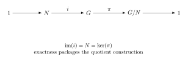

This chapter has two interlocking themes. The first is computational: how does one actually identify a factor group $G/N$ by finding the right surjective homomorphism? The second is structural: which groups admit no nontrivial normal collapse, and why does that matter? The answer leads to simple groups, composition series, and the Jordan-Holder theorem -- the group-theoretic analogue of unique prime factorization.

---

## §15.1 The Fundamental Homomorphism Theorem as a Computational Tool

The Fundamental Homomorphism Theorem (FHT, also called the First Isomorphism Theorem) was stated in Chapter 14. Here we use it as a *strategy* for computing factor groups.

**Theorem 15.1** (Fundamental Homomorphism Theorem). Let $\phi: G \to H$ be a surjective homomorphism with $\ker(\phi) = N$. Then
$$
G/N \cong H.
$$
More precisely, the map $\mu: G/N \to H$ defined by $\mu(gN) = \phi(g)$ is a well-defined isomorphism.

> [!info]- Proof
>
> This was proved in Chapter 14. We recall the key steps for reference.
>
> **Well-defined:** If $gN = g'N$, then $g' = gn$ for some $n \in N = \ker(\phi)$, so $\phi(g') = \phi(gn) = \phi(g)\phi(n) = \phi(g)e = \phi(g)$.
>
> **Homomorphism:** $\mu(gN \cdot g'N) = \mu(gg'N) = \phi(gg') = \phi(g)\phi(g') = \mu(gN)\mu(g'N)$.
>
> **Injective:** If $\mu(gN) = e_H$, then $\phi(g) = e_H$, so $g \in \ker(\phi) = N$, hence $gN = N$.
>
> **Surjective:** Since $\phi$ is surjective, for every $h \in H$ there exists $g \in G$ with $\phi(g) = h$, so $\mu(gN) = h$.

**The strategy.** To identify $G/N$:
1. Find a group $H$ that you suspect is the answer.
2. Construct a surjective homomorphism $\phi: G \to H$.
3. Verify that $\ker(\phi) = N$.
4. Conclude $G/N \cong H$ by the FHT.

This is almost always faster than listing all cosets and building the multiplication table from scratch.

---

## §15.2 Worked Factor-Group Computations

### Example 15.2: $(\mathbb{Z}_4 \times \mathbb{Z}_6)/\langle(\bar{2}, \bar{3})\rangle$

**Step 1: Compute the subgroup being collapsed.**

Let $N = \langle(\bar{2}, \bar{3})\rangle$ inside $G = \mathbb{Z}_4 \times \mathbb{Z}_6$. We compute:
$$
(\bar{2}, \bar{3}), \quad 2(\bar{2}, \bar{3}) = (\bar{0}, \bar{0}).
$$
So $|(\bar{2}, \bar{3})| = 2$ and $N = \{(\bar{0}, \bar{0}),\, (\bar{2}, \bar{3})\}$, hence $|N| = 2$.

**Step 2: Determine the order of the quotient.**
$$
|G/N| = \frac{|G|}{|N|} = \frac{4 \cdot 6}{2} = 12.
$$

**Step 3: Find the right homomorphism (or classify by structure).**

Since $G = \mathbb{Z}_4 \times \mathbb{Z}_6$ is abelian, so is $G/N$. By the Fundamental Theorem of Finitely Generated Abelian Groups, an abelian group of order $12$ is isomorphic to either $\mathbb{Z}_{12}$ or $\mathbb{Z}_2 \times \mathbb{Z}_6$.

To distinguish them, find an element of order $12$ in $G/N$. Consider the coset $(\bar{1}, \bar{0}) + N$. We need the smallest $m > 0$ such that $m(\bar{1}, \bar{0}) \in N$. Now $m(\bar{1}, \bar{0}) = (\bar{m}, \bar{0})$. For this to be in $N = \{(\bar{0}, \bar{0}), (\bar{2}, \bar{3})\}$:
- $(\bar{m}, \bar{0}) = (\bar{0}, \bar{0})$ requires $4 \mid m$, so $m = 4$ at minimum.
- $(\bar{m}, \bar{0}) = (\bar{2}, \bar{3})$ requires $\bar{0} = \bar{3}$ in $\mathbb{Z}_6$, which is impossible.

So $(\bar{1}, \bar{0}) + N$ has order $4$ in $G/N$.

Now consider $(\bar{0}, \bar{1}) + N$. We need $m(\bar{0}, \bar{1}) = (\bar{0}, \bar{m}) \in N$:
- $(\bar{0}, \bar{m}) = (\bar{0}, \bar{0})$ requires $6 \mid m$, so $m = 6$ at minimum.
- $(\bar{0}, \bar{m}) = (\bar{2}, \bar{3})$ requires $\bar{0} = \bar{2}$ in $\mathbb{Z}_4$, which is impossible.

So $(\bar{0}, \bar{1}) + N$ has order $6$.

Since $\gcd(4, 6) = 2$, the element $(\bar{1}, \bar{0}) + N + (\bar{0}, \bar{1}) + N = (\bar{1}, \bar{1}) + N$ has order $\operatorname{lcm}(4, 6) = 12$. (One checks: $\operatorname{ord}((\bar{1}, \bar{1}) + N) = 12$ since $m(\bar{1}, \bar{1}) = (\bar{m}, \bar{m}) \in N$ forces both $4 \mid m$ and $6 \mid m$, or $\bar{m} = \bar{2}$ in $\mathbb{Z}_4$ and $\bar{m} = \bar{3}$ in $\mathbb{Z}_6$ simultaneously. The second case requires $m \equiv 2 \pmod{4}$ and $m \equiv 3 \pmod{6}$; by CRT this gives $m \equiv 9 \pmod{12}$, but then $m = 9$ gives $(\bar{1}, \bar{3}) \neq (\bar{2}, \bar{3})$. Actually, $9 \bmod 4 = 1 \neq 2$. So only the first case applies: $\operatorname{lcm}(4,6) = 12$.)

Therefore $G/N$ has an element of order $12$, so
$$
(\mathbb{Z}_4 \times \mathbb{Z}_6)/\langle(\bar{2}, \bar{3})\rangle \cong \mathbb{Z}_{12}.
$$

**Alternative via FHT:** Define $\phi: \mathbb{Z}_4 \times \mathbb{Z}_6 \to \mathbb{Z}_{12}$ by $\phi(\bar{a}, \bar{b}) = \overline{3a + 2b}$ in $\mathbb{Z}_{12}$. One checks this is a well-defined surjective homomorphism (since $\phi(\bar{1}, \bar{1}) = \bar{5}$ has order $12$ in $\mathbb{Z}_{12}$, so the image is all of $\mathbb{Z}_{12}$). The kernel consists of $(\bar{a}, \bar{b})$ with $12 \mid 3a + 2b$ (lifting to integers). One verifies $\ker(\phi) = \{(\bar{0}, \bar{0}), (\bar{2}, \bar{3})\} = N$.

---

### Example 15.3: $(\mathbb{Z}_2 \times \mathbb{Z}_4)/\langle(\bar{1}, \bar{2})\rangle$

Let $N = \langle(\bar{1}, \bar{2})\rangle$ in $G = \mathbb{Z}_2 \times \mathbb{Z}_4$.

Compute: $(\bar{1}, \bar{2})$, then $2(\bar{1}, \bar{2}) = (\bar{0}, \bar{0})$. So $|N| = 2$ and $N = \{(\bar{0}, \bar{0}), (\bar{1}, \bar{2})\}$.
$$
|G/N| = \frac{2 \cdot 4}{2} = 4.
$$

An abelian group of order $4$ is either $\mathbb{Z}_4$ or $\mathbb{Z}_2 \times \mathbb{Z}_2$ (the Klein four-group $V_4$).

Check whether $G/N$ has an element of order $4$. The coset $(\bar{0}, \bar{1}) + N$ has order $m$ where $m$ is the smallest positive integer with $m(\bar{0}, \bar{1}) = (\bar{0}, \bar{m}) \in N$:
- $(\bar{0}, \bar{m}) = (\bar{0}, \bar{0})$ requires $4 \mid m$.
- $(\bar{0}, \bar{m}) = (\bar{1}, \bar{2})$ requires $\bar{0} = \bar{1}$ in $\mathbb{Z}_2$, impossible.

So $\operatorname{ord}((\bar{0}, \bar{1}) + N) = 4$, hence
$$
(\mathbb{Z}_2 \times \mathbb{Z}_4)/\langle(\bar{1}, \bar{2})\rangle \cong \mathbb{Z}_4.
$$

---

### Example 15.4: $(\mathbb{Z} \times \mathbb{Z})/\langle(1, 1)\rangle \cong \mathbb{Z}$

Let $N = \langle(1,1)\rangle = \{(n, n) : n \in \mathbb{Z}\}$ in $G = \mathbb{Z} \times \mathbb{Z}$.

**Using FHT:** Define $\phi: \mathbb{Z} \times \mathbb{Z} \to \mathbb{Z}$ by $\phi(a, b) = a - b$.

- **Homomorphism:** $\phi((a,b) + (c,d)) = \phi(a+c, b+d) = (a+c) - (b+d) = (a-b) + (c-d) = \phi(a,b) + \phi(c,d)$.
- **Surjective:** For any $n \in \mathbb{Z}$, $\phi(n, 0) = n$.
- **Kernel:** $\phi(a, b) = 0 \iff a = b \iff (a, b) = (a, a) \in \langle(1,1)\rangle$.

So $\ker(\phi) = N$, and by the FHT:
$$
(\mathbb{Z} \times \mathbb{Z})/\langle(1, 1)\rangle \cong \mathbb{Z}.
$$

This is a beautiful example because the quotient of an uncountable-rank-looking object turns out to be the simplest infinite cyclic group.

---

### Example 15.5: $(\mathbb{Z} \times \mathbb{Z})/\langle(2, 2)\rangle$

Define $\phi: \mathbb{Z} \times \mathbb{Z} \to \mathbb{Z} \times \mathbb{Z}_2$ by $\phi(a, b) = (a - b,\, \bar{b})$ where $\bar{b}$ is $b \bmod 2$.

- **Homomorphism:** routine check.
- **Surjective:** $\phi(n, 0) = (n, \bar{0})$ and $\phi(n, 1) = (n-1, \bar{1})$, so the image is all of $\mathbb{Z} \times \mathbb{Z}_2$.
- **Kernel:** $\phi(a,b) = (0, \bar{0})$ requires $a = b$ and $2 \mid b$, so $(a,b) = (2k, 2k)$ for some $k$. Thus $\ker(\phi) = \langle(2,2)\rangle$.

Therefore
$$
(\mathbb{Z} \times \mathbb{Z})/\langle(2, 2)\rangle \cong \mathbb{Z} \times \mathbb{Z}_2.
$$

---

### Example 15.6: $\mathbb{R}^*/\{1, -1\} \cong \mathbb{R}_{>0}$

Let $G = \mathbb{R}^* = (\mathbb{R} \setminus \{0\}, \cdot)$ and $N = \{1, -1\}$.

Define $\phi: \mathbb{R}^* \to \mathbb{R}_{>0}$ by $\phi(x) = |x|$.

- **Homomorphism:** $\phi(xy) = |xy| = |x||y| = \phi(x)\phi(y)$.
- **Surjective:** every positive real is already in $\mathbb{R}^*$.
- **Kernel:** $\phi(x) = 1 \iff |x| = 1 \iff x = \pm 1$.

So $\ker(\phi) = \{1, -1\} = N$ and by the FHT:
$$
\mathbb{R}^*/\{1, -1\} \cong \mathbb{R}_{>0}.
$$

---

## §15.3 The $G/Z(G)$ Theorem

**Definition 15.7.** The **center** of a group $G$ is
$$
Z(G) = \{z \in G : zg = gz \text{ for all } g \in G\}.
$$

> [!info]- $Z(G) \trianglelefteq G$
>
> **Proof.** Let $z \in Z(G)$ and $g \in G$. Then $gzg^{-1} = zgg^{-1} = z \in Z(G)$, where we used $gz = zg$. So $Z(G)$ is stable under conjugation and hence normal.

**Theorem 15.8** ($G/Z(G)$ Theorem). If $G/Z(G)$ is cyclic, then $G$ is abelian.

> [!info]- Proof
>
> Suppose $G/Z(G)$ is cyclic, say $G/Z(G) = \langle gZ(G) \rangle$ for some $g \in G$.
>
> Then every element of $G$ can be written as $g^k z$ for some integer $k$ and some $z \in Z(G)$.
>
> Let $a, b \in G$ be arbitrary. Write $a = g^m z_1$ and $b = g^n z_2$ with $z_1, z_2 \in Z(G)$. Then:
> $$
> ab = g^m z_1 \cdot g^n z_2 = g^m g^n z_1 z_2 = g^{m+n} z_1 z_2
> $$
> where we used the fact that $z_1$ commutes with everything (including $g^n$). Similarly:
> $$
> ba = g^n z_2 \cdot g^m z_1 = g^{n+m} z_2 z_1 = g^{m+n} z_1 z_2
> $$
> using commutativity of $z_1, z_2$ with everything and with each other.
>
> Therefore $ab = ba$ for all $a, b \in G$, so $G$ is abelian.

Note the logical content: if $G/Z(G)$ is cyclic, then $G$ is abelian, which means $Z(G) = G$, which means $G/Z(G)$ is trivial. So the hypothesis "$G/Z(G)$ is cyclic and nontrivial" is *impossible*. The theorem is really a proof by contradiction in disguise.

**Corollary 15.9.** If $|G| = p^2$ for a prime $p$, then $G$ is abelian.

> [!info]- Proof
>
> By the class equation and properties of $p$-groups, $|Z(G)| > 1$. Since $|G| = p^2$, we have $|Z(G)| \in \{p, p^2\}$.
>
> If $|Z(G)| = p^2$, then $Z(G) = G$ and $G$ is abelian.
>
> If $|Z(G)| = p$, then $|G/Z(G)| = p^2/p = p$, which is prime. A group of prime order is cyclic. So $G/Z(G)$ is cyclic, and by Theorem 15.8, $G$ is abelian. But then $Z(G) = G$, contradicting $|Z(G)| = p$. So this case is impossible.
>
> In either case, $G$ is abelian.

This corollary shows that groups of order $p^2$ are isomorphic to either $\mathbb{Z}_{p^2}$ or $\mathbb{Z}_p \times \mathbb{Z}_p$. There are no nonabelian groups of order $p^2$.

---

## §15.4 Simple Groups

**Definition 15.10.** A group $G$ is **simple** if $G \neq \{e\}$ and the only normal subgroups of $G$ are $\{e\}$ and $G$ itself.

### The abelian case

**Theorem 15.11.** A finite abelian group is simple if and only if it has prime order (i.e., $G \cong \mathbb{Z}_p$).

> [!info]- Proof
>
> ($\Leftarrow$) If $|G| = p$ is prime, then by Lagrange's theorem, the only subgroups are $\{e\}$ and $G$. Since $G$ is abelian, every subgroup is normal. So $G$ is simple.
>
> ($\Rightarrow$) Let $G$ be a finite abelian simple group. Pick $a \neq e$ in $G$. Since $G$ is abelian, $\langle a \rangle \trianglelefteq G$. By simplicity, $\langle a \rangle = G$, so $G$ is cyclic. If $|G| = n$ is composite, say $n = km$ with $1 < k, m < n$, then $\langle a^k \rangle$ is a proper nontrivial subgroup (it has order $m$), contradicting simplicity. So $|G|$ is prime.

### Examples

- $\mathbb{Z}_p$ is simple for every prime $p$.
- $\mathbb{Z}_6$ is not simple: $\{0, 2, 4\} \cong \mathbb{Z}_3$ is a proper nontrivial normal subgroup.
- $A_n$ is simple for $n \geq 5$ (this is a major theorem, discussed below).
- $A_4$ is *not* simple: the Klein four-group $V_4 = \{e, (12)(34), (13)(24), (14)(23)\}$ is a proper nontrivial normal subgroup.

### Why simple groups matter: atoms of group theory

Simple groups play the role for groups that prime numbers play for the integers. Every finite group can be "decomposed" into simple groups via composition series (see §15.7), and the Jordan-Holder theorem guarantees that this decomposition is essentially unique. Understanding all finite groups therefore reduces to:
1. Classifying all finite simple groups (completed in the 1980s--2004).
2. Understanding how simple groups can be assembled (the extension problem).

---

## §15.5 Simplicity of $A_5$

**Theorem 15.12.** $A_5$ is simple.

> [!info]- Proof outline
>
> We show that any normal subgroup $N \trianglelefteq A_5$ with $N \neq \{e\}$ must be all of $A_5$.
>
> **Key facts:**
> - $|A_5| = 60$.
> - The conjugacy classes in $A_5$ have sizes: $1, 12, 12, 15, 20$ (corresponding to cycle types $e$, $(abcde)$, $(abced)$, $(ab)(cd)$, $(abc)$).
> - A normal subgroup must be a union of conjugacy classes (since it is closed under conjugation) and must contain $e$.
> - The order of $N$ must divide $60$.
>
> **Elimination:** We need a union of conjugacy classes including $\{e\}$ whose total size divides $60$. The possibilities are:
> $$
> 1, \quad 1+12=13, \quad 1+12=13, \quad 1+15=16, \quad 1+20=21,
> $$
> $$
> 1+12+12=25, \quad 1+12+15=28, \quad 1+12+20=33,
> $$
> $$
> 1+15+20=36, \quad 1+12+12+15=40, \quad 1+12+12+20=45,
> $$
> $$
> 1+12+15+20=48, \quad 1+12+12+15+20=60.
> $$
>
> Of these, the only ones dividing $60$ are $1$ and $60$.
>
> Therefore $N = \{e\}$ or $N = A_5$, so $A_5$ is simple.

**Remark.** For $n \geq 5$, $A_n$ is simple. The proof for general $n$ uses the fact that $A_n$ is generated by $3$-cycles, and any normal subgroup containing a $3$-cycle must contain all $3$-cycles (by conjugation), hence must be all of $A_n$.

---

## §15.6 The Center and the Commutator Subgroup

### The center revisited

**Definition 15.13.** The **center** of $G$ is $Z(G) = \{z \in G : zg = gz \text{ for all } g \in G\}$.

We proved in §15.3 that $Z(G) \trianglelefteq G$. Note that $G$ is abelian if and only if $Z(G) = G$.

### The commutator subgroup

**Definition 15.14.** For $a, b \in G$, the **commutator** of $a$ and $b$ is
$$
[a, b] = aba^{-1}b^{-1}.
$$
The **commutator subgroup** (or **derived subgroup**) of $G$ is
$$
G' = [G, G] = \langle\, [a, b] : a, b \in G \,\rangle,
$$
the subgroup *generated by* all commutators.

Note: the set of all commutators is not always a subgroup (a product of two commutators need not itself be a commutator), so we must take the subgroup generated.

**Theorem 15.15.** $G' \trianglelefteq G$.

> [!info]- Proof
>
> It suffices to show that $g[a,b]g^{-1}$ is a commutator for every $g, a, b \in G$, since $G'$ is generated by commutators.
>
> Compute:
> $$
> g[a,b]g^{-1} = g(aba^{-1}b^{-1})g^{-1} = (gag^{-1})(gbg^{-1})(ga^{-1}g^{-1})(gb^{-1}g^{-1})
> $$
> $$
> = (gag^{-1})(gbg^{-1})(gag^{-1})^{-1}(gbg^{-1})^{-1} = [gag^{-1},\, gbg^{-1}].
> $$
>
> So conjugating a commutator gives another commutator, which lies in $G'$. Since $G'$ is generated by commutators and conjugation sends generators to elements of $G'$, we conclude $gG'g^{-1} \subseteq G'$ for all $g$. Hence $G' \trianglelefteq G$.

**Theorem 15.16.** $G/G'$ is abelian.

> [!info]- Proof
>
> Let $aG', bG' \in G/G'$. We need $(aG')(bG') = (bG')(aG')$, i.e., $abG' = baG'$.
>
> Two cosets are equal if and only if their quotient lies in the subgroup, so it suffices to show
> $$
> (ab)(ba)^{-1} \in G'.
> $$
> But
> $$
> (ab)(ba)^{-1} = aba^{-1}b^{-1} = [a,b],
> $$
> and $[a,b] \in G'$ by definition of the commutator subgroup.
>
> Therefore $abG' = baG'$, so
> $$
> (aG')(bG') = (bG')(aG')
> $$
> for all $a, b \in G$. Hence $G/G'$ is abelian.

**Theorem 15.17.** $G'$ is the *smallest* normal subgroup of $G$ with abelian quotient. That is, if $N \trianglelefteq G$ and $G/N$ is abelian, then $G' \subseteq N$.

> [!info]- Proof
>
> Suppose $N \trianglelefteq G$ and $G/N$ is abelian. Then for all $a, b \in G$:
> $$
> (aN)(bN) = (bN)(aN),
> $$
> so $abN = baN$, hence $(ab)(ba)^{-1} \in N$, i.e., $aba^{-1}b^{-1} \in N$, i.e., $[a,b] \in N$.
>
> Since every commutator lies in $N$ and $G'$ is generated by commutators, $G' \subseteq N$.

**Example.** For $S_3$: the commutators include $[(12),(123)] = (12)(123)(12)^{-1}(123)^{-1} = (12)(123)(12)(132) = (132)$. One checks that $S_3' = A_3 = \{e, (123), (132)\}$, and $S_3/S_3' \cong \mathbb{Z}_2$, which is abelian. For an abelian group $G$, $G' = \{e\}$.

### Worked example 15.17a: the abelianization of $D_8$

Let
$$
D_8=\langle r,s \mid r^4=e,\ s^2=e,\ srs=r^{-1}\rangle
$$
be the symmetry group of the square.

We want to compute the commutator subgroup $D_8'$ and the abelian quotient $D_8/D_8'$.

Start with a commutator:
$$
[s,r]=srs^{-1}r^{-1}.
$$
Since $s^{-1}=s$ and $srs=r^{-1}$, we get
$$
[s,r]=srsr^{-1}=r^{-1}r^{-1}=r^{-2}=r^2.
$$
So
$$
r^2\in D_8'.
$$

Now look at the quotient where all commutators are forced to disappear. In the abelianization, the relation
$$
srs=r^{-1}
$$
becomes
$$
sr=rs \quad \text{and hence} \quad r=r^{-1},
$$
so
$$
r^2=e
$$
in the quotient. We already have $s^2=e$. Therefore the quotient is generated by the images of $r$ and $s$, both of order $2$, and it is abelian. So
$$
D_8/D_8' \cong \mathbb{Z}_2 \times \mathbb{Z}_2.
$$

Since $|D_8|=8$, the quotient has order $4$, so $|D_8'|=2$. But $D_8'$ already contains the nontrivial element $r^2$, hence
$$
D_8'=\{e,r^2\}=\langle r^2\rangle.
$$

Therefore
$$
D_8/\langle r^2\rangle \cong \mathbb{Z}_2 \times \mathbb{Z}_2.
$$

### Productive struggle: abelianization is not the same as quotienting by the center

> [!warning] Common wrong guess
> To make a group abelian, quotient by its center.
>
> **Where it breaks.** The center measures elements that already commute with everything. It does not measure all of the noncommutativity in the group. For $S_3$, the center is trivial:
> $$
> Z(S_3)=\{e\}.
> $$
> So
> $$
> S_3/Z(S_3)\cong S_3,
> $$
> which is still nonabelian.
>
> **Repaired method.** The correct subgroup to quotient by is the commutator subgroup $G'$. The theorem says $G/G'$ is abelian and is the smallest such quotient. So the center and the derived subgroup answer different questions:
> - $Z(G)$ asks which elements already commute with everything;
> - $G'$ asks what must be killed to force the whole quotient to commute.

---

## §15.7 The Second and Third Isomorphism Theorems

**Theorem 15.18** (Second Isomorphism Theorem). Let $H \leq G$ and $N \trianglelefteq G$. Then $HN \leq G$, $N \trianglelefteq HN$, $H \cap N \trianglelefteq H$, and
$$
HN/N \cong H/(H \cap N).
$$

> [!info]- Proof
>
> **$HN$ is a subgroup:** Since $N$ is normal, for any $h \in H$ and $n \in N$, $hn = (hnh^{-1})h = n'h$ for some $n' \in N$. Hence $HN = NH$, and a product of two elements of $HN$ is:
> $$
> (h_1 n_1)(h_2 n_2) = h_1 (n_1 h_2) n_2 = h_1 (h_2 n_1') n_2 = (h_1 h_2)(n_1' n_2) \in HN.
> $$
> Closure under inverses is similar. So $HN \leq G$.
>
> **$N \trianglelefteq HN$:** $N$ is normal in $G$, hence certainly in $HN \leq G$.
>
> **Define the map:** Let $\phi: H \to HN/N$ be defined by $\phi(h) = hN$.
>
> - **Homomorphism:** $\phi(h_1 h_2) = h_1 h_2 N = (h_1 N)(h_2 N) = \phi(h_1)\phi(h_2)$.
> - **Surjective:** Every element of $HN/N$ has the form $hnN = hN$ (since $n \in N$), which is $\phi(h)$.
> - **Kernel:** $\phi(h) = N \iff hN = N \iff h \in N$. Since $h \in H$, we get $h \in H \cap N$. So $\ker(\phi) = H \cap N$.
>
> In particular, $H \cap N \trianglelefteq H$ (as the kernel of a homomorphism from $H$). By the FHT:
> $$
> H/(H \cap N) \cong HN/N.
> $$

**Example.** Let $G = \mathbb{Z}_{12}$, $H = \langle\bar{4}\rangle = \{\bar{0}, \bar{4}, \bar{8}\}$, $N = \langle\bar{6}\rangle = \{\bar{0}, \bar{6}\}$.

Then $HN = \{\bar{0}, \bar{4}, \bar{8}, \bar{6}, \bar{10}, \bar{2}\} = \langle\bar{2}\rangle$, which has order $6$. And $H \cap N = \{\bar{0}\}$ (since $\bar{4}, \bar{8} \notin \{\bar{0}, \bar{6}\}$). The second isomorphism theorem gives:
$$
HN/N \cong H/(H \cap N) = H/\{\bar{0}\} \cong H \cong \mathbb{Z}_3.
$$
Indeed, $|HN/N| = 6/2 = 3$, consistent.

---

**Theorem 15.19** (Third Isomorphism Theorem). Let $N \subseteq M$ with both $N \trianglelefteq G$ and $M \trianglelefteq G$. Then $M/N \trianglelefteq G/N$ and
$$
(G/N)\big/(M/N) \cong G/M.
$$

> [!info]- Proof
>
> Define $\phi: G/N \to G/M$ by $\phi(gN) = gM$.
>
> - **Well-defined:** If $gN = g'N$, then $g^{-1}g' \in N \subseteq M$, so $gM = g'M$.
> - **Homomorphism:** $\phi(gN \cdot g'N) = \phi(gg'N) = gg'M = (gM)(g'M) = \phi(gN)\phi(g'N)$.
> - **Surjective:** For any $gM \in G/M$, we have $\phi(gN) = gM$.
> - **Kernel:** $\phi(gN) = M \iff gM = M \iff g \in M \iff gN \in M/N$. So $\ker(\phi) = M/N$.
>
> In particular, $M/N \trianglelefteq G/N$. By the FHT:
> $$
> (G/N)\big/(M/N) \cong G/M.
> $$

**Example.** Let $G = \mathbb{Z}$, $N = 12\mathbb{Z}$, $M = 4\mathbb{Z}$. Then $N \subseteq M$, both are normal in $\mathbb{Z}$. The theorem says:
$$
(\mathbb{Z}/12\mathbb{Z})\big/(4\mathbb{Z}/12\mathbb{Z}) \cong \mathbb{Z}/4\mathbb{Z}.
$$
The left side is $\mathbb{Z}_{12}/\langle\bar{4}\rangle$, which is a group of order $12/3 = 4$, and the right side is $\mathbb{Z}_4$. Indeed, $\mathbb{Z}_{12}/\langle\bar{4}\rangle \cong \mathbb{Z}_4$ as we computed in Chapter 14.

---

## §15.8 Composition Series and the Jordan-Holder Theorem

**Definition 15.20.** A **composition series** for a group $G$ is a chain of subgroups
$$
\{e\} = G_0 \trianglelefteq G_1 \trianglelefteq G_2 \trianglelefteq \cdots \trianglelefteq G_n = G
$$
such that each **composition factor** $G_{i+1}/G_i$ is a simple group. (Each $G_i$ is normal in $G_{i+1}$, but not necessarily in $G$.)

### Example: Composition series for $\mathbb{Z}_{12}$

$$
\{0\} \trianglelefteq \langle\bar{6}\rangle \trianglelefteq \langle\bar{2}\rangle \trianglelefteq \mathbb{Z}_{12}.
$$

The composition factors are:
- $\langle\bar{6}\rangle / \{0\} \cong \mathbb{Z}_2$
- $\langle\bar{2}\rangle / \langle\bar{6}\rangle \cong \mathbb{Z}_3$ (order $6/2 = 3$)
- $\mathbb{Z}_{12} / \langle\bar{2}\rangle \cong \mathbb{Z}_2$ (order $12/6 = 2$)

All factors are cyclic of prime order, hence simple. The composition factors (with multiplicity) are $\{\mathbb{Z}_2, \mathbb{Z}_3, \mathbb{Z}_2\}$.

An alternative composition series is $\{0\} \trianglelefteq \langle\bar{4}\rangle \trianglelefteq \langle\bar{2}\rangle \trianglelefteq \mathbb{Z}_{12}$ with factors $\mathbb{Z}_3, \mathbb{Z}_2, \mathbb{Z}_2$ -- the same multiset, reordered.

### Example: Composition series for $S_3$

$$
\{e\} \trianglelefteq A_3 \trianglelefteq S_3.
$$

Factors: $A_3/\{e\} \cong \mathbb{Z}_3$ and $S_3/A_3 \cong \mathbb{Z}_2$. Both simple. Composition factors: $\{\mathbb{Z}_2, \mathbb{Z}_3\}$.

### Example: Composition series for $S_4$

$$
\{e\} \trianglelefteq V_4 \trianglelefteq A_4 \trianglelefteq S_4,
$$
where $V_4 = \{e, (12)(34), (13)(24), (14)(23)\}$.

This chain is **not yet** a composition series, because
$$
V_4/\{e\} \cong V_4 \cong \mathbb{Z}_2 \times \mathbb{Z}_2
$$
is not simple: it has proper nontrivial subgroups. So we refine the chain by inserting one subgroup of order $2$ inside $V_4$.

A proper composition series for $S_4$ is:
$$
\{e\} \trianglelefteq \langle(12)(34)\rangle \trianglelefteq V_4 \trianglelefteq A_4 \trianglelefteq S_4.
$$

Factors:
- $\langle(12)(34)\rangle / \{e\} \cong \mathbb{Z}_2$ (simple)
- $V_4 / \langle(12)(34)\rangle \cong \mathbb{Z}_2$ (simple)
- $A_4 / V_4 \cong \mathbb{Z}_3$ (simple, since $|A_4/V_4| = 12/4 = 3$)
- $S_4 / A_4 \cong \mathbb{Z}_2$ (simple)

Composition factors: $\{\mathbb{Z}_2, \mathbb{Z}_2, \mathbb{Z}_3, \mathbb{Z}_2\}$.

### The Jordan-Holder Theorem

**Theorem 15.21** (Jordan-Holder). If a finite group $G$ has a composition series, then any two composition series for $G$ have the same length and the same composition factors (up to permutation and isomorphism).

This theorem is stated without proof. It is the group-theoretic analogue of the uniqueness of prime factorization for integers. Just as every positive integer factors uniquely (up to order) into primes, every finite group decomposes uniquely (up to order) into simple composition factors.

### Worked comparison: $\mathbb{Z}_6$ and $S_3$ have the same factors but are different groups

This is one of the most important sanity checks in the chapter.

For $\mathbb{Z}_6$, a composition series is
$$
\{0\}\trianglelefteq \langle \bar{2}\rangle \trianglelefteq \mathbb{Z}_6,
$$
with factors
$$
\langle \bar{2}\rangle/\{0\}\cong \mathbb{Z}_3,\qquad
\mathbb{Z}_6/\langle \bar{2}\rangle \cong \mathbb{Z}_2.
$$

For $S_3$, a composition series is
$$
\{e\}\trianglelefteq A_3\trianglelefteq S_3,
$$
with factors
$$
A_3/\{e\}\cong \mathbb{Z}_3,\qquad
S_3/A_3\cong \mathbb{Z}_2.
$$

So both groups have the same composition factors:
$$
\mathbb{Z}_3,\ \mathbb{Z}_2.
$$

But the groups are not isomorphic.

Why?

- $\mathbb{Z}_6$ is abelian.
- $S_3$ is nonabelian.

In exact-sequence language, both groups fit into a short exact sequence
$$
1\to \mathbb{Z}_3 \to G \to \mathbb{Z}_2 \to 1,
$$
but the way $\mathbb{Z}_2$ acts on the $\mathbb{Z}_3$ part is different.

For $\mathbb{Z}_6$, the action is trivial, so
$$
\mathbb{Z}_6\cong \mathbb{Z}_3\times \mathbb{Z}_2.
$$

For $S_3$, the action is nontrivial, so
$$
S_3\cong \mathbb{Z}_3\rtimes \mathbb{Z}_2.
$$

The factors agree, but the extension data does not.

### Productive struggle: same composition factors does not mean same group

> [!warning] Common wrong guess
> If two groups have the same composition factors, then they should be isomorphic.
>
> **Where it breaks.** Jordan-Holder says the factors are uniquely determined up to order and isomorphism, but it does not say the whole group is uniquely determined by those factors. The comparison above already destroys that hope.
>
> **Repaired method.** Treat composition factors as the group-theoretic analogue of prime factors only up to a point. They record the simple building blocks. To recover the whole group, one must also understand how those blocks are glued together, which is exactly the role of extensions and exact sequences.

---

## §15.9 Solvable Groups

**Definition 15.22.** A group $G$ is **solvable** if it has a composition series in which every composition factor is abelian. Equivalently (for finite groups), every composition factor is cyclic of prime order.

(The name comes from Galois theory: a polynomial equation is solvable by radicals if and only if its Galois group is solvable.)

**Theorem 15.23.** $S_n$ is solvable for $n \leq 4$.

> [!info]- Proof
>
> We showed above that the composition factors of $S_4$ are $\{\mathbb{Z}_2, \mathbb{Z}_2, \mathbb{Z}_3, \mathbb{Z}_2\}$, all abelian.
>
> For $S_3$: composition factors $\{\mathbb{Z}_2, \mathbb{Z}_3\}$, all abelian.
>
> For $S_2 \cong \mathbb{Z}_2$: already simple and abelian.
>
> For $S_1 \cong \{e\}$: trivial, hence solvable.
>
> In each case, every composition factor is cyclic of prime order, hence abelian. So $S_n$ is solvable for $n \leq 4$.

**Theorem 15.24.** $S_n$ is not solvable for $n \geq 5$.

> [!info]- Proof
>
> Consider the composition series for $S_n$ ($n \geq 5$):
> $$
> \{e\} \trianglelefteq A_n \trianglelefteq S_n.
> $$
> The factor $S_n/A_n \cong \mathbb{Z}_2$ is abelian. But $A_n/\{e\} \cong A_n$ is simple (Theorem 15.12 for $n = 5$, and the general result for $n \geq 5$) and nonabelian (since $|A_n| = n!/2$ is not prime for $n \geq 5$).
>
> Since $A_n$ is simple and nonabelian, it appears as a composition factor, and this cannot be refined further. So any composition series for $S_n$ contains a nonabelian factor, and $S_n$ is not solvable.

This is ultimately why the general quintic equation is not solvable by radicals: $S_5$ is not solvable.

---

## §15.10 Lang's Perspective: Exact Sequences, Atoms, and Extensions

Lang's treatment of this material is organized by **exact sequences**. This is the right language for describing kernels, images, quotients, and the problem of building a group from simpler pieces.

### Exactness

**Definition 15.25 (Exact sequence).** A sequence of homomorphisms
$$
\cdots \to A_{i-1} \xrightarrow{f_{i-1}} A_i \xrightarrow{f_i} A_{i+1}\to \cdots
$$
is **exact at $A_i$** if
$$
\operatorname{im}(f_{i-1})=\ker(f_i).
$$
The sequence is **exact** if it is exact at every intermediate term.

This is a compact way of saying that nothing is lost and nothing extra appears between consecutive maps: everything arriving at $A_i$ is exactly what gets killed by the next map.

### The quotient construction as a short exact sequence

Whenever $N \trianglelefteq G$, the quotient map sits in the short exact sequence
$$
1 \to N \xrightarrow{i} G \xrightarrow{\pi} G/N \to 1,
$$
where $i$ is inclusion and $\pi(g)=gN$.

Figure: the short exact sequence attached to a quotient group.

The arrows package the subgroup, the ambient group, and the quotient into one line, with exactness recording that $\pi$ kills exactly $N$.

Let us check the exactness carefully:
- At $N$: the image of the trivial map $1\to N$ is just $\{e\}$, which equals $\ker(i)$ because inclusion is injective.
- At $G$: the image of $i$ is exactly $N$, and by Chapter 14 we know $\ker(\pi)=N$.
- At $G/N$: the image of $\pi$ is all of $G/N$, so the map $G/N\to 1$ has kernel equal to all of $G/N$.

So exactness packages three statements at once:
- $N$ really sits inside $G$;
- the quotient map kills exactly $N$ and nothing larger;
- every coset occurs as the image of some element of $G$.

This one short exact sequence is the compressed form of the entire quotient construction.

### Standard examples of short exact sequences

1. The sign homomorphism gives
   $$
   1 \to A_n \to S_n \xrightarrow{\operatorname{sgn}} \{\pm 1\} \to 1
   $$
   for $n\ge 2$.

2. The Euclidean group from Chapter 12 gives
   $$
   1 \to \mathbb{R}^2 \to E(2) \to O(2) \to 1.
   $$
   This sequence splits, which is why
   $$
   E(2)\cong \mathbb{R}^2 \rtimes O(2).
   $$

3. For any group $G$, the commutator subgroup gives
   $$
   1 \to G' \to G \to G/G' \to 1,
   $$
   where $G/G'$ is the largest abelian quotient of $G$.

These examples are worth comparing. Each of them says: a complicated group can be studied by isolating a normal subgroup and understanding the quotient.

### Split exact sequences and semidirect products

**Definition 15.26 (Split short exact sequence).** A short exact sequence
$$
1\to N \xrightarrow{i} G \xrightarrow{\pi} Q \to 1
$$
is **split** if there exists a homomorphism
$$
s:Q\to G
$$
such that
$$
\pi\circ s=\operatorname{id}_Q.
$$

The map $s$ is called a **section**. It chooses, in a homomorphism-respecting way, one representative in $G$ for each element of the quotient.

When such a section exists, one can show
$$
G\cong N\rtimes Q.
$$
So semidirect products are the algebraic form of split short exact sequences.

### Worked example 15.26a: a split sequence that is not a direct product

Consider
$$
1\to A_3 \to S_3 \xrightarrow{\operatorname{sgn}} \mathbb{Z}_2 \to 1.
$$

This sequence is exact because:

- the inclusion $A_3\hookrightarrow S_3$ is injective;
- $\ker(\operatorname{sgn})=A_3$;
- the sign map is surjective.

Now define
$$
s:\mathbb{Z}_2\to S_3
$$
by sending the nonzero element of $\mathbb{Z}_2$ to the transposition $(1\,2)$. This is a homomorphism because $(1\,2)^2=e$, so the order-$2$ relation is respected, and
$$
\operatorname{sgn}(s(\bar{1}))=\operatorname{sgn}((1\,2))=\bar{1}.
$$
Hence
$$
\operatorname{sgn}\circ s=\operatorname{id}_{\mathbb{Z}_2},
$$
so the sequence splits.

Therefore
$$
S_3\cong A_3\rtimes \mathbb{Z}_2 \cong \mathbb{Z}_3\rtimes \mathbb{Z}_2.
$$

But
$$
S_3\not\cong \mathbb{Z}_3\times \mathbb{Z}_2.
$$
The direct product would be abelian, while $S_3$ is not. The splitting gives a complement; it does not guarantee that the complement commutes with the normal subgroup.

This explains two earlier constructions:
- Chapter 12: $E(2)\cong \mathbb{R}^2\rtimes O(2)$ because the origin-fixing orthogonal subgroup gives a section of the quotient map.
- Dihedral groups satisfy
  $$
  1\to C_n\to D_n\to C_2\to 1
  $$
  and the reflection subgroup provides the splitting, so
  $$
  D_n\cong C_n\rtimes C_2.
  $$

### Bridge back to Chapter 12

The geometric examples from Chapter 12 are exactly the same phenomenon in a different costume.

- For the Euclidean group:
  $$
  1\to \mathbb{R}^2\to E(2)\to O(2)\to 1
  $$
  splits because the origin-fixing orthogonal maps form a subgroup isomorphic to $O(2)$.
- For the dihedral group:
  $$
  1\to C_n\to D_n\to C_2\to 1
  $$
  splits because any reflection gives a subgroup isomorphic to $C_2$.

So Chapter 12 supplied the geometry and semidirect products. Chapter 15 supplies the exact-sequence language that explains why those semidirect products appear.

This is the beginning of the **extension problem**: given $N$ and $Q$, which groups $G$ fit into a short exact sequence
$$
1\to N\to G\to Q\to 1?
$$
Sometimes the answer is a direct product, sometimes a semidirect product, and sometimes something more subtle.

### Simple groups as atoms

Now the slogan about simple groups can be stated more precisely.

If a group $G$ has a nontrivial proper normal subgroup $N$, then there is a nontrivial short exact sequence
$$
1\to N\to G\to G/N\to 1.
$$
So a simple group is one that cannot be decomposed further in this way.

That is why Lang calls simple groups the **atoms** of finite group theory. They are the groups for which the quotient process immediately collapses to something trivial:
- either $1\to 1\to G\to G\to 1$,
- or $1\to G\to G\to 1\to 1$.

No nontrivial intermediate exact sequence exists.

### Composition series as iterated exact sequences

If
$$
\{e\}=G_0 \trianglelefteq G_1 \trianglelefteq \cdots \trianglelefteq G_n=G
$$
is a composition series, then each factor
$$
G_{i+1}/G_i
$$
is simple.

So a composition series breaks a group into a chain of exact quotient steps. This is the group-theoretic analogue of prime factorization, except that the way the factors are reassembled matters.

### The classification program

The Classification of Finite Simple Groups (proved 1955--2004, across tens of thousands of pages) says that every finite simple group is one of:
1. A cyclic group $\mathbb{Z}_p$ of prime order.
2. An alternating group $A_n$ for $n \ge 5$.
3. A group of Lie type (for example $\operatorname{PSL}(n,q)$ and related families).
4. One of the $26$ sporadic groups.

At the level of this course, you do not use the classification theorem itself. But it matters philosophically: Chapter 15 is the first place where you meet the ideas that make such a theorem possible, namely normal subgroups, quotients, composition factors, and the uniqueness of those factors up to order.

### The real warning: factors do not determine the whole group

For integers, the prime factors determine the integer. For groups, the composition factors do **not** determine the group uniquely.

For example, two nonisomorphic groups can have the same composition factors:
- $\mathbb{Z}_6$ has composition factors $\mathbb{Z}_2$ and $\mathbb{Z}_3$.
- $S_3$ also has composition factors $\mathbb{Z}_3$ and $\mathbb{Z}_2$.

But
$$
\mathbb{Z}_6 \not\cong S_3.
$$

What differs is not the list of factors, but the way they are glued together. That gluing data is exactly what exact sequences and extensions are meant to study.

---

## Mastery Checklist

Before leaving Chapter 15, verify you can:

- [ ] Use the FHT to identify a quotient group by constructing the right homomorphism
- [ ] Compute the order of a coset $gN$ as $\min\{m > 0 : g^m \in N\}$
- [ ] Prove and apply the $G/Z(G)$ theorem
- [ ] Determine whether an abelian group of a given order is simple
- [ ] Outline the proof that $A_5$ is simple (conjugacy class argument)
- [ ] Compute the commutator subgroup for a given group and verify $G/G'$ is abelian
- [ ] State and prove the Second and Third Isomorphism Theorems
- [ ] State what it means for a sequence to be exact and explain the short exact sequence $1\to N\to G\to G/N\to 1$
- [ ] Find a composition series for $\mathbb{Z}_n$, $S_3$, $S_4$
- [ ] Define solvable group and explain why $S_n$ is not solvable for $n \geq 5$
- [ ] Explain how split exact sequences lead to semidirect products and why composition factors do not determine the whole group
- [ ] Articulate Lang's "atoms of group theory" analogy for simple groups
